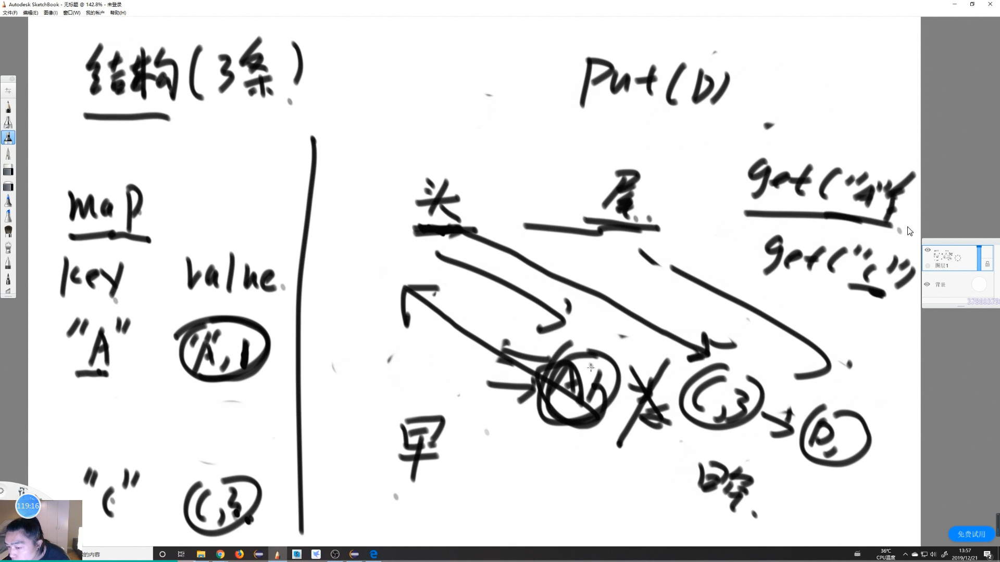

### 题目

运用你所掌握的数据结构，设计和实现一个  LRU (最近最少使用) 缓存机制 。
实现 LRUCache 类：

`LRUCache(int capacity)` 以正整数作为容量 capacity 初始化 LRU 缓存
int get(int key) 如果关键字 key 存在于缓存中，则返回关键字的值，否则返回 -1 。
void put(int key, int value) 如果关键字已经存在，则变更其数据值；如果关键字不存在，则插入该组「关键字-值」。当缓存容量达到上限时，它应该在写入新数据之前删除最久未使用的数据值，从而为新的数据值留出空间。
 
- 进阶：你是否可以在 O(1) 时间复杂度内完成这两种操作？

示例：
```
输入
["LRUCache", "put", "put", "get", "put", "get", "put", "get", "get", "get"]
[[2], [1, 1], [2, 2], [1], [3, 3], [2], [4, 4], [1], [3], [4]]
输出
[null, null, null, 1, null, -1, null, -1, 3, 4]

解释
LRUCache lRUCache = new LRUCache(2);
lRUCache.put(1, 1); // 缓存是 {1=1}
lRUCache.put(2, 2); // 缓存是 {1=1, 2=2}
lRUCache.get(1);    // 返回 1
lRUCache.put(3, 3); // 该操作会使得关键字 2 作废，缓存是 {1=1, 3=3}
lRUCache.get(2);    // 返回 -1 (未找到)
lRUCache.put(4, 4); // 该操作会使得关键字 1 作废，缓存是 {4=4, 3=3}
lRUCache.get(1);    // 返回 -1 (未找到)
lRUCache.get(3);    // 返回 3
lRUCache.get(4);    // 返回 4
```

提示：

- 1 <= capacity <= 3000
- 0 <= key <= 3000
- 0 <= value <= 10e4
- 最多调用 3 * 10e4 次 get 和 put

来源：力扣（LeetCode）
链接：https://leetcode-cn.com/problems/lru-cache

### 思路

双向链表 + HashMap

双向链表 一个头 一个尾 

HashMap 记录 

    key 对应字  "A"  "B"
    
    value 字的地址 + 类似于时间戳的东西 理解成 进入次序
          
        两个的地址 用于 O(1)的查找 而不是 系统双向链表的遍历那就是 logN

        第几个进入 如果容量超了 淘汰最早进入的
        
也可以用系统提供的 Linkedlist



### Code
```java
    class LRUCache<K, V> {

        public class Node<K, V> {
            public K key;
            public V value;
            public Node<K, V> last;
            public Node<K, V> next;

            public Node(K key, V value) {
                this.key = key;
                this.value = value;
            }
        }

        // 手写双向链表
        public class NodeDoubleLinkedList<K, V> {
            private Node<K, V> head;
            private Node<K, V> tail;

            public NodeDoubleLinkedList() {
                this.head = null;
                this.tail = null;
            }

            // 添加节点
            public void addNode(Node<K, V> newNode) {
                if (newNode == null) {
                    return;
                }
                // 如果是里面没节点
                if (this.head == null) {
                    this.head = newNode;
                    this.tail = newNode;
                } else {
                    // 里面有节点了 最后进入放尾巴上
                    this.tail.next = newNode;
                    newNode.last = this.tail;
                    this.tail = newNode;
                }
            }

            // 操作了链表中有的东西 时间戳要更新 
            // 从链表中把 node 抽出去 node 前后相连
            // node 放到尾部
            public void moveNodeToTail(Node<K, V> node) {
                // 如果是尾巴 无事发生
                if (this.tail == node) {
                    return;
                }
                // 如果node是头部
                if (this.head == node) {
                    this.head = node.next;
                    this.head.last = null;
                } else {
                    // node 是中间的一个
                    node.last.next = node.next;
                    node.next.last = node.last;
                }
                // 放到尾巴上 接好
                node.last = this.tail;
                node.next = null;
                this.tail.next = node;
                this.tail = node;
            }

            // 内存更新
            // 删除 头节点
            public Node<K, V> removeHead() {
                if (this.head == null) {
                    return null;
                }
                // 把头结点记录下来
                Node<K, V> res = this.head;
                // 只有一个节点时
                if (this.head == this.tail) {
                    this.head = null;
                    this.tail = null;
                } else {
                    // 一般的 移除头
                    this.head = res.next;
                    res.next = null;
                    this.head.last = null;
                }
                return res;
            }

        }

        private HashMap<K, Node<K, V>> keyNodeMap;
        private NodeDoubleLinkedList<K, V> nodeList;
        private int capacity;

        public LRUCache(int capacity) {
            if (capacity < 1) {
                return;
            }
            this.keyNodeMap = new HashMap<K, Node<K, V>>();
            this.nodeList = new NodeDoubleLinkedList<K, V>();
            this.capacity = capacity;
        }

        public int get(K key) {
            // 看看 HashMap 里有无
            if (this.keyNodeMap.containsKey(key)) {
                // 查询了 更新 res 的时间
                Node<K, V> res = this.keyNodeMap.get(key);
                this.nodeList.moveNodeToTail(res);
                return (int) res.value;
            }
            return -1;
        }

        public void put(K key, V value) {
            // 如果之前出现了
            if (this.keyNodeMap.containsKey(key)) {
                Node<K, V> node = this.keyNodeMap.get(key);
                node.value = value;
                this.nodeList.moveNodeToTail(node);
            } else {
                // 添加了一个新的 node
                Node<K, V> newNode = new Node<K, V>(key, value);
                this.keyNodeMap.put(key, newNode);
                // 先加进去 再看看有无 超+1 
                // 也可先判 超 删除再加入
                this.nodeList.addNode(newNode);
                if (this.keyNodeMap.size() == this.capacity + 1) {
                    this.removeMostUnusedCache();
                }
            }
        }
        
        // 删除最老的操作 就是删双向链表的头
        private void removeMostUnusedCache() {
            Node<K, V> removeNode = this.nodeList.removeHead();
            this.keyNodeMap.remove(removeNode.key);
        }

    }

```
*** 
### 收获
