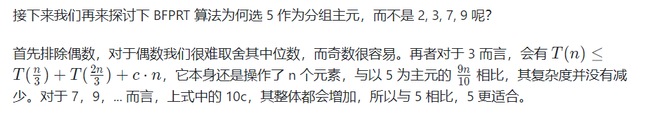

- [BFPRT 算法解决 TopK 问题](#bfprt-算法解决-topk-问题)
	- [Why 5 ？](#why-5-)
# BFPRT 算法解决 TopK 问题

在一大堆数中求其前k大或前k小的问题，简称TOP-K问题。而目前解决TOP-K问题最有效的算法即是BFPRT算法，其又称为中位数的中位数算法，该算法由Blum、Floyd、Pratt、Rivest、Tarjan提出，最坏时间复杂度为O(n)。

在首次接触TOP-K问题时，我们的第一反应就是可以先对所有数据进行一次排序，然后取其前k即可，但是这么做有两个问题： 

    1. 快速排序的平均复杂度为O(nlogn)，但最坏时间复杂度为O(n2)，不能始终保证较好的复杂度。 

    2. 我们只需要前k大的，而对其余不需要的数也进行了排序，浪费了大量排序时间。

除这种方法之外，堆排序也是一个比较好的选择，可以维护一个大小为k的堆，时间复杂度为O(nlogk)。

BFPRT 的主要目的是 给 partition 找一个合适的 划分值

.png)

选取主元

    1.1. 将 n 个元素按顺序分为 N/5​	个组，每组 5 个元素，若有剩余，继续保留
    
    1.2. 对于这 N /5 个组中的每一组使用插入排序找到它们各自的中位数；
    
    1.3. 对于 1.2 中找到的所有中位数，调用 BFPRT 算法求出它们的中位数，作为主元以 1.3 选取的主元为分界点，把小于主元的放在左边，大于主元的放在右边；
    
        判断主元的位置与 k 的大小，有选择的对左边或右边递归。


BFPRT() 调用 GetPivotIndex() 和 Partition() 来求解第 k 小，在这过程中，GetPivotIndex() 也调用了 BFPRT()，即 GetPivotIndex() 和 BFPRT() 为互递归的关系。


.png)

分组后 取中位数 如果偶数个 向上取 组成 marr[]

在找 marr[] 的中位数 递归调用 f(marr,marr.length/2)

以返回值 X 来做归并  (等同于荷兰国旗问题)

    在归并的时候 因为我们 X 限制了范围所以使得归并范围小 时间复杂度低

.png)

(三) 这列大于 c 的就有 N / 10 算上 d，e 

计算出 大于它至少有 3N/10 个  

C 就是我要的 X

.png)

可用 master 公式算复杂度 O(N) 

```java
public class Problem06_BFPRT {

	public static int[] getMinKNumsByBFPRT(int[] arr, int k) {
		if (k < 1 || k > arr.length) {
			return arr;
		}
		int minKth = getMinKthByBFPRT(arr, k);
		int[] res = new int[k];
		int index = 0;
		for (int i = 0; i != arr.length; i++) {
			if (arr[i] < minKth) {
				res[index++] = arr[i];
			}
		}
		for (; index != res.length; index++) {
			res[index] = minKth;
		}
		return res;
	}

	public static int getMinKthByBFPRT(int[] arr, int K) {
		int[] copyArr = copyArray(arr);
		return select(copyArr, 0, copyArr.length - 1, K - 1);
	}

	public static int[] copyArray(int[] arr) {
		int[] res = new int[arr.length];
		for (int i = 0; i != res.length; i++) {
			res[i] = arr[i];
		}
		return res;
	}

	// 在arr[begin..end]范围上，求如果排序的话，i位置的数是谁，返回
	// i一定在begin~end范围上
	public static int select(int[] arr, int begin, int end, int i) {
		if (begin == end) {
			return arr[begin];
		}
		// 分组 + 组内排序 + 组成newarr + 选出newarr的上中位数  pivot
		int pivot = medianOfMedians(arr, begin, end);
		// 根据pivot做划分值   <p  ==p   >p  ，返回等于区域的左边界和右边界
		// pivotRange[0] 等于区域的左边界
		// pivotRange[1] 等于区域的右边界
		int[] pivotRange = partition(arr, begin, end, pivot);
		if (i >= pivotRange[0] && i <= pivotRange[1]) {
			return arr[i];
		} else if (i < pivotRange[0]) {
			return select(arr, begin, pivotRange[0] - 1, i);
		} else {
			return select(arr, pivotRange[1] + 1, end, i);
		}
	}

	public static int medianOfMedians(int[] arr, int begin, int end) {
		int num = end - begin + 1;
		int offset = num % 5 == 0 ? 0 : 1;
		int[] mArr = new int[num / 5 + offset];
		for (int i = 0; i < mArr.length; i++) {
			int beginI = begin + i * 5;
			int endI = beginI + 4;
			mArr[i] = getMedian(arr, beginI, Math.min(end, endI));
		}
		return select(mArr, 0, mArr.length - 1, mArr.length / 2);
	}

	public static int[] partition(int[] arr, int begin, int end, int pivotValue) {
		int small = begin - 1;
		int cur = begin;
		int big = end + 1;
		while (cur != big) {
			if (arr[cur] < pivotValue) {
				swap(arr, ++small, cur++);
			} else if (arr[cur] > pivotValue) {
				swap(arr, cur, --big);
			} else {
				cur++;
			}
		}
		int[] range = new int[2];
		range[0] = small + 1;
		range[1] = big - 1;
		return range;
	}

	public static int getMedian(int[] arr, int begin, int end) {
		insertionSort(arr, begin, end);
		int sum = end + begin;
		int mid = (sum / 2) + (sum % 2);
		return arr[mid];
	}

	public static void insertionSort(int[] arr, int begin, int end) {
		for (int i = begin + 1; i != end + 1; i++) {
			for (int j = i; j != begin; j--) {
				if (arr[j - 1] > arr[j]) {
					swap(arr, j - 1, j);
				} else {
					break;
				}
			}
		}
	}

	public static void swap(int[] arr, int index1, int index2) {
		int tmp = arr[index1];
		arr[index1] = arr[index2];
		arr[index2] = tmp;
	}

	public static void printArray(int[] arr) {
		for (int i = 0; i != arr.length; i++) {
			System.out.print(arr[i] + " ");
		}
		System.out.println();
	}

	public static void main(String[] args) {
		int[] arr = { 6, 9, 1, 3, 1, 2, 2, 5, 6, 1, 3, 5, 9, 7, 2, 5, 6, 1, 9 };
		printArray(getMinKNumsByBFPRT(arr, 10));

	}

}
```


## Why 5 ？



他这里的整体应该是 取中位数的 和 左右递归的时间复杂度 增加


参考

[BFPRT 算法（TOP-K 问题） Ethson](https://segmentfault.com/a/1190000008322873)