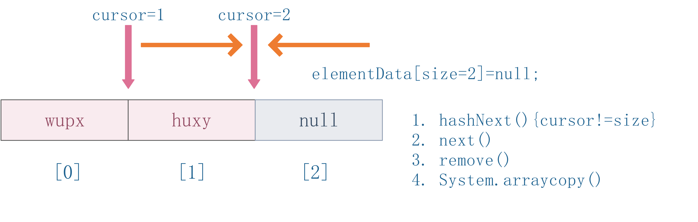

[toc]

# 一. 集合 Collection

ali 开发手册：

1. 在集合泛型定义时  JDK7及以上 使用 diamond 语法或全省略
    ```java
    // diamond 方法 <>
    HashMap<String, String> userCache = new HashMap<>(16);
    // 全省略
    ArrayList<User> users = new ArrayList(10);
    ```
2. 在JDK7以及以上版本中，Comparator要满足自反性，传递性，对称性，不然调用Arrays.sort()或者Collections.sort()会报异常。Comparator要满足三个条件.

    The implementor must ensure that sgn(compare(x, y)) == -sgn(compare(y, x)) for all x and y. (This implies that compare(x, y) must throw an exception if and only if compare(y, x) throws an exception.)

    The implementor must also ensure that the relation is transitive: ((compare(x, y)>0) && (compare(y, z)>0)) implies compare(x, z)>0.

    Finally, the implementor must ensure that compare(x, y)0 implies that sgn(compare(x, z))sgn(compare(y, z)) for all z.

   1.  x，y 的比较结果和 y，x 的比较结果相反。
   2. 传递性：x>y,y>z,则 x>z。
   3. 对称性：x=y,则 x,z 比较结果和 y，z 比较结果相同。

3. 不要在 foreach 循环里进行元素的 remove/add 操作 remove 使用 Iterator 方式，如果并发操作，需要对 Iterator 对象加锁

    或者使用并发容器 CopyOnWriteArrayList 代替 ArrayList，该容器内部会对 Iterator 进行加锁操作。
    
    正例
    ```java
    List<String> list = new ArrayList<>();
        list.add("1");
        list.add("2");
        Iterator<String> iterator = list.iterator();
        while (iterator.hasNext()) {
            String item = iterator.next();
            // 删除条件 可替换 
           if ("1".equals(item)) {
                iterator.remove();
            }
        }
    ```

    反例
    ```java
    List<String> list2 = list;
        for (String item : list2) {
            // 删除条件第一次成功 但修改条件后直接报错
            if ("2".equals(item)){
                list2.remove(item);
            }
        }
    ```

    ```
    output:

    [2]
    Exception in thread "main" java.util.ConcurrentModificationException
	at java.base/java.util.ArrayList$Itr.checkForComodification(ArrayList.java:1013)
	at java.base/java.util.ArrayList$Itr.next(ArrayList.java:967)
	at leetcode.editor.cn.CountOfSmallerNumbersAfterSelf.main(CountOfSmallerNumbersAfterSelf.java:51)
    ```

    错误源码

    ```java
    private class Itr implements Iterator<E> {
        int cursor;       // 下一个要返回的元素的索引
        int lastRet = -1; // 返回的最后一个元素的索引（如果没有返回-1）
        int expectedModCount = modCount;

        public boolean hasNext() {
            return cursor != size;
        }

        public void remove() {
            if (lastRet < 0)
                throw new IllegalStateException();
            checkForComodification();

            try {
                ArrayList.this.remove(lastRet);
                cursor = lastRet;
                lastRet = -1;
                expectedModCount = modCount;
            } catch (IndexOutOfBoundsException ex) {
                throw new ConcurrentModificationException();
            }
        }

        @Override
        @SuppressWarnings("unchecked")
        public void forEachRemaining(Consumer<? super E> consumer) {
            Objects.requireNonNull(consumer);
            final int size = ArrayList.this.size;
            int i = cursor;
            if (i >= size) {
                return;
            }
            final Object[] elementData = ArrayList.this.elementData;
            if (i >= elementData.length) {
                throw new ConcurrentModificationException();
            }
            while (i != size && modCount == expectedModCount) {
                consumer.accept((E) elementData[i++]);
            }
            cursor = i;
            lastRet = i - 1;
            checkForComodification();
        }

        @SuppressWarnings("unchecked")
        public E next() {
            checkForComodification();
            int i = cursor;
            if (i >= size)
                throw new NoSuchElementException();
            Object[] elementData = ArrayList.this.elementData;
            if (i >= elementData.length)
                throw new ConcurrentModificationException();
            cursor = i + 1;
            return (E) elementData[lastRet = i];
        }

        final void checkForComodification() {
            if (modCount != expectedModCount)
                throw new ConcurrentModificationException();
        }
    }
    ```    
    从代码中可以看出，其实在集合遍历时维护一个初始值为 0 的游标 cursor，从头到尾地进行扫描，在 cursor==size 时，退出遍历。如下图所示，执行 remove 这个元素后，所有元素往前拷贝， size=size-1 即为 2 ，这时 cursor 也等于 2 。
    
    在执行hasNext() 时， 结果为 false ，退出循环体，并没有机会执行到 next() 的第一行代码
    checkForComodification() ，此方法用来判断 expectedModCount 和 modCount 是否相等，
    如果不相等，则抛出 ConcurrentModificationException 异常。

    


    之所以会报 ConcurrentModificationException 异常，是因为触发了 Java 的 fail-fast 机制，该机制是集合中比较常见的错误检测机制，通常出现在遍历集合元素的过程中。举个生活中的栗子：

    比如上体育课时，在上课前都会依次报数，如果在报数期间，有人突然加进来，还要重新报数，再次报数，又有同学溜出去了，又要重新报数，这就是 fail-fast 机制，它是对集合（班级同学）遍历操作的错误检测机制，在遍历中途出现意料之外的修改时，通过 unchecked 异常反馈出来。这种机制经常出现在多线程环境下，当前线程会维护一个计数比较器（expectedModCount），记录已经修改的次数。在进入遍历前，会把实时修改次数
    
    modCount 赋值给 expectedModCount，如果这两个数据不相等，则抛出异常。java.util 下的所有集合类都是 fail-fast。

    [from 武培轩](https://www.cnblogs.com/wupeixuan/p/11974270.html)

## 1. 数组 Array

### 1.1 新建数组
```java
int[] tmp = new int[5];
```

### 1.2 数组长度
```java
tmp.length
```

### 1.3 数组排序
```java
// 基础类型值 直接排 不然不用比较器它排的内存地址
// 升序
Arrays.sort(tmp);
// 对index从    fromIndex 1 -> toIndex（5-1）= 4
Arrays.sort(tmp,1,5);
```

自定义排序 
```java
Arrays.sort(b,(o1,o2)->(o1.val - o2.val))

int[][] b = new int[4][2];
Arrays.sort(b, (o1, o2) -> o1[0] == o2[0] ? o1[1] - o2[1] : o2[0] - o1[0]);
Arrays.sort(b, new Comparator<int[]>(){
    @Override
    public int compare(int[] o1, int[] o2){
        return o1[0]==o2[0] ? o1[1]-o2[1] : o2[0]-o1[0];
    }
})
```

##### 比较器的一点思考

```java
class MyComparator implements Comparator<Integer> {
    @Override
    public int compare(Integer o1, Integer o2) {
        //return o1 - o2; //语句一
        return o2 - o1; //语句二
    }
}
```

首先要知道，o1 是需要比较的数，o2 是一个标准，比较过程是

```java
o1 - o2 
	结果为负，则 o1 排到 o2 的前面，此时说明 o1 的数值小于 o2
	结果为正，则 o1 排到 o2 的后面，此时说明 o1 的数值大于 o2
	结果为0，则 o1 和 o2 并排，此时说明 o1 的数值等于 o2
这种排序方式是从小到大升序排列

o2 - o1 
	结果为负，则 o1 排到 o2 的前面，此时说明 o1 的数值大于 o2 
    ···

这种排序方式是从大到小降序排列

用来自己搞大小根堆的时候用用一下比较器 一般用λ表达式方便

PriorityQueue<Integer> left = new PriorityQueue<>((n1,n2)->n2-n1)

```

因为单纯记住结论并不能很好的理解，所以通过这种记录的方式能够更好的理解比较器的比较方式。

还有在比较val的时候是不能用 o1.val o2.val 的

### 1.4 数组复制

1. 使用 CopyOfRange() 方法对数组进行复制

    Arrays 类的 CopyOfRange() 方法是另一种复制数组的方法，其语法形式如下：
    ```java
    Arrays.copyOfRange(dataType[] srcArray,int startIndex,int endIndex)
    ```
    其中：

    srcArray 表示原数组。

    startIndex 表示开始复制的起始索引，目标数组中将包含起始索引对应的元素，另外，startIndex 必须在 0 到 srcArray.length 之间。

    endIndex 表示终止索引，目标数组中将不包含终止索引对应的元素，endIndex 必须大于等于 startIndex，可以大于 srcArray.length，如果大于 srcArray.length，则目标数组中使用默认值填充。

    注意：目标数组如果已经存在，将会被重构。
    ```java
    Arrays.copyOfRange(array,0,array.length);//左闭右开
    ```

2. 使用 arraycopy() 方法

    arraycopy() 方法位于 java.lang.System 类中，其语法形式如下：

    System.arraycopy(dataType[] srcArray,int srcIndex,int destArray,int destIndex,int length)

    其中，srcArray 表示原数组；srcIndex 表示原数组中的起始索引；destArray 表示目标数组；destIndex 表示目标数组中的起始索引；length 表示要复制的数组长度。

    使用此方法复制数组时，length+srcIndex 必须小于等于 srcArray.length，同时 length+destIndex 必须小于等于 destArray.length。

    注意：目标数组必须已经存在，且不会被重构，相当于替换目标数组中的部分元素。

    ```java
    int[] heightsP = new int[heights.length + 2];
    // 加两个哨兵
    System.arraycopy(heights, 0, heightsP, 1, heights.length);
    ```

    
    注意：在使用 arraycopy() 方法时要注意，此方法的命名违背了 Java 的命名惯例。即第二个单词 copy 的首字母没有大写，但按惯例写法应该为 arrayCopy。

3. 使用 clone() 方法
    clone() 方法也可以实现复制数组。该方法是类 Object 中的方法，可以创建一个有单独内存空间的对象。因为数组也是一个 Object 类，因此也可以使用数组对象的 clone() 方法来复制数组。

    clone() 方法的返回值是 Object 类型，要使用强制类型转换为适当的类型。其语法形式比较简单：
    ```java
    array_name.clone()
    ```
    ```java
    int[] targetArray=(int[])sourceArray.clone();
    ```
    注意：目标数组如果已经存在，将会被重构。


注意：以上几种方法都是浅拷贝（浅复制）。浅拷贝只是复制了对象的引用地址，两个对象指向同一个内存地址，所以修改其中任意的值，另一个值都会随之变化。深拷贝是将对象及值复制过来，两个对象修改其中任意的值另一个值不会改变。

## 2. List

### 2.1 新建List
```java
List<Integer> num1 = new ArrayList<>();

List<Integer> num2 = new ArrayList<Integer>();

var num3 = new ArrayList<Integer>();
```

### 2.2 添加元素
```java
// 从尾部 添加 2
nums.add(2);
// 从 index = 0 处 添加 1
nums.add(0,1);
```

### 2.3 获取元素
```java
// index
int n = nums.get(0);
```

### 2.4 删除元素
```java
// index
nums.remove(0);
```

### 2.5 判空
```java
boolean flag = nums.isEmpty();

// 一般都是用来判非空
while(!stack.isEmpty()){
    .....   
}
```

### 2.6 是否包含元素
```java
nums.contains(2);
```

### 2.7 列表长度
```java
nums.size()
```

### 2.8 清空列表
```java
nums.clear();
```

### 2.9 reverse
```java
List<Integer> nums = new ArrayList<>();
Collection.reverse(nums);
```

### 2.10 List2Array

for 循环
```java
List<String> strList = new ArrayList<String>();
strList.add("list");
strList.add("to");
strList.add("array");

//初始化需要得到的数组
String[] array = new String[testList.size()];

//使用for循环得到数组
for(int i = 0; i < testList.size();i++){
    array[i] = testList.get(i);
}

//打印数组
for(int i = 0; i < array.length; i++){
    System.out.println(array[i]);
}
```

List 转 Array 数组

使用集合转数组的方法，必须使用集合的 toArray(T[] array)，传入的是类型完全一样的数组，大小就是 list.size()。

反例：直接使用 toArray 无参方法存在问题，此方法返回值只能是 Object[] 类，若强转其它类型数组将出现 ClassCastException 错误。

正例：

```java
List<String> strList = new ArrayList<String>();
strList.add("list");
strList.add("to");
strList.add("array");

String[] strArray = new String[strList.size()];
strList.toArray(strArray);//括号里的数组，为想要的结果数组的形式

String[]array2 = strList.toArray(new String[strList.size()]);
```

说明：使用 toArray 带参方法，入参分配的数组空间不够大时，toArray 方法内部将重新分配内存空间，并返回新数组地址；如果数组元素大于实际所需，下标为 [ list.size() ] 的数组元素将被置为 null，其它数组元素保持原值，因此最好将方法入参数组大小定义与集合元素个数一致。


### 2.11 Array2List

使用工具类 Arrays.asList() 把数组转换成集合时，不能使用其修改集合相关的方法，它的 add/remove/clear 方法会抛出 UnsupportedOperationException 异常。

说明：asList 的返回对象是一个 Arrays 内部类，并没有实现集合的修改方法。Arrays.asList体现的是适配器模式，只是转换接口，后台的数据仍是数组。

```java
String[] strArray = new String[]{"array", "to", "list"};
List<String> strList = Arrays.asList(strArray);
```

第一种情况：list.add("c"); 运行时异常。

第二种情况：str[0]= "gujin"; 那么 list.get(0)也会随之修改。

### 2.12 List合并

```java
list1.addAll(list2);
```

### 2.13 List 排序

In Java 8, Collections.sort(list, c) changed implementation:

JDK 1.8后期版本增加了 list.sort() using the specified list and comparator.

早期 Collections.sort() uses the list iterator's set() to modify the list.

```java
List<Integer> list1 = new ArrayList<>();
list1.add(11111);
list1.add(23);
// 从大到小
list1.sort((o1, o2) -> o2 - o1);
// sort 里面要放比较器的
default void sort(Comparator<? super E> c) {
    Object[] a = this.toArray();
    Arrays.sort(a, (Comparator) c);
    ListIterator<E> i = this.listIterator();
    for (Object e : a) {
        i.next();
        i.set((E) e);
    }
}


Collections.sort(list);//从小到大

Collections.sort(list,Collections.reverseOrder());//从大到小

//自定义
Collections.sort(list,new Comparator<Point>(){
    public int compare(Point a,Point b){
        return a.get(x)==b.get(x)?a.get(y)-b.get(y):a.get(x)-b.get(x);
    }
});
```

## 3 Set

`Set和List一样，也是继承Collection的接口，但Set是不包含重复元素的集合`

3种实现类 HashSet LinkedHashSet TreeSet

`Set基本上都是以Map为基础实现的，例如两个主要集合HashSet以HashMap为基础实现，是无序的；而TreeSet以TreeMap为基础实现，是有序的。`
```
一.HashSet 特点：

1.HashSet中不能有相同的元素，可以有一个Null元素，存入的元素是无序的。

2.HashSet如何保证唯一性？

1).HashSet底层数据结构是哈希表，哈希表就是存储唯一系列的表，

而哈希值是由对象的hashCode()方法生成。

2).确保唯一性的两个方法：hashCode()和equals()方法。

3.添加、删除操作时间复杂度都是O(1)。

4.非线程安全

二.LinkedHashSet 特点：

1.LinkedHashSet中不能有相同元素，可以有一个Null元素，元素严格按照放入的顺序排列。

2.LinkedHashSet如何保证有序和唯一性？

1).底层数据结构由哈希表和链表组成。

2).链表保证了元素的有序即存储和取出一致，哈希表保证了元素的唯一性。

3.添加、删除操作时间复杂度都是O(1)。

4.非线程安全

三.TreeSet 特点：

1.TreeSet是中不能有相同元素，不可以有Null元素，根据元素的自然顺序进行排序。

2.TreeSet如何保证元素的排序和唯一性？

底层的数据结构是红黑树(一种自平衡二叉查找树)

3.添加、删除操作时间复杂度都是O(log(n))

4.非线程安全

四.总结：
通过以上特点可以分析出，三者都保证了元素的唯一性，如果无排序要求可以选用HashSet；如果想取出元素的顺序和放入元素的顺序相同，那么可以选用LinkedHashSet。如果想插入、删除立即排序或者按照一定规则排序可以选用TreeSet。
```

### 3.1 新建集合
```java
HashSet<Integer> set = new HashSet<>();
```

### 3.2 删除元素
```java
//这里只能删除元素，无index
set.remove(1);
```

### 3.3 是否包含
```java
set.contains(5);
```

### 3.4 遍历
```java
for(Integer num:set){
    System.out.println(...);
}
```

## 4. Map

- HashMapis implemented as a hash table, and there is no ordering on keys or values. 
- TreeMap is implemented based on red-black tree structure, and it is ordered by the key. 
- LinkedHashMap preserves the insertion order
- Hashtable  is synchronized in contrast to HashMap. 

一般做算法题都是 HashMap 偶尔可能用到 TreeMap

### 4.1 新建HashMap
```java
HashMap<String, Integer> map = new HashMap<>();
```

### 4.2 添加 K-V
```java
map.put("LBW",12);
```

### 4.3 获取 V
```java
map.get("LBW");
```

### 4.4 是否包含
```java
map.containsKey("LBW");

map.containsValue(12);
```
### 4.5 删除键值对

```java
map.remove("LBW");

// 只有 K—V 匹配的时候才能删掉
//Removes the entry for the specified key only if it is currently mapped to the specified value
map.remove("LBW",12);
```
### 4.6  KeySet

public Set<K> keySet()

Returns a Set view of the keys contained in this map. The set is backed by the map, so changes to the map are reflected in the set, and vice-versa. If the map is modified while an iteration over the set is in progress (except through the iterator's own remove operation), the results of the iteration are undefined. The set supports element removal, which removes the corresponding mapping from the map, via the Iterator.remove, Set.remove, removeAll, retainAll, and clear operations. It does not support the add or addAll operations.

Specified by:

- keySet in interface Map<K,V>

Overrides:

- keySet in class AbstractMap<K,V>

Returns:

- a set view of the keys contained in this map

~~就返回一个 map 里所有key的set~~ 

返回 hashMap 中所有 key 组成的集合视图

```java
map.ketSet();
```
### 4.7 values

返回 hashMap 中存在的所有 value 值

```java
map.values();
```

### 4.8 遍历HashMap

迭代 HashMap

可以使用 for-each 来迭代 HashMap 中的元素。

如果你只想获取 key，可以使用 keySet() 方法，然后可以通过 get(key) 获取对应的 value

如果你只想获取 value，可以使用 values() 方法

```java
HashMap<String, String> map = new HashMap<>();
for (String key : map.keySet()) {
	map.get(key);
}
```

### 4.9 getOrDefault

获取指定 key 对应对 value，如果找不到 key ，则返回设置的默认值

public V getOrDefault(Object key,
                      V defaultValue)

Description copied from interface: Map

Returns the value to which the specified key is mapped, or defaultValue if this map contains no mapping for the key.

Specified by:

- getOrDefault in interface Map<K,V>

Parameters:
- key - the key whose associated value is to be returned
- defaultValue - the default mapping of the key

Returns:
- the value to which the specified key is mapped, or defaultValue if this map contains no mapping for the key

```java
// 如果存在原值就 +1，不存在就为 0 + 1 
// get 到了就 K 对应的 V ， 没 get 到就得到 default 
map.put(str, map.getOrDefault(str, 0) + 1);
```

## 5. Stack

### 5.1 新建栈
老式
```java
// 默认 10 数组 装10个 线程同步
Stack<Integer> stack = new Stack<>();
```
但是java官方不推荐 他是在 vector 下的 vector 都不推荐 这个 Stack 也不推荐 

建议使用 Deque 双端队列 维护了 stack 和 queue 的方法  线程不同步
```java
// 默认是个 16 + 1 的数组 装16个
Deque<Integer> stack = new ArrayDeque<>();

// 链表
Deque<Integer> stack2 = new LinkedList<>();
```
1.需要线程同步

    使用Collections工具类中synchronizedXxx()将线程不同步的ArrayDeque以及LinkedList转换成线程同步。

2.频繁的插入、删除操作：LinkedList

3.频繁的随机访问操作：ArrayDeque

4.未知的初始数据量：LinkedList

### 5.2 添加元素 push

```java
stack.push(2);
```

### 5.3 弹出元素 pop

```java
stack.pop();
```

### 5.4 获取栈顶元素
```java
stack.peek();
```
### 5.5 判空
```java
!stack.isEmpty()
```
### 5.6 方法实现
| Stack   | ArrayDeque                | LinkedList                |
| ------- | ------------------------- | ------------------------- |
| push(e) | addFirst(e)/offerFirst(e) | addFirst(e)/offerFirst(e) |
| pop()   | removeFirst()/pollFirst() | removeFirst()/pollFirst() |
| peek()  | getFirst()/peekFirst()    | getFirst()/peekFirst()    |

## 6. Queue

### 6.1 新建队列

子接口

`BlockingDeque<E>`, `BlockingQueue<E>`, `Deque<E>`, `TransferQueue<E>`

Queue 的实现类

 `AbstractQueue`, `ArrayBlockingQueue`, `ArrayDeque`, `ConcurrentLinkedDeque`, `ConcurrentLinkedQueue`, `DelayQueue`, `LinkedBlockingDeque`, `LinkedBlockingQueue`, `LinkedList`, `LinkedTransferQueue`, `PriorityBlockingQueue`, `PriorityQueue`, `SynchronousQueue`

一般就三种  (延迟队列也有，但很少只见过一道题 而且还是用PriortyQueue改一下就好了)
```java
Queue<Integer> queue1 = new LinkedList<>();

Queue<Integer> queue2 = new ArrayDeque<>();

// 这一般都用来搞 堆 的 
Queue<Integer> queue3 = new PriorityQueue<>();
```

### 6.2 入队

offer，add 区别：

一些队列有大小限制，因此如果想在一个满的队列中加入一个新项，多出的项就会被拒绝。

这时新的 offer 方法就可以起作用了。它不是对调用 add() 方法抛出一个 unchecked 异常，而只是得到由 offer() 返回的 false。
```java
queue.add(2);
// 推荐用 offer, offer 底层是个 add + check
queue.offer(1);
```

### 6.3 出队

poll，remove 区别：

remove() 和 poll() 方法都是从队列中删除第一个元素。remove() 的行为与 Collection 接口的版本相似

但是新的 poll() 方法在用空集合调用时不是抛出异常，只是返回 null。因此新的方法更适合容易出现异常条件的情况。
```java
queue.remove();
//推荐用 poll
queue.poll();
```

### 6.4 查询头部元素

peek，element区别：

element() 和 peek() 用于在队列的头部查询元素。与 remove() 方法类似，在队列为空时， element() 抛出一个异常，而 peek() 返回 null。
```java
queue.element();
// 推荐用peek
queue.peek();
```

## 7. PriorityQueue 底层是个堆 Heap

Note that this implementation is `not synchronized`.

PriorityQueue() 

Creates a PriorityQueue with the default initial capacity (11) that orders its elements according to their natural ordering.

### 7.1 新建Heap

java 默认小顶堆 用比较器造一个大顶堆
```java
PriorityQueue<Integer> left = new PriorityQueue<>((n1,n2)->n2-n1)
```

```java
PriorityQueue<Integer> heap = new PriorityQueue<>();
```
### 7.2 添加元素
```java
// 从源码看 add 就是 return offer 一样
heap.add(2);

heap.offer(3);
```

### 7.3 获取堆顶元素
```java
// 删除
heap.poll();
//不删除元素
heap.peek();
```

### 7.4 移除特定元素
```java
heap.remove(2);
```

### 7.5 size
```java
heap.size();
```

### 7.6 toArray

public Object[] toArray()

Returns an array containing all of the elements in this queue. The elements are in no particular order.

The returned array will be "safe" in that no references to it are maintained by this queue. (In other words, this method must allocate a new array). The caller is thus free to modify the returned array.

This method acts as bridge between array-based and collection-based APIs.

Specified by:
- toArray in interface Collection<E>

Overrides:
- toArray in class AbstractCollection<E>

Returns:
- an array containing all of the elements in this queue

返回一个新Object的数组 里面包含所有里面的对象
```java
PriorityQueue<Integer> res = new PriorityQueue<>();
res.add(3);
res.add(1);
Object[] test = res.toArray();
System.out.println(test[0]);
```

### 7.7 contains

public boolean contains(Object o)

Returns true if this queue contains the specified element. More formally, returns true if and only if this queue contains at least one element e such that `o.equals(e)`.

Specified by:
- contains in interface Collection<E>

Overrides:
- contains in class AbstractCollection<E>

Parameters:
- o - object to be checked for containment in this queue

Returns:
- true if this queue contains the specified element

```java
    public boolean contains(Object o) {
        return indexOf(o) >= 0;
    }

    private int indexOf(Object o) {
        if (o != null) {
            final Object[] es = queue;
            for (int i = 0, n = size; i < n; i++)
                if (o.equals(es[i]))
                    return i;
        }
        return -1;
    }
```

```java
PriorityQueue<Integer> res = new PriorityQueue<>();
res.add(3);
res.add(1);
System.out.println(res.contains(1));
```

## 8. Deque 双端队列

双端队列，控制每一端元素的进出，可以实现栈或者队列


Summary of Deque methods

| ---     | First Element (Head) | 同左          | Last Element (Tail) | 同左          |
| ------- | -------------------- | ------------- | ------------------- | ------------- |
| ---     | Throws exception     | Special value | Throws exception    | Special value |
| Insert  | addFirst(e)          | offerFirst(e) | addLast(e)          | offerLast(e)  |
| Remove  | removeFirst()        | pollFirst()   | removeLast()        | pollLast()    |
| Examine | getFirst()           | peekFirst()   | getLast()           | peekLast()    |


Comparison of Stack and Deque methods

| Stack Method | Equivalent Deque Method |
| ------------ | ----------------------- |
| push(e)      | addFirst(e)             |
| pop()        | removeFirst()           |
| peek()       | peekFirst()             |

### 8.1 实例化
```java
Deque<Integer> deque1 = new ArrayDeque<>();

Deque<Integer> deque2 = new LinkedList<>();
```

在leetcode看到有人采用Vector下的Stack，这个同步加锁粒度过大(对象级)，另外我觉得算法中没有线程同步的需要吧。

PriorityQueue可以作为堆使用，而且可以根据传入的Comparator实现大小的调整，会是一个很好的选择。

ArrayDeque and LinkedList are implementing Deque interface but implementation is different.

Key differences:

1. The ArrayDeque class is the resizable array implementation of the Deque interface and LinkedList class is the list implementation

2. NULL elements can be added to LinkedList but not in ArrayDeque

3. ArrayDeque is more efficient than the LinkedList for add and remove operation at both ends and LinkedList implementation is efficient for removing the current element during the iteration

4. The LinkedList implementation consumes more memory than the ArrayDeque

So if you don't have to support NULL elements && looking for less memory && efficiency of add/remove elements at both ends, ArrayDeque is the best.

stackoverflow

ArrayDeque 内存用的少 操作两端方便 数据量大下性能好  (一般选它来实现Deque)

LinkedList 用在 有NULL 在迭代中删元素 

### 8.2 添加元素到队尾
一个 throw 一个return false
```java
addLast(E e)；

offerLast(E e)；
```

### 8.3 取队尾元素并删除
区别和之前一样的 一个 throw 一个 return null
```java
E removeLast()
E pollLast()
```

### 8.4 取队尾元素并不删除
区别和之前一样的 一个 throw 一个 return null
```java
E getLast()
E peekLast()
```

### 8.5 添加元素到队首
add throw 推荐用 offer
```java
addFirst(E e)
offerFirst(E e)
```

### 8.6 取队首元素并删除
一个 throw 一个return null
```java
E removeFirst()
E pollFirst()
```

### 8.7 取队首元素并不删除
区别和之前一样的 一个 throw 一个 return null
```java
```java
E getFirst()
E peekFirst()
```

# 二. 杂项

## 1. 三元运算符
```java
return (res == 8) ? true : false;
```

## 2. Math 用法
```java
int a = Math.max(2,3);
int a = Math.sqrt(4);//开根号
int a = Math.abs(-1);//取绝对值
int a = Math.pow(2,3);//2的3次方
```

## 3. 最大值、最小值表示
```java
int a = Integer.MAX_VALUE
int b = Integer.MIN_VALUE
```

## 4. Arrays
```java
Arrays.sort(a);//排序int[] a
Arrays.fill(a,Integer.MAX_VALUE);//快速向a中填充最大值
Arrays.copyOf(nums,nums.length);//复制数组
```

## 5. 位运算

位运算后，需要重新赋值

```java
//判断a是不是奇数
a = a & 1;
a = a | 1;
a = ~a;
// 异或
a = a ^ 1;
// 算数左移
a = a << 1;
// 算数右移
a = a >> 1;
// 逻辑右移 不保留符号 直接加 0 
a = a >>> 1; 


// 挖坑 二进制什么 取最右边的 1 啊 技巧还没写

```

## 6. 转换

### 6.1 char转int
```java
// 本质是 ASCII 值
char ch = 'x';
int x = 'x' - 'a';
```

### 6.2 int转char
```java
char ch = (char)(num + 'a');
```

### 6.3 char转String
```java
String s = String.valueOf(ch);
```

### 6.4 char[]转Stirng
```java
char[] chs = new char[n];
String s = new String(chs);
//或者 效率最高
String s = String.valueOf(chs)
// 效率最低
String s = "" + 'c';
// 虽然这个方法很简单，但这是效率最低的方法
// Java中的String Object的值实际上是不可变的，是一个final的变量。
// 所以我们每次对String做出任何改变，都是初始化了一个全新的String Object并将原来的变量指向了这个新String。
// 而Java对使用+运算符处理String相加进行了方法重载。
// 字符串直接相加连接实际上调用了如下方法：
// new StringBuilder().append("").append('c').toString();
```

### 6.5 String转char
```java
s.charAt(i);
```

### 6.6 String转char[]
```java
char[] chs = s.toCharArray();
```

## 7 flag取反
```java
flag = !flag;
```

## 8 随机数
```java
Random rand = new Random();
rand.nextInt(n);//[0,n)
```

参考了[RenKeXZ](https://hexuezhi.github.io/2020/09/24/java%E5%88%B7%E9%A2%98%E7%AC%94%E8%AE%B0)
