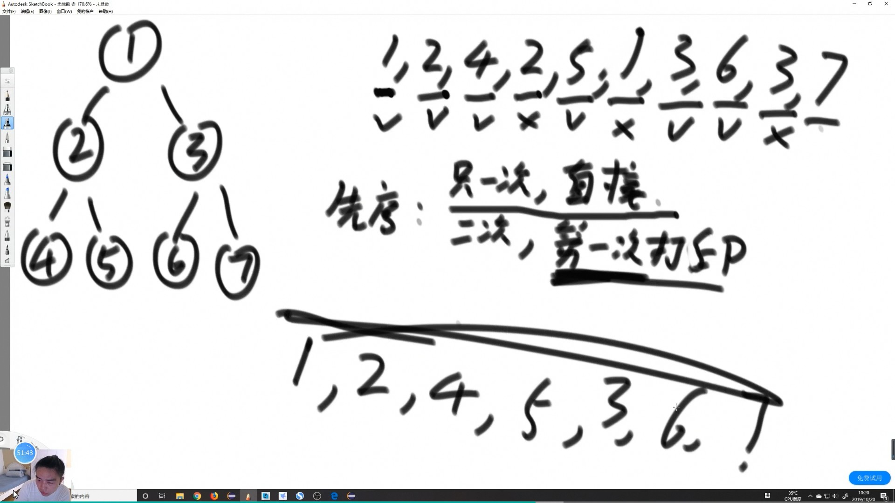
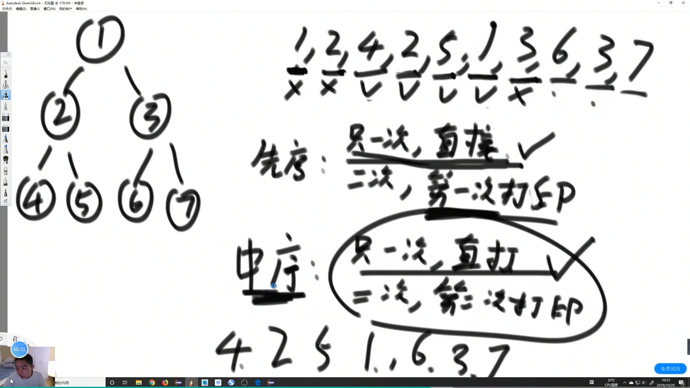
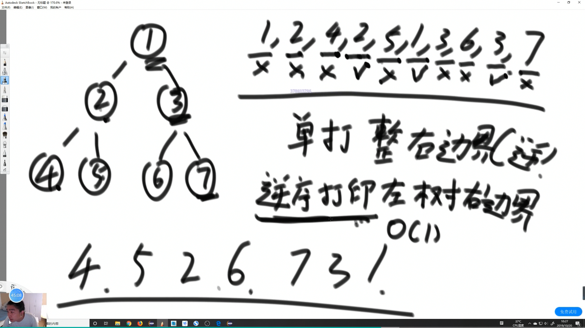

# Morris 遍历

遍历二叉树的一种方式

时间复杂度 O(N) 

空间复杂度 O(1)

利用Morris遍历实现二叉树的先序，中序，后序遍历，时间复杂度O(N)，额外空间复杂度O(1)。

利用了底层空闲的空间，在学术上称为线索二叉树

## Morris遍历细节

假设来到当前节点cur，开始时cur来到头节点位置

1. 如果cur没有左孩子，cur向右移动(cur = cur.right)

2. 如果cur有左孩子，找到左子树上最右的节点mostRight：
        
    a.如果mostRight的右指针指向空，让其指向cur，然后cur向左移动(cur = cur.left)
    
    b.如果mostRight的右指针指向cur，让其指向null，然后cur向右移动(cur = cur.right)

3. cur为空时遍历停止

原理:

    对于没有左子树的节点只到达一次，对于有左子树的节点会到达两次

空间当然是 O(1) 时间 O(N)数量级

```java
	public static void morris(Node head) {
		if (head == null) {
			return;
		}
		Node cur = head;
		Node mostRight = null;
		while (cur != null) { // 过流程
			mostRight = cur.left; // mostRight是cur左孩子
			if (mostRight != null) { // 有左子树
				while (mostRight.right != null && mostRight.right != cur) {
					mostRight = mostRight.right;
				}
				// mostRight变成了cur左子树上，最右的节点
				if (mostRight.right == null) { // 这是第一次来到cur
					mostRight.right = cur;
					cur = cur.left;
					continue;
				} else { // mostRight.right == cur
					mostRight.right = null;
				}
			}
			cur = cur.right;
		}
	}
```
## Morris 序


如图所示二叉树 Morris序为 

    1,2,4,2,5,1,3,6,3,7

先序遍历:



    只出现一次的点 直接打印
    出现两次的点   第一次打印

    1,2,4,5,3,6,7
```java
	public static void morrisPre(Node head) {
		if (head == null) {
			return;
		}
		Node cur = head;
		Node mostRight = null;
		while (cur != null) { // 过流程
			mostRight = cur.left; // mostRight是cur左孩子
			if (mostRight != null) { // 有左子树
				while (mostRight.right != null && mostRight.right != cur) {
					mostRight = mostRight.right;
				}
				// mostRight变成了cur左子树上，最右的节点
				if (mostRight.right == null) { // 这是第一次来到cur
                    // 操作
					System.out.println(cur.value);
					mostRight.right = cur;
					cur = cur.left;
					continue;
				} else { // mostRight.right == cur
					mostRight.right = null;
				}
			} else { // 没有左子树的情况
                // 操作
				System.out.println(cur.value);
			}
			cur = cur.right;
		}
	}
```


中序遍历：



    只出现一次的点 直接打印
    出现二次的点   第二次打印

    4,2,5,1,6,3,7

```java
	public static void morrisIn(Node head) {
		if (head == null) {
			return;
		}
		Node cur = head;
		Node mostRight = null;
		while (cur != null) { // 过流程
			mostRight = cur.left; // mostRight是cur左孩子
			if (mostRight != null) { // 有左子树
				while (mostRight.right != null && mostRight.right != cur) {
					mostRight = mostRight.right;
				}
				// mostRight变成了cur左子树上，最右的节点
				if (mostRight.right == null) { // 这是第一次来到cur
					mostRight.right = cur;
					cur = cur.left;
					continue;
				} else { // mostRight.right == cur
					mostRight.right = null;
				}
			}
            // 在此操作
			System.out.println(cur.value);
			cur = cur.right;
		}
	}
```
### 后序遍历



    逆序打印左树的右边界

    单打印整个树的右边界 (逆序) 

    4，5，2，6，7，3，1

怎么做到后序？

后序遍历只关心能到自己两次的节点，第二次到达节点的时候逆序打印左子树的右边界，打印完成后，在整个函数退出前，单独打印整课树的右边界，就是后序遍历。

怎么逆序打印整棵树右边界？

用类似逆转链表的方式，把指针修改，打印完，再调整回去。

Caution
    
    你要实现 O(1)的空间 别用栈来搞逆序

```java
	public static void morrisPos(Node head) {
		if (head == null) {
			return;
		}
		Node cur = head;
		Node mostRight = null;
		while (cur != null) {
			mostRight = cur.left;
			if (mostRight != null) {
				while (mostRight.right != null && mostRight.right != cur) {
					mostRight = mostRight.right;
				}
				if (mostRight.right == null) {
					mostRight.right = cur;
					cur = cur.left;
					continue;
				} else {
					mostRight.right = null;
                    // 操作
					printEdge(cur.left);
				}
			}
			cur = cur.right;
		}
        // 操作
		printEdge(head);
		System.out.println();
	}

	// 以X为头的树，逆序打印这棵树的右边界
	public static void printEdge(Node X) {
		Node tail = reverseEdge(X);
		Node cur = tail;
		while (cur != null) {
            // 逻辑写在这里
			System.out.print(cur.value + " ");
			cur = cur.right;
		}
		reverseEdge(tail);
	}

    // 类似于单链表逆序
	public static Node reverseEdge(Node from) {
		Node pre = null;
		Node next = null;
		while (from != null) {
			next = from.right;
			from.right = pre;
			pre = from;
			from = next;
		}
		return pre;
	}
```

### 用 Morris 判 isBST

BST 从`中序遍历`看就是 是否单调增

```java
	public static boolean isBST(Node head) {
		if (head == null) {
			return true;
		}
		Node cur = head;
		Node mostRight = null;
		int preValue = Integer.MIN_VALUE;
		while (cur != null) { // 过流程
			mostRight = cur.left; // mostRight是cur左孩子
			if (mostRight != null) { // 有左子树
				while (mostRight.right != null && mostRight.right != cur) {
					mostRight = mostRight.right;
				}
				// mostRight变成了cur左子树上，最右的节点
				if (mostRight.right == null) { // 这是第一次来到cur
					mostRight.right = cur;
					cur = cur.left;
					continue;
				} else { // mostRight.right == cur
					mostRight.right = null;
				}
			}
            // 判断逻辑 放这里
			if(cur.value <= preValue) {
				return false;
			}
			preValue = cur.value;
			cur = cur.right;
		}
		return true;
	}
```
### 用 Morris 
