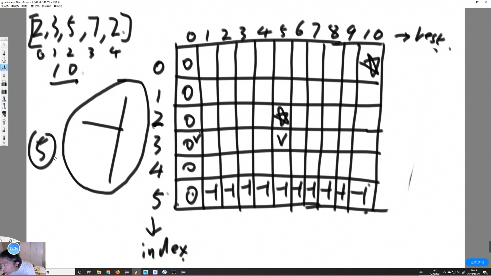

# 方法

轨迹

1. 尝试方法 try 递归
2. 记忆化搜索 dp
3. 严格表结构优化 dp 某些问题和记忆化搜索一样
4. 严格表精简版 dp

### 暴力递归

找组合的方式

    1. 可变参数的维度 一般都是 0 维 ( int ) 这样比较好写 约束范围
    1. 可变参数的个数 (递归函数里的个数 = dp遍历的维度)

### 记忆化搜索

暴力递归加缓存

几个可变参数 几维缓存表

### 严格表结构

画出DP表

    1. 列出可变参数 和 可变参数的约束 当维度
    2. 找到最终位置
    3. 根据 basecase 找限制返回
    4. 找出位置依赖
    5. 确定严格表的计算顺序

### 位置依赖的顺序

斜率优化 四边形不等式 等