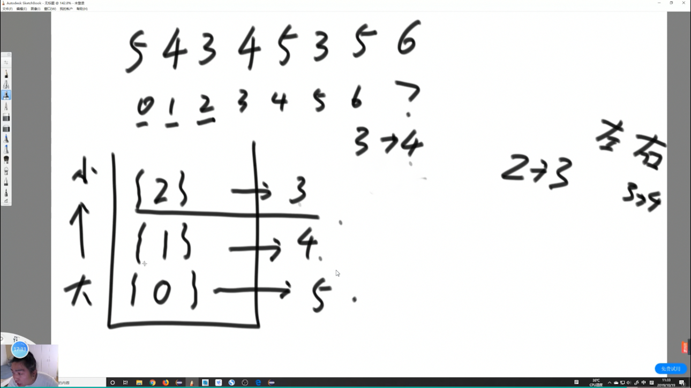

## 单调栈

一个 单调增 \ 单调减 的栈

用在 O(N) 来找在一个数组中，所有的数左/右边距离最近的比他大的数。

一般单调栈里 放的是 `数组下标`



使用

    自然就是从栈顶读出来一个元素，该元素满足单调性的某一端。

    弹出的时候生成信息。

    让他弹出的是右边比他大的，他下面的是左边最近比他大的。

    如果数组遍历完，就单独处理栈内的信息。单独弹出的右边为null，左边是底下的数。

.png)
特殊情况：

    相同的数，压在一起。

    相等情况，不会有影响，下标压在一起，共同结算即可。

### 例题

### 题目
请根据每日 气温 列表，重新生成一个列表。对应位置的输出为：要想观测到更高的气温，至少需要等待的天数。如果气温在这之后都不会升高，请在该位置用 0 来代替。


例如，给定一个列表 temperatures = [73, 74, 75, 71, 69, 72, 76, 73]，你的输出应该是 [1, 1, 4, 2, 1, 1, 0, 0]。


- 提示：气温 列表长度的范围是 [1, 30000]。每个气温的值的均为华氏度，都是在 [30, 100] 范围内的整数。

来源：力扣（LeetCode）

链接：https://leetcode-cn.com/problems/daily-temperatures
### 思路

这可太单调栈了

### Code
```java
    class Solution {
        public int[] dailyTemperatures(int[] T) {
            if (T.length == 0) return null;
            // 不会吧不会吧 不会还有人用 
            // Stack<Integer> stack = new Stack<>();
            Deque<Integer> stack = new ArrayDeque<>();
            int[] res = new int[T.length];
            Arrays.fill(res, 0);
            for (int i = 0; i < T.length; i++) {
                // 用来看当前值 一般的 我们都存下标
                // 如果 T[i] > 栈顶元素 弹出 记录下两个下标 差就是 res
                while (!stack.isEmpty() && T[stack.peek()] < T[i]) {
                    int tmp = stack.pop();
                    res[tmp] = (i - tmp);
                }
                // while 循环 弹到大于他的 入栈
                stack.push(i);
            }
            return res;
        }
    }
```