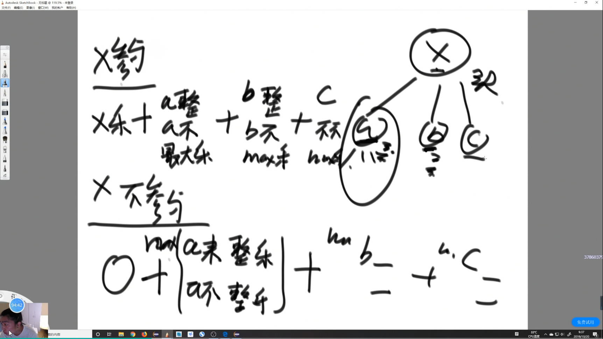

## 树形DP

本质上就是从子节点传递信息给父节点 头向左向右要信息 还是个递归

如果题目求解目标是S规则，则求解流程可以定成以每一个节点为头节点的子树在S规则下的每一个答案，并且最终答案一定在其中


1. 树形dp套路第一步：

    以某个节点X为头节点的子树中，分析答案有哪些可能性，并且这种分析是以X的左子树、X的右子树和X整棵树的角度来考虑可能性的

2. 树形dp套路第二步：

    根据第一步的可能性分析，列出所有需要的信息

3. 树形dp套路第三步：

    合并第二步的信息，对左树和右树提出同样的要求，并写出信息结构

4. 树形dp套路第四步：

    设计递归函数，递归函数是处理以X为头节点的情况下的答案。包括设计递归的basecase，默认直接得到左树和右树的所有信息，以及把可能性做整合，并且要返回第三步的信息结构这四个小步骤


常见可能性 头节点参不参与


### 叉树节点间的最大距离问题

从二叉树的节点a出发，可以向上或者向下走，但沿途的节点只能经过一次，到达节点b时路径上的节点个数叫作a到b的距离，那么二叉树任何两个节点之间都有距离，求整棵树上的最大距离。

列可能性：

    1、来自左子树最长距离

    2、来自右子树最长距离

    3、经过X的情况下的最远距离，左树最深+右树最深+1

需要收集信息：

    1、最长距离

    2、深度

```java
public class Code02_MaxDistanceInTree {

	public static class Node {
		public int value;
		public Node left;
		public Node right;

		public Node(int data) {
			this.value = data;
		}
	}
	
	
	public static int maxDistance(Node head) {
		return process(head).maxDistance;
	}
	
	public static class Info{
		public int maxDistance;
		public int height;
		public Info(int dis, int h) {
			maxDistance = dis;
			height  = h;
		}
	}
	
	// 返回以x为头的整棵树，两个信息
	public static Info process(Node x) {
		if(x == null) {
			return new Info(0,0);
		}
		Info leftInfo = process(x.left);
		Info rightInfo = process(x.right);
		// info
		int p1 = leftInfo.maxDistance;
		int p2 = rightInfo.maxDistance;
		int p3 = leftInfo.height + 1 + rightInfo.height;
		int maxDistance = Math.max(p3, Math.max(p1, p2));
		int height = Math.max(leftInfo.height, rightInfo.height) + 1 ;
		return new Info(maxDistance, height);
	}


	public static void main(String[] args) {
		Node head1 = new Node(1);
		head1.left = new Node(2);
		head1.right = new Node(3);
		head1.left.left = new Node(4);
		head1.left.right = new Node(5);
		head1.right.left = new Node(6);
		head1.right.right = new Node(7);
		head1.left.left.left = new Node(8);
		head1.right.left.right = new Node(9);
		System.out.println(maxDistance(head1));

		Node head2 = new Node(1);
		head2.left = new Node(2);
		head2.right = new Node(3);
		head2.right.left = new Node(4);
		head2.right.right = new Node(5);
		head2.right.left.left = new Node(6);
		head2.right.right.right = new Node(7);
		head2.right.left.left.left = new Node(8);
		head2.right.right.right.right = new Node(9);
		System.out.println(maxDistance(head2));

	}

}
```


### 派对的最大快乐值

员工信息的定义如下:
```
class Employee {
    public int happy; // 这名员工可以带来的快乐值
    List<Employee> subordinates; // 这名员工有哪些直接下级
}
```

公司的每个员工都符合 Employee 类的描述。整个公司的人员结构可以看作是一棵标准的、 没有环的

多叉树。树的头节点是公司唯一的老板。除老板之外的每个员工都有唯一的直接上级。 叶节点是没有

任何下属的基层员工(subordinates列表为空)，除基层员工外，每个员工都有一个或多个直接下级。

这个公司现在要办party，你可以决定哪些员工来，哪些员工不来。但是要遵循如下规则。

   1. 如果某个员工来了，那么这个员工的所有直接下级都不能来

   2. 派对的整体快乐值是所有到场员工快乐值的累加

   3. 你的目标是让派对的整体快乐值尽量大给定一棵多叉树的头节点boss，请返回派对的最大快乐值。




可能性

    1、X来，活跃度就是x乐+(x1不来整体的max乐)+(x2不来整体的max乐)+(x3不来整体的max乐)的总和。

    2、X不来，活跃度就是(x1/x2/x3来和不来)中最大的总和。

收集信息：

    1、一棵树在头结点来的活跃度

    2、一棵树在头结点不来的活跃度

```java
import java.util.List;

public class Code03_MaxHappy {

	public static int maxHappy(int[][] matrix) {
		int[][] dp = new int[matrix.length][2];
		boolean[] visited = new boolean[matrix.length];
		int root = 0;
		for (int i = 0; i < matrix.length; i++) {
			if (i == matrix[i][0]) {
				root = i;
			}
		}
		process(matrix, dp, visited, root);
		return Math.max(dp[root][0], dp[root][1]);
	}

	public static void process(int[][] matrix, int[][] dp, boolean[] visited, int root) {
		visited[root] = true;
		dp[root][1] = matrix[root][1];
		for (int i = 0; i < matrix.length; i++) {
			if (matrix[i][0] == root && !visited[i]) {
				process(matrix, dp, visited, i);
				dp[root][1] += dp[i][0];
				dp[root][0] += Math.max(dp[i][1], dp[i][0]);
			}
		}
	}
	
	public static class Employee { 
		public int happy; // 这名员工可以带来的快乐值 
	    public List<Employee> nexts; // 这名员工有哪些直接下级 
	}
	
	
	public static int maxHappy(Employee boss) {
		Info headInfo = process(boss);
		return Math.max(headInfo.laiMaxHappy, headInfo.buMaxHappy);
	}
	
	public static class Info{
		public int laiMaxHappy;
		public int buMaxHappy;
		public Info(int lai, int bu) {
			laiMaxHappy = lai;
			buMaxHappy = bu;
		}
	}
	
	public static Info process(Employee x) {
		if(x.nexts.isEmpty()) { // x是基层员工的时候
			return new Info(x.happy,0);
		}
		int lai = x.happy; // x来的情况下，整棵树最大收益
		int bu = 0; // x不来的情况下，整棵树最大收益
		for(Employee next : x.nexts) {
			Info nextInfo = process(next);
			lai += nextInfo.buMaxHappy;
			bu += Math.max(nextInfo.laiMaxHappy, nextInfo.buMaxHappy);
		}
		return new Info(lai,bu);
	}
	
	
	
	
	
	
	

	public static void main(String[] args) {
		int[][] matrix = { { 1, 8 }, { 1, 9 }, { 1, 10 } };
		System.out.println(maxHappy(matrix));
	}
}
```