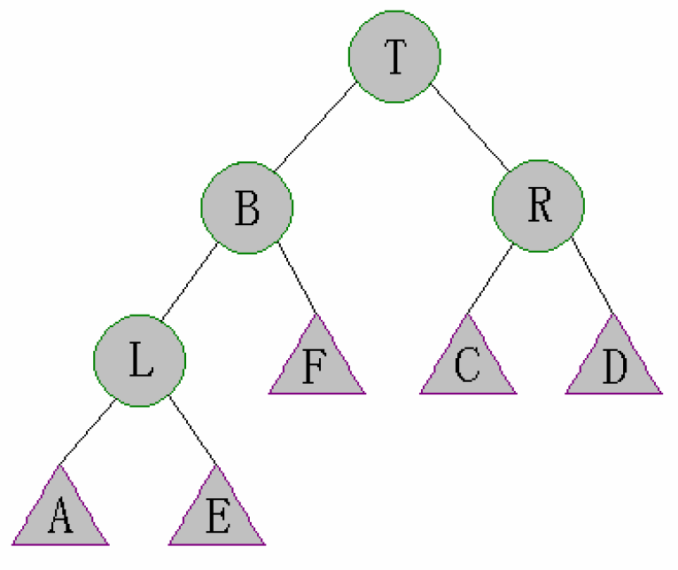

## 有序表 

操作 O(logN)

实现 红黑树 AVL SB树(sizeBalance) 跳表(skipList)

三个BST 一个多链表


### BST

查找 

新增 

删除

没有平衡性 直接退化成链表


### AVL

左旋 

头节点到左边


右旋

和上相反


AVL 平衡性检查时机

增加时 从`加的点从下往上`

删除时 从`删的点上面的节点`

##### 破坏平衡的情况 O(1)
1. LL

2. RR

3. LR 
   
4. RL


### 红黑树

判断平衡条件不一样

特性：

    1. 每个点 不是红就是黑
    2. 整个树的头 和 叶(底下null) 都是黑
    3. 红点不能相邻
    4. cur头部每条到叶节点 黑节点数量一样 (路径长度 最短和最长不差两倍以上)


### SB树

用法

`动态多次求第 k 的时候`

判断平衡条件不一样

平衡性：
    
    每个子树的大小，不小于其兄弟的子树的大小
    ~~每个叔叔树，不小于其任何侄子树的大小~~
 
左旋右旋同 AVL

当孩子节点变化时 重新 M(cur) 递归操作


#### LL
    
    1. 右旋
    2. M（T）
    3. M（L)


首先对 t 进行右旋，此时 t 更新成了原图中的 L


则对于图中的 T，其子树不一定满足性质，需要 Maintain (T)

当 T 调整完之后，T 的子树与 L 可能也不一定满足性质，需要再次 Maintain (L)

#### RL


首先对 L 进行左旋



再右旋 T


经过上面两步操作之后，整棵树的结构可以说是完全改变了，具体形态也可能变得难以预测。但是根据左右旋的性质，我们可以保证上图的结果中 A、E、F、R 都是性质完好的 SBT，所以只要分别 Maintain (L) 和 Maintain (T) 即可。

经过上面那一步，我们能保证 L 和 T 以及其子树都是性质完好了，但是它们之间的任然不能确保，所以需要再 Maintain (B) 一次。

左旋右旋差不多 就是要从 新检查平衡

### 跳表

默认节点 Integer.MIN 只有默认节点才能扩充

    进去的节点 roll 向后的指针数


### Treap 树堆

treap 是一种弱平衡的二叉搜索树。treap 这个单词是 tree 和 heap 的组合，表明 treap 是一种由树和堆组合形成的数据结构。treap 的每个结点上要额外储存一个值 Priority 。

treap 除了要满足二叉搜索树的性质之外，还需满足父节点的 Priority 大于等于两个儿子的 Priority。而 Priority 是每个结点建立时随机生成的，因此 treap 是期望平衡的。

treap 分为旋转式和无旋式两种，这里讲的是 `旋转式` 的

Every node of Treap maintains two values.

1) Key Follows standard BST ordering (left is smaller and right is greater)

2) Priority Randomly assigned value that follows Max-Heap property.

Basic Operation on Treap:
Like other self-balancing Binary Search Trees, Treap uses rotations to maintain Max-Heap property during insertion and deletion.

```
T1, T2 and T3 are subtrees of the tree rooted with y (on left side) 
or x (on right side)           
                y                               x
               / \     Right Rotation          /  \
              x   T3   – – – – – – – >        T1   y 
             / \       < - - - - - - -            / \
            T1  T2     Left Rotation            T2  T3
Keys in both of the above trees follow the following order 
      keys(T1) < key(x) < keys(T2) < key(y) < keys(T3)
So BST property is not violated anywhere. 
```


Insert(x):

1. Create new node with key equals to x and value equals to a random value.
2. Perform standard BST insert.
3. Use rotations to make sure that inserted node's priority follows max heap property.


Delete(x):

1. If node to be deleted is a leaf, delete it.
2. Else replace node's priority with minus infinite ( -INF ), and do appropriate rotations to bring the node down to a leaf.


```java
        class Treap {
            private static class TreeNode {
                long value;
                int priority;
                int count;
                int size;
                TreeNode left;
                TreeNode right;

                TreeNode(long value, int priority) {
                    this.value = value;
                    this.priority = priority;
                    this.count = 1;
                    this.size = 1;
                }

                TreeNode leftRotate() {
                    int preSize = size;
                    int curSize = (left == null ? 0 : left.size) + (right.left == null ? 0 : right.left.size) + count;
                    TreeNode root = right;
                    right = root.left;
                    root.left = this;
                    this.size = curSize;
                    root.size = preSize;
                    return root;
                }

                TreeNode rightRotate() {
                    int preSize = size;
                    int curSize = (right == null ? 0 : right.size) + (left.right == null ? 0 : left.right.size) + count;
                    TreeNode root = left;
                    left = root.right;
                    root.right = this;
                    this.size = curSize;
                    root.size = preSize;
                    return root;
                }
            }

            private TreeNode root;
            private final Random random;

            public Treap() {
                this.random = new Random();
            }

            public int getSize() {
                return root == null ? 0 : root.size;
            }

            public void insert(long x) {
                root = insert(root, x);
            }

            private TreeNode insert(TreeNode root, long x) {
                if (root == null)
                    return new TreeNode(x, random.nextInt());
                root.size++;
                if (x < root.value) {
                    root.left = insert(root.left, x);
                    if (root.left.priority > root.priority) {
                        root = root.rightRotate();
                    }
                } else if (x > root.value) {
                    root.right = insert(root.right, x);
                    if (root.right.priority > root.priority) {
                        root = root.leftRotate();
                    }
                } else {
                    root.count++;
                }
                return root;
            }

            public long lowerBound(long x) { //第一个大于等于x的数(从小到大排序)
                long ret = Long.MAX_VALUE;
                TreeNode node = root;
                while (node != null) {
                    if (node.value == x) {
                        return x;
                    } else if (node.value > x) {
                        ret = node.value;
                        node = node.left;
                    } else {
                        node = node.right;
                    }
                }
                return ret;
            }

            public long upperBound(long x) { //第一个大于x的数(从小到大排序)
                long ret = Long.MAX_VALUE;
                TreeNode node = root;
                while (node != null) {
                    if (node.value > x) {
                        ret = node.value;
                        node = node.left;
                    } else {
                        node = node.right;
                    }
                }
                return ret;
            }

            public int[] rank(long x) { //返回x的排名，从1开始。返回数组ret，ret[0]表示第一个x的rank，ret[1]表示最后一个x的rank。
                TreeNode node = root;
                int ans = 0;
                while (node != null) {
                    if (node.value > x) {
                        node = node.left;
                    } else {
                        ans += (node.left == null ? 0 : node.left.size) + node.count;
                        if (x == node.value) {
                            return new int[]{ans - node.count + 1, ans};
                        }
                        node = node.right;
                    }
                }
                return new int[]{Integer.MIN_VALUE, Integer.MAX_VALUE};
            }

            public void delete(int val) {
                root = delete(root, val);
            }

            private TreeNode delete(TreeNode root, int value) {
                if (root == null)
                    return null;
                if (root.value > value) {
                    root.left = delete(root.left, value);
                } else if (root.value < value) {
                    root.right = delete(root.right, value);
                } else {
                    if (root.count > 1) {
                        root.count--;
                        root.size--;
                        return root;
                    }
                    if (root.left == null || root.right == null) {
                        root.size--;
                        return root.left == null ? root.right : root.left;
                    } else if (root.left.priority > root.right.priority) {
                        root = root.rightRotate();
                        root.right = delete(root.right, value);

                    } else {
                        root = root.leftRotate();
                        root.left = delete(root.left, value);
                    }
                }
                root.size = (root.left == null ? 0 : root.left.size) + (root.right == null ? 0 : root.right.size) + root.count;
                return root;

            }

            public boolean contains(long value) {
                return contains(root, value);
            }

            private boolean contains(TreeNode root, long value) {
                if (root == null)
                    return false;
                if (root.value == value)
                    return true;
                else if (root.value > value) {
                    return contains(root.left, value);
                } else {
                    return contains(root.right, value);
                }
            }
        }
```

### ~~Splay Tree 差不多得了 我又不搞比赛~~

