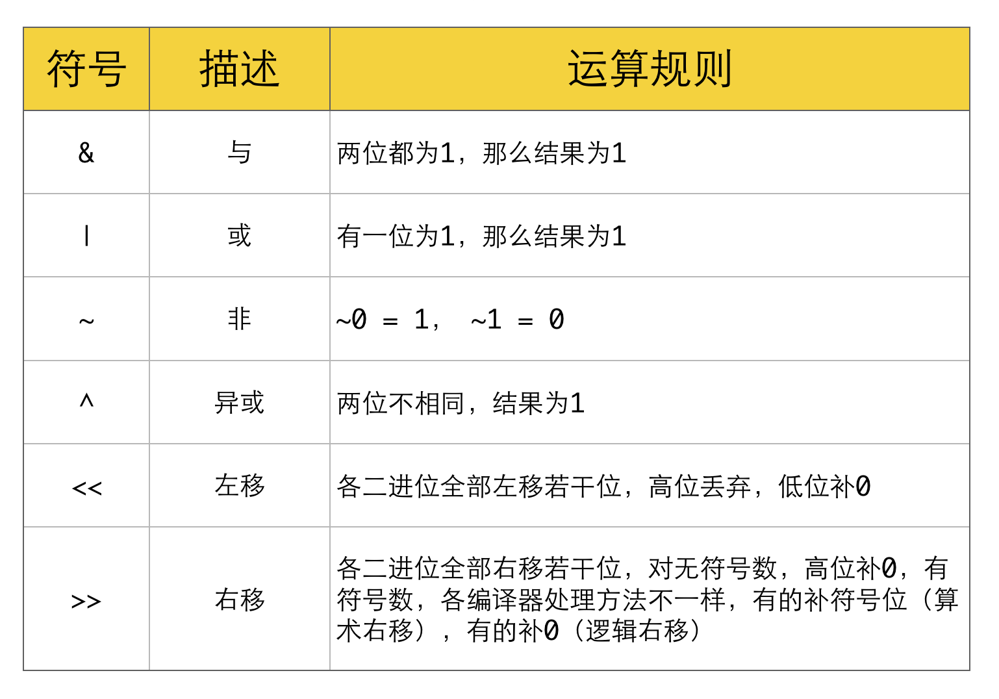

### 题目

颠倒给定的 32 位无符号整数的二进制位。

 

提示：

请注意，在某些语言（如 Java）中，没有无符号整数类型。在这种情况下，输入和输出都将被指定为有符号整数类型，并且不应影响您的实现，因为无论整数是有符号的还是无符号的，其内部的二进制表示形式都是相同的。
在 Java 中，编译器使用二进制补码记法来表示有符号整数。因此，在上面的 示例 2 中，输入表示有符号整数 -3，输出表示有符号整数 -1073741825。
 

进阶:
如果多次调用这个函数，你将如何优化你的算法？

示例 1：
```
输入: 00000010100101000001111010011100
输出: 00111001011110000010100101000000
解释: 输入的二进制串 00000010100101000001111010011100 表示无符号整数 43261596，
     因此返回 964176192，其二进制表示形式为 00111001011110000010100101000000。
```
示例 2：
```
输入：11111111111111111111111111111101
输出：10111111111111111111111111111111
解释：输入的二进制串 11111111111111111111111111111101 表示无符号整数 4294967293，
     因此返回 3221225471 其二进制表示形式为 10111111111111111111111111111111 。
```
示例 1：
```
输入：n = 00000010100101000001111010011100
输出：964176192 (00111001011110000010100101000000)
解释：输入的二进制串 00000010100101000001111010011100 表示无符号整数 43261596，
     因此返回 964176192，其二进制表示形式为 00111001011110000010100101000000。
```
示例 2：
```
输入：n = 11111111111111111111111111111101
输出：3221225471 (10111111111111111111111111111111)
解释：输入的二进制串 11111111111111111111111111111101 表示无符号整数 4294967293，
     因此返回 3221225471 其二进制表示形式为 10111111111111111111111111111111 。
```

提示：

- 输入是一个长度为 32 的二进制字符串

链接：https://leetcode-cn.com/problems/reverse-bits

### 思路

位运算都这样。。。 有几个常用的 取最低位的数字等。。。



常用位操作

判断奇偶
```
(x & 1) == 1 ---等价---> (x % 2 == 1)
(x & 1) == 0 ---等价---> (x % 2 == 0)
x / 2 ---等价---> x >> 1
x &= (x - 1) ------> 把x最低位的二进制1给去掉
x & -x -----> 得到最低位的1
x & ~x -----> 0
```

指定位置的位运算
```
将X最右边的n位清零：x & (~0 << n)
获取x的第n位值：(x >> n) & 1
获取x的第n位的幂值：x & (1 << n)
仅将第n位置为1：x | (1 << n)
仅将第n位置为0：x & (~(1 << n))
将x最高位至第n位（含）清零：x & ((1 << n) - 1)
将第n位至第0位（含）清零：x & (~((1 << (n + 1)) - 1))
```
异或结合律
```
x ^ 0 = x, x ^ x = 0
x ^ (~0) = ~x, x ^ (~x) = ~0
a ^ b = c, a ^ c = b, b ^ c = a

(有没有点乘法结合律的意思)
字母表示：(a ^ b) ^ c = a ^ (b ^ c)
图形表示：(☆ ^ ◇) ^ △ = ☆ ^ (◇ ^ △)
```

还有个 Integer.reverse()的源码
### Code
```java
    public class Solution {
        public int reverseBits(int n) {
            int len = 32;
            int res = 0;
            // 他就是 从左往右变成从右往左
            while (len > 0) {
                // n 从右往左取 取最右一位
                // res 左移  n 右移
                res <<= 1;
                res += (n & 1);
                n >>= 1;
                len--;
            }
            return res;
        }
    }
```

```java
public class Solution {
    private static final int M1 = 0x55555555; // 01010101010101010101010101010101
    private static final int M2 = 0x33333333; // 00110011001100110011001100110011
    private static final int M4 = 0x0f0f0f0f; // 00001111000011110000111100001111
    private static final int M8 = 0x00ff00ff; // 00000000111111110000000011111111

    public int reverseBits(int n) {
        n = n >>> 1 & M1 | (n & M1) << 1;
        n = n >>> 2 & M2 | (n & M2) << 2;
        n = n >>> 4 & M4 | (n & M4) << 4;
        n = n >>> 8 & M8 | (n & M8) << 8;
        return n >>> 16 | n << 16;
    }
}
```
*** 
### 收获
