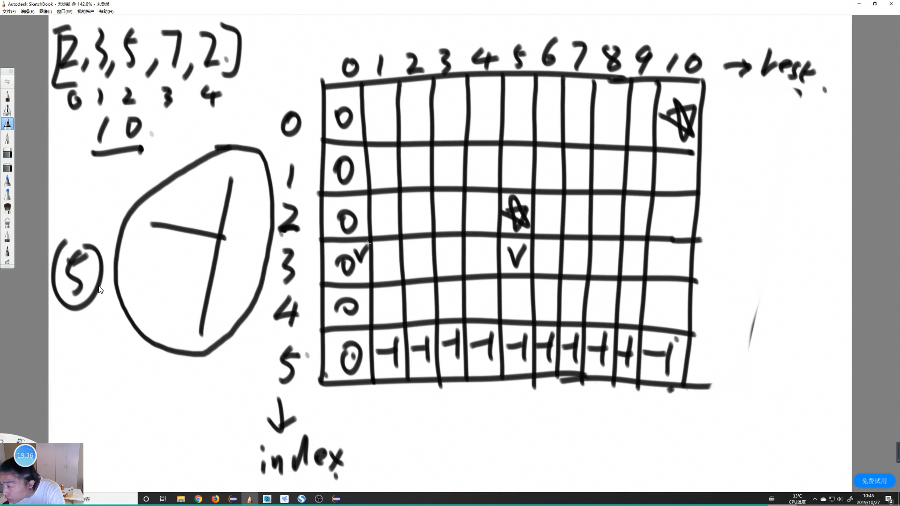

- [方法](#方法)
	- [暴力递归](#暴力递归)
	- [记忆化搜索](#记忆化搜索)
	- [严格表结构](#严格表结构)
	- [位置依赖的顺序](#位置依赖的顺序)
		- [例子](#例子)
# 方法

轨迹

1. 尝试方法 try 递归
2. 记忆化搜索 dp
3. 严格表结构优化 dp 某些问题和记忆化搜索一样
4. 严格表精简版 dp



## 暴力递归

找组合的方式

    1. 可变参数的维度 一般都是 0 维 ( int ) 这样比较好写 约束范围
    1. 可变参数的个数 (递归函数里的个数 = dp遍历的维度)

## 记忆化搜索

暴力递归加缓存

几个可变参数 几维缓存表


## 严格表结构

画出DP表

    1. 列出可变参数 和 可变参数的约束 当维度
    2. 找到最终位置
    3. 根据 basecase 找限制返回
    4. 找出位置依赖
    5. 确定严格表的计算顺序

## 位置依赖的顺序

斜率优化 四边形不等式 等


### 例子
【题目】

给定数组 arr，arr 中所有的值都为正数且不重复。每个值代表一种面值的货币，每种面值的货币可以使用任意张，再给定一个整数 aim，代表要找的钱数，求组成 aim 的最少货币数。

【举例】

arr=[5,2,3]，aim=20。

    4 张 5 元可以组成 20 元，其他的找钱方案都要使用更多张的货币，所以返回 4。
arr=[5,2,3]，aim=0。

    不用任何货币就可以组成 0 元，返回 0。
arr=[3,5]，aim=2。
    
    根本无法组成 2 元，钱不能找开的情况下默认返回-1。


1. 暴力
2. 记忆化搜索
3. DP表找规律

```java
public class Code02_CoinsMin {

	public static int minCoins1(int[] arr, int aim) {
		return process1(arr, 0, aim);
	}

	// arr[index...] 组成出rest这么多钱，最少的硬币数量返回
	public static int process1(int[] arr, int index, int rest) {
		if (rest < 0) {
			return -1;
		}
		if (rest == 0) {
			return 0;
		}
		// rest > 0
		if (index == arr.length) {
			return -1;
		}
		// rest > 0 并且 也有硬币
		int p1 = process1(arr, index + 1, rest);
		int p2Next = process1(arr, index + 1, rest - arr[index]);
		if (p1 == -1 && p2Next == -1) {
			return -1;
		} else {
			if (p1 == -1) {
				return p2Next + 1;
			}
			if (p2Next == -1) {
				return p1;
			}
			return Math.min(p1, p2Next + 1);
		}
	}

	public static int minCoins2(int[] arr, int aim) {
		int[][] dp = new int[arr.length + 1][aim + 1];
		for (int i = 0; i <= arr.length; i++) {
			for (int j = 0; j <= aim; j++) {
				dp[i][j] = -2;
			}
		}

		return process2(arr, 0, aim, dp);
	}

	// arr[index...] 组成出rest这么多钱，最少的硬币数量返回
	public static int process2(int[] arr, int index, int rest, int[][] dp) {
		if (rest < 0) {
			return -1;
		}
		if (dp[index][rest] != -2) {
			return dp[index][rest];
		}
		if (rest == 0) {
			dp[index][rest] = 0;
		} else if (index == arr.length) {
			dp[index][rest] = -1;
		} else {
			int p1 = process2(arr, index + 1, rest, dp);
			int p2Next = process2(arr, index + 1, rest - arr[index], dp);
			if (p1 == -1 && p2Next == -1) {
				dp[index][rest] = -1;
			} else {
				if (p1 == -1) {
					dp[index][rest] = p2Next + 1;
				} else if (p2Next == -1) {
					dp[index][rest] = p1;
				} else {
					dp[index][rest] = Math.min(p1, p2Next + 1);
				}
			}

		}
		return dp[index][rest];
	}

	public static int minCoins3(int[] arr, int aim) {
		int N = arr.length;
		int[][] dp = new int[N + 1][aim + 1];
		for (int row = 0; row <= N; row++) {
			dp[row][0] = 0;
		}
		for (int col = 1; col <= aim; col++) {
			dp[N][col] = -1;
		}
		for (int index = N - 1; index >= 0; index--) {
			for (int rest = 1; rest <= aim; rest++) {
				int p1 = dp[index + 1][rest];
				int p2Next = -1;
				if (rest - arr[index] >= 0) {
					p2Next = dp[index + 1][rest - arr[index]];
				}
				if (p1 == -1 && p2Next == -1) {
					dp[index][rest] = -1;
				} else {
					if (p1 == -1) {
						dp[index][rest] = p2Next + 1;
					} else if (p2Next == -1) {
						dp[index][rest] = p1;
					} else {
						dp[index][rest] = Math.min(p1, p2Next + 1);
					}
				}
			}
		}
		return dp[0][aim];
	}
```