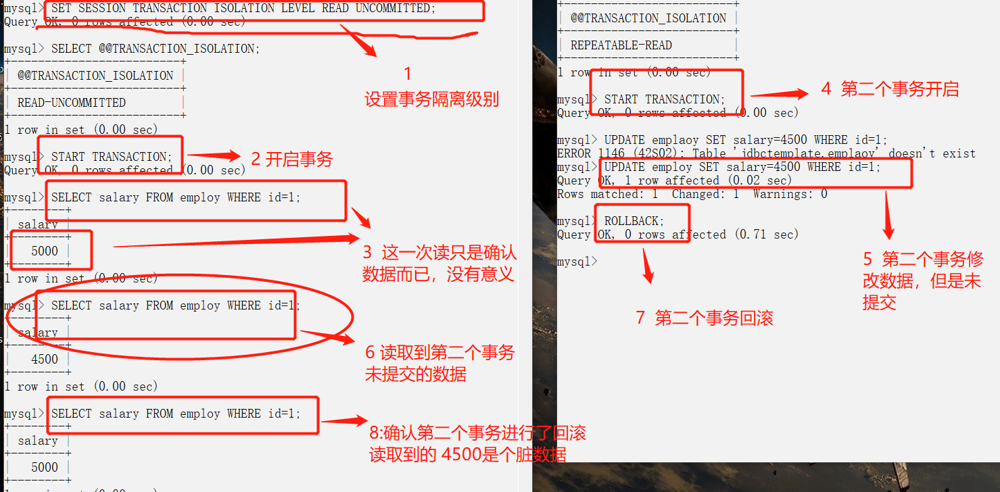
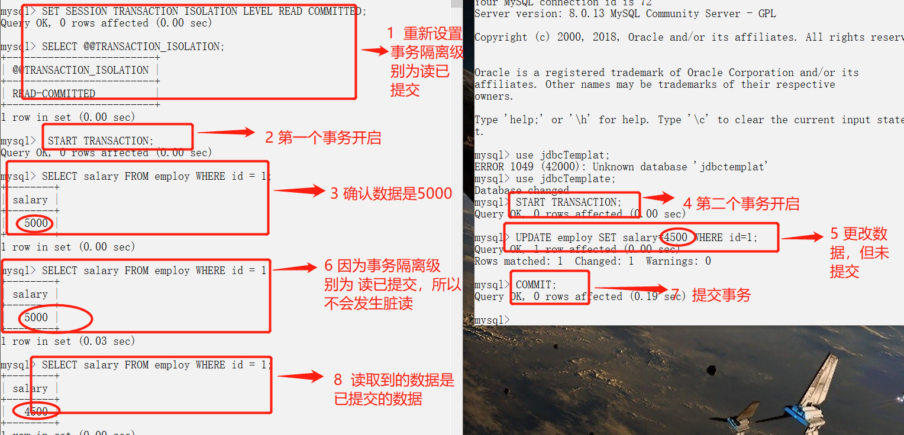
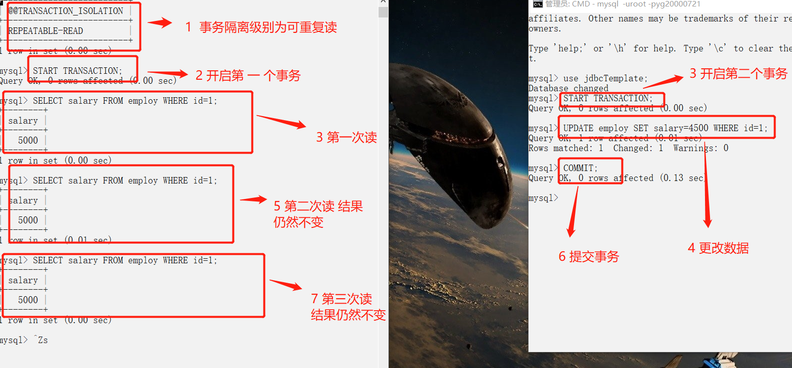

## 事务隔离级别(图文详解)

### 什么是事务?

事务是逻辑上的一组操作，要么都执行，要么都不执行。

事务最经典也经常被拿出来说例子就是转账了。假如小明要给小红转账1000元，这个转账会涉及到两个关键操作就是：将小明的余额减少1000元，将小红的余额增加1000元。万一在这两个操作之间突然出现错误比如银行系统崩溃，导致小明余额减少而小红的余额没有增加，这样就不对了。事务就是保证这两个关键操作要么都成功，要么都要失败。

### 事务的特性(ACID)


1.  **原子性：** 事务是最小的执行单位，不允许分割。事务的原子性确保动作要么全部完成，要么完全不起作用；
2.  **一致性：** 执行事务前后，数据保持一致，例如转账业务中，无论事务是否成功，转账者和收款人的总额应该是不变的；
3.  **隔离性：** 并发访问数据库时，一个用户的事务不被其他事务所干扰，各并发事务之间数据库是独立的；
4.  **持久性：** 一个事务被提交之后。它对数据库中数据的改变是持久的，即使数据库发生故障也不应该对其有任何影响。

### 并发事务带来的问题

在典型的应用程序中，多个事务并发运行，经常会操作相同的数据来完成各自的任务（多个用户对统一数据进行操作）。并发虽然是必须的，但可能会导致以下的问题。

- **脏读（Dirty read）:** 当一个事务正在访问数据并且对数据进行了修改，而这种修改还没有提交到数据库中，这时另外一个事务也访问了这个数据，然后使用了这个数据。因为这个数据是还没有提交的数据，那么另外一个事务读到的这个数据是“脏数据”，依据“脏数据”所做的操作可能是不正确的。
- **丢失修改（Lost to modify）:** 指在一个事务读取一个数据时，另外一个事务也访问了该数据，那么在第一个事务中修改了这个数据后，第二个事务也修改了这个数据。这样第一个事务内的修改结果就被丢失，因此称为丢失修改。	例如：事务1读取某表中的数据A=20，事务2也读取A=20，事务1修改A=A-1，事务2也修改A=A-1，最终结果A=19，事务1的修改被丢失。
- **不可重复读（Unrepeatableread）:** 指在一个事务内多次读同一数据。在这个事务还没有结束时，另一个事务也访问该数据。那么，在第一个事务中的两次读数据之间，由于第二个事务的修改导致第一个事务两次读取的数据可能不太一样。这就发生了在一个事务内两次读到的数据是不一样的情况，因此称为不可重复读。
- **幻读（Phantom read）:** 幻读与不可重复读类似。它发生在一个事务（T1）读取了几行数据，接着另一个并发事务（T2）插入了一些数据时。在随后的查询中，第一个事务（T1）就会发现多了一些原本不存在的记录，就好像发生了幻觉一样，所以称为幻读。

**不可重复度和幻读区别：**

不可重复读的重点是修改，幻读的重点在于新增或者删除。

例1（同样的条件, 你读取过的数据, 再次读取出来发现值不一样了 ）：事务1中的A先生读取自己的工资为     1000的操作还没完成，事务2中的B先生就修改了A的工资为2000，导        致A再读自己的工资时工资变为  2000；这就是不可重复读。

 例2（同样的条件, 第1次和第2次读出来的记录数不一样 ）：假某工资单表中工资大于3000的有4人，事务1读取了所有工资大于3000的人，共查到4条记录，这时事务2 又插入了一条工资大于3000的记录，事务1再次读取时查到的记录就变为了5条，这样就导致了幻读。

### 事务隔离级别

**SQL 标准定义了四个隔离级别：**

- **READ-UNCOMMITTED(读取未提交)：** 最低的隔离级别，允许读取尚未提交的数据变更，**可能会导致脏读、幻读或不可重复读**。
- **READ-COMMITTED(读取已提交)：** 允许读取并发事务已经提交的数据，**可以阻止脏读，但是幻读或不可重复读仍有可能发生**。
- **REPEATABLE-READ(可重复读)：**  对同一字段的多次读取结果都是一致的，除非数据是被本身事务自己所修改，**可以阻止脏读和不可重复读，但幻读仍有可能发生**。
- **SERIALIZABLE(可串行化)：** 最高的隔离级别，完全服从ACID的隔离级别。所有的事务依次逐个执行，这样事务之间就完全不可能产生干扰，也就是说，**该级别可以防止脏读、不可重复读以及幻读**。

----

| 隔离级别 | 脏读 | 不可重复读 | 幻影读 |
| :---: | :---: | :---:| :---: |
| READ-UNCOMMITTED | √ | √ | √ |
| READ-COMMITTED | × | √ | √ |
| REPEATABLE-READ | × | × | √ |
| SERIALIZABLE | × | × | × |

MySQL InnoDB 存储引擎的默认支持的隔离级别是 **REPEATABLE-READ（可重读）**。我们可以通过`SELECT @@tx_isolation;`命令来查看,MySQL 8.0 该命令改为`SELECT @@transaction_isolation;`

```sql
mysql> SELECT @@tx_isolation;
+-----------------+
| @@tx_isolation  |
+-----------------+
| REPEATABLE-READ |
+-----------------+
```

这里需要注意的是：与 SQL 标准不同的地方在于InnoDB 存储引擎在 **REPEATABLE-READ（可重读）** 事务隔离级别下，允许应用使用 Next-Key Lock 锁算法来避免幻读的产生。这与其他数据库系统(如 SQL Server)是不同的。所以说虽然 InnoDB 存储引擎的默认支持的隔离级别是 **REPEATABLE-READ（可重读）** ，但是可以通过应用加锁读（例如 `select * from table for update` 语句）来保证不会产生幻读，而这个加锁度使用到的机制就是 Next-Key Lock 锁算法。从而达到了 SQL 标准的 **SERIALIZABLE(可串行化)** 隔离级别。

因为隔离级别越低，事务请求的锁越少，所以大部分数据库系统的隔离级别都是**READ-COMMITTED(读取提交内容):**，但是你要知道的是InnoDB 存储引擎默认使用 **REPEATABLE-READ（可重读）** 并不会有任何性能损失。

InnoDB 存储引擎在 **分布式事务** 的情况下一般会用到**SERIALIZABLE(可串行化)** 隔离级别。

### 实际情况演示

在下面我会使用 2 个命令行mysql ，模拟多线程（多事务）对同一份数据的脏读问题。

MySQL 命令行的默认配置中事务都是自动提交的，即执行SQL语句后就会马上执行 COMMIT 操作。如果要显式地开启一个事务需要使用命令：`START TARNSACTION`。

我们可以通过下面的命令来设置隔离级别。

```sql
SET [SESSION|GLOBAL] TRANSACTION ISOLATION LEVEL [READ UNCOMMITTED|READ COMMITTED|REPEATABLE READ|SERIALIZABLE]
```

我们再来看一下我们在下面实际操作中使用到的一些并发控制语句:

- `START TARNSACTION` |`BEGIN`：显式地开启一个事务。
- `COMMIT`：提交事务，使得对数据库做的所有修改成为永久性。
- `ROLLBACK`：回滚会结束用户的事务，并撤销正在进行的所有未提交的修改。

#### 脏读(读未提交)



#### 避免脏读(读已提交)



#### 不可重复读

还是刚才上面的读已提交的图，虽然避免了读未提交，但是却出现了，一个事务还没有结束，就发生了 不可重复读问题。


</div>

#### 可重复读



#### 防止幻读(可重复读)


一个事务对数据库进行操作，这种操作的范围是数据库的全部行，然后第二个事务也在对这个数据库操作，这种操作可以是插入一行记录或删除一行记录，那么第一个是事务就会觉得自己出现了幻觉，怎么还有没有处理的记录呢? 或者 怎么多处理了一行记录呢?

幻读和不可重复读有些相似之处 ，但是不可重复读的重点是修改，幻读的重点在于新增或者删除。

### 参考

- 《MySQL技术内幕：InnoDB存储引擎》
- <https://dev.mysql.com/doc/refman/5.7/en/>
- [Mysql 锁：灵魂七拷问](https://tech.youzan.com/seven-questions-about-the-lock-of-mysql/)
- [Innodb 中的事务隔离级别和锁的关系](https://tech.meituan.com/2014/08/20/innodb-lock.html)