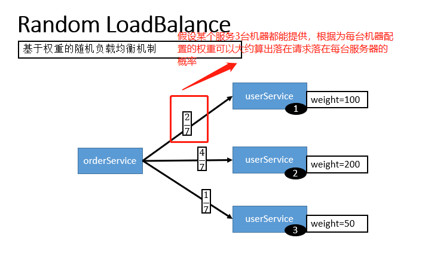
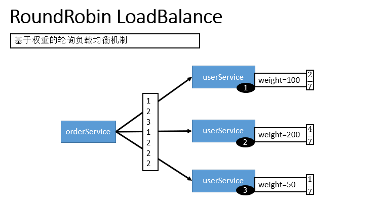

## 什么是 RPC?RPC原理是什么?

### **什么是 RPC？**

RPC（Remote Procedure Call）—远程过程调用，它是一种通过网络从远程计算机程序上请求服务，而不需要了解底层网络技术的协议。比如两个不同的服务 A、B 部署在两台不同的机器上，那么服务 A 如果想要调用服务 B 中的某个方法该怎么办呢？使用 HTTP请求 当然可以，但是可能会比较慢而且一些优化做的并不好。 RPC 的出现就是为了解决这个问题。

### **RPC原理是什么？**


1. 服务消费方（client）调用以本地调用方式调用服务；
2. client stub接收到调用后负责将方法、参数等组装成能够进行网络传输的消息体；
3. client stub找到服务地址，并将消息发送到服务端；
4. server stub收到消息后进行解码；
5. server stub根据解码结果调用本地的服务；
6. 本地服务执行并将结果返回给server stub；
7. server stub将返回结果打包成消息并发送至消费方；
8. client stub接收到消息，并进行解码；
9. 服务消费方得到最终结果。

下面再贴一个网上的时序图：


### RPC 解决了什么问题？

从上面对 RPC 介绍的内容中，概括来讲RPC 主要解决了：**让分布式或者微服务系统中不同服务之间的调用像本地调用一样简单。**

### 常见的 RPC 框架总结?

- **RMI（JDK自带）：** JDK自带的RPC，有很多局限性，不推荐使用。
- **Dubbo:** Dubbo是 阿里巴巴公司开源的一个高性能优秀的服务框架，使得应用可通过高性能的 RPC 实现服务的输出和输入功能，可以和 Spring框架无缝集成。目前 Dubbo 已经成为 Spring Cloud Alibaba 中的官方组件。
- **gRPC** ：gRPC是可以在任何环境中运行的现代开源高性能RPC框架。它可以通过可插拔的支持来有效地连接数据中心内和跨数据中心的服务，以实现负载平衡，跟踪，运行状况检查和身份验证。它也适用于分布式计算的最后一英里，以将设备，移动应用程序和浏览器连接到后端服务。

- **Hessian：** Hessian是一个轻量级的remotingonhttp工具，使用简单的方法提供了RMI的功能。 相比WebService，Hessian更简单、快捷。采用的是二进制RPC协议，因为采用的是二进制协议，所以它很适合于发送二进制数据。
- **Thrift：**  Apache Thrift是Facebook开源的跨语言的RPC通信框架，目前已经捐献给Apache基金会管理，由于其跨语言特性和出色的性能，在很多互联网公司得到应用，有能力的公司甚至会基于thrift研发一套分布式服务框架，增加诸如服务注册、服务发现等功能。

## 既有 HTTP ,为啥用 RPC 进行服务调用?

### RPC 只是一种设计而已

RPC 只是一种概念、一种设计，就是为了解决 **不同服务之间的调用问题**, 它一般会包含有 **传输协议** 和 **序列化协议** 这两个。

但是，HTTP  是一种协议，RPC框架可以使用 HTTP协议作为传输协议或者直接使用TCP作为传输协议，使用不同的协议一般也是为了适应不同的场景。

### HTTP 和 TCP

**可能现在很多对计算机网络不太熟悉的朋友已经被搞蒙了，要想真正搞懂，还需要来简单复习一下计算机网络基础知识：**

> 我们通常谈计算机网络的五层协议的体系结构是指：应用层、传输层、网络层、数据链路层、物理层。
>
> **应用层(application-layer）的任务是通过应用进程间的交互来完成特定网络应用。**HTTP 属于应用层协议，它会基于TCP/IP通信协议来传递数据（HTML 文件, 图片文件, 查询结果等）。HTTP协议工作于客户端-服务端架构为上。浏览器作为HTTP客户端通过 URL 向HTTP服务端即WEB服务器发送所有请求。Web服务器根据接收到的请求后，向客户端发送响应信息。HTTP协议建立在 TCP 协议之上。
>
> **运输层(transport layer)的主要任务就是负责向两台主机进程之间的通信提供通用的数据传输服务**。TCP是传输层协议，主要解决数据如何在网络中传输。相比于UDP,**TCP** 提供的是**面向连接**的，**可靠的**数据传输服务。

### RPC框架功能更齐全

成熟的 RPC框架还提供好了“服务自动注册与发现”、"智能负载均衡"、“可视化的服务治理和运维”、“运行期流量调度”等等功能，这些也算是选择
RPC 进行服务注册和发现的一方面原因吧！

**相关阅读：**

- http://www.ruanyifeng.com/blog/2016/08/http.html （HTTP 协议入门- 阮一峰）

### 一个常见的错误观点

很多文章中还会提到说 HTTP 协议相较于自定义 TCP 报文协议，增加的开销在于连接的建立与断开，但是这个观点已经被否认，下面截取自知乎中一个回答，原回答地址：https://www.zhihu.com/question/41609070/answer/191965937。

>首先要否认一点 HTTP 协议相较于自定义 TCP 报文协议，增加的开销在于连接的建立与断开。HTTP 协议是支持连接池复用的，也就是建立一定数量的连接不断开，并不会频繁的创建和销毁连接。二一要说的是 HTTP 也可以使用 Protobuf 这种二进制编码协议对内容进行编码，因此二者最大的区别还是在传输协议上。

<font color = green>

TVM 里的 RPC 好像是自己写的？

但我记得当时好像是用了 gRPC? 

吃它那个跨语言的特性  py -> C

TVM 0.8后改了应该

TensorFlow 也是gRPC

</font>

***

### Dubbo

Apache Dubbo (incubating) |ˈdʌbəʊ| 是一款高性能、轻量级的开源Java RPC 框架，它提供了三大核心能力：面向接口的远程方法调用，智能容错和负载均衡，以及服务自动注册和发现。简单来说 Dubbo 是一个分布式服务框架，致力于提供高性能和透明化的RPC远程服务调用方案，以及SOA服务治理方案。

Dubbo 目前已经有接近 23k 的 Star ，Dubbo的Github 地址：[https://github.com/apache/incubator-dubbo](https://github.com/apache/incubator-dubbo) 。 另外，在开源中国举行的2018年度最受欢迎中国开源软件这个活动的评选中，Dubbo 更是凭借其超高人气仅次于 vue.js 和 ECharts 获得第三名的好成绩。

Dubbo 是由阿里开源，后来加入了 Apache 。正式由于 Dubbo 的出现，才使得越来越多的公司开始使用以及接受分布式架构。

### 为什么要用 Dubbo?

Dubbo 的诞生和 SOA 分布式架构的流行有着莫大的关系。SOA 面向服务的架构（Service Oriented Architecture），也就是把工程按照业务逻辑拆分成服务层、表现层两个工程。服务层中包含业务逻辑，只需要对外提供服务即可。表现层只需要处理和页面的交互，业务逻辑都是调用服务层的服务来实现。SOA架构中有两个主要角色：服务提供者（Provider）和服务使用者（Consumer）。


**如果你要开发分布式程序，你也可以直接基于 HTTP 接口进行通信，但是为什么要用 Dubbo呢？**

我觉得主要可以从 Dubbo 提供的下面四点特性来说为什么要用 Dubbo：

1. **负载均衡**——同一个服务部署在不同的机器时该调用那一台机器上的服务。
2. **服务调用链路生成**——随着系统的发展，服务越来越多，服务间依赖关系变得错踪复杂，甚至分不清哪个应用要在哪个应用之前启动，架构师都不能完整的描述应用的架构关系。Dubbo 可以为我们解决服务之间互相是如何调用的。
3. **服务访问压力以及时长统计、资源调度和治理**——基于访问压力实时管理集群容量，提高集群利用率。
4. **服务降级**——某个服务挂掉之后调用备用服务。

另外，Dubbo 除了能够应用在分布式系统中，也可以应用在现在比较火的微服务系统中。不过，由于 Spring Cloud 在微服务中应用更加广泛，所以，我觉得一般我们提 Dubbo 的话，大部分是分布式系统的情况。

**我们刚刚提到了分布式这个概念，下面再给大家介绍一下什么是分布式？为什么要分布式？**

### 什么是分布式?

分布式或者说 SOA 分布式重要的就是面向服务，说简单的分布式就是我们把整个系统拆分成不同的服务然后将这些服务放在不同的服务器上减轻单体服务的压力提高并发量和性能。比如电商系统可以简单地拆分成订单系统、商品系统、登录系统等等，拆分之后的每个服务可以部署在不同的机器上，如果某一个服务的访问量比较大的话也可以将这个服务同时部署在多台机器上。

### 为什么要分布式?

从开发角度来讲单体应用的代码都集中在一起，而分布式系统的代码根据业务被拆分。所以，每个团队可以负责一个服务的开发，这样提升了开发效率。另外，代码根据业务拆分之后更加便于维护和扩展。

另外，我觉得将系统拆分成分布式之后不光便于系统扩展和维护，更能提高整个系统的性能。你想一想嘛？把整个系统拆分成不同的服务/系统，然后每个服务/系统 单独部署在一台服务器上，是不是很大程度上提高了系统性能呢？

### Dubbo 的架构图解


**上述节点简单说明：**

- **Provider：**    暴露服务的服务提供方
- **Consumer：**    调用远程服务的服务消费方
- **Registry：**    服务注册与发现的注册中心
- **Monitor：**     统计服务的调用次数和调用时间的监控中心
- **Container：**   服务运行容器

**调用关系说明：**

1. 服务容器负责启动，加载，运行服务提供者。
2. 服务提供者在启动时，向注册中心注册自己提供的服务。
3. 服务消费者在启动时，向注册中心订阅自己所需的服务。
4. 注册中心返回服务提供者地址列表给消费者，如果有变更，注册中心将基于长连接推送变更数据给消费者。
5. 服务消费者，从提供者地址列表中，基于软负载均衡算法，选一台提供者进行调用，如果调用失败，再选另一台调用。
6. 服务消费者和提供者，在内存中累计调用次数和调用时间，定时每分钟发送一次统计数据到监控中心。

**重要知识点总结：**

- **注册中心负责服务地址的注册与查找，相当于目录服务，服务提供者和消费者只在启动时与注册中心交互，注册中心不转发请求，压力较小**
- **监控中心负责统计各服务调用次数，调用时间等，统计先在内存汇总后每分钟一次发送到监控中心服务器，并以报表展示**
- **注册中心，服务提供者，服务消费者三者之间均为长连接，监控中心除外**
- **注册中心通过长连接感知服务提供者的存在，服务提供者宕机，注册中心将立即推送事件通知消费者**
- **注册中心和监控中心全部宕机，不影响已运行的提供者和消费者，消费者在本地缓存了提供者列表**
- **注册中心和监控中心都是可选的，服务消费者可以直连服务提供者**
- **服务提供者无状态，任意一台宕掉后，不影响使用**
- **服务提供者全部宕掉后，服务消费者应用将无法使用，并无限次重连等待服务提供者恢复**


### Dubbo 工作原理


图中从下至上分为十层，各层均为单向依赖，右边的黑色箭头代表层之间的依赖关系，每一层都可以剥离上层被复用，其中，Service 和 Config 层为 API，其它各层均为 SPI。

**各层说明**：

- 第一层：**service层**，接口层，给服务提供者和消费者来实现的
- 第二层：**config层**，配置层，主要是对dubbo进行各种配置的
- 第三层：**proxy层**，服务接口透明代理，生成服务的客户端 Stub 和服务器端 Skeleton
- 第四层：**registry层**，服务注册层，负责服务的注册与发现
- 第五层：**cluster层**，集群层，封装多个服务提供者的路由以及负载均衡，将多个实例组合成一个服务
- 第六层：**monitor层**，监控层，对rpc接口的调用次数和调用时间进行监控
- 第七层：**protocol层**，远程调用层，封装rpc调用
- 第八层：**exchange层**，信息交换层，封装请求响应模式，同步转异步
- 第九层：**transport层**，网络传输层，抽象mina和netty为统一接口
- 第十层：**serialize层**，数据序列化层，网络传输需要

### 先来解释一下什么是负载均衡

**先来个官方的解释。**

> 维基百科对负载均衡的定义：负载均衡改善了跨多个计算资源（例如计算机，计算机集群，网络链接，中央处理单元或磁盘驱动）的工作负载分布。负载平衡旨在优化资源使用，最大化吞吐量，最小化响应时间，并避免任何单个资源的过载。使用具有负载平衡而不是单个组件的多个组件可以通过冗余提高可靠性和可用性。负载平衡通常涉及专用软件或硬件。

**上面讲的大家可能不太好理解，再用通俗的话给大家说一下。**

比如我们的系统中的某个服务的访问量特别大，我们将这个服务部署在了多台服务器上，当客户端发起请求的时候，多台服务器都可以处理这个请求。那么，如何正确选择处理该请求的服务器就很关键。假如，你就要一台服务器来处理该服务的请求，那该服务部署在多台服务器的意义就不复存在了。负载均衡就是为了避免单个服务器响应同一请求，容易造成服务器宕机、崩溃等问题，我们从负载均衡的这四个字就能明显感受到它的意义。

### 再来看看 Dubbo 提供的负载均衡策略

在集群负载均衡时，Dubbo 提供了多种均衡策略，默认为 `random` 随机调用。可以自行扩展负载均衡策略，参见：[负载均衡扩展](https://dubbo.gitbooks.io/dubbo-dev-book/content/impls/load-balance.html)。

备注:下面的图片来自于：尚硅谷2018Dubbo 视频。


#### Random LoadBalance(默认，基于权重的随机负载均衡机制)

- **随机，按权重设置随机概率。**
- 在一个截面上碰撞的概率高，但调用量越大分布越均匀，而且按概率使用权重后也比较均匀，有利于动态调整提供者权重。




####  RoundRobin LoadBalance(不推荐，基于权重的轮询负载均衡机制)

- 轮循，按公约后的权重设置轮循比率。
- 存在慢的提供者累积请求的问题，比如：第二台机器很慢，但没挂，当请求调到第二台时就卡在那，久而久之，所有请求都卡在调到第二台上。



####  LeastActive LoadBalance

- 最少活跃调用数，相同活跃数的随机，活跃数指调用前后计数差。
- 使慢的提供者收到更少请求，因为越慢的提供者的调用前后计数差会越大。

####  ConsistentHash LoadBalance

- **一致性 Hash，相同参数的请求总是发到同一提供者。(如果你需要的不是随机负载均衡，是要一类请求都到一个节点，那就走这个一致性hash策略。)**
- 当某一台提供者挂时，原本发往该提供者的请求，基于虚拟节点，平摊到其它提供者，不会引起剧烈变动。
- 算法参见：http://en.wikipedia.org/wiki/Consistent_hashing
- 缺省只对第一个参数 Hash，如果要修改，请配置 `<dubbo:parameter key="hash.arguments" value="0,1" />`
- 缺省用 160 份虚拟节点，如果要修改，请配置 `<dubbo:parameter key="hash.nodes" value="320" />`

### 配置方式

**xml 配置方式**

服务端服务级别

```java
<dubbo:service interface="..." loadbalance="roundrobin" />
```
客户端服务级别

```java
<dubbo:reference interface="..." loadbalance="roundrobin" />
```

服务端方法级别

```java
<dubbo:service interface="...">
    <dubbo:method name="..." loadbalance="roundrobin"/>
</dubbo:service>
```

客户端方法级别

```java
<dubbo:reference interface="...">
    <dubbo:method name="..." loadbalance="roundrobin"/>
</dubbo:reference>
```

**注解配置方式：**

消费方基于基于注解的服务级别配置方式：

```java
@Reference(loadbalance = "roundrobin")
HelloService helloService;
```

### zookeeper宕机与dubbo直连的情况

zookeeper宕机与dubbo直连的情况在面试中可能会被经常问到，所以要引起重视。

在实际生产中，假如zookeeper注册中心宕掉，一段时间内服务消费方还是能够调用提供方的服务的，实际上它使用的本地缓存进行通讯，这只是dubbo健壮性的一种体现。

**dubbo的健壮性表现：**

1. 监控中心宕掉不影响使用，只是丢失部分采样数据
2. 数据库宕掉后，注册中心仍能通过缓存提供服务列表查询，但不能注册新服务
3. 注册中心对等集群，任意一台宕掉后，将自动切换到另一台
4. 注册中心全部宕掉后，服务提供者和服务消费者仍能通过本地缓存通讯
5. 服务提供者无状态，任意一台宕掉后，不影响使用
5. 服务提供者全部宕掉后，服务消费者应用将无法使用，并无限次重连等待服务提供者恢复

我们前面提到过：注册中心负责服务地址的注册与查找，相当于目录服务，服务提供者和消费者只在启动时与注册中心交互，注册中心不转发请求，压力较小。所以，我们可以完全可以绕过注册中心——采用 **dubbo 直连** ，即在服务消费方配置服务提供方的位置信息。


**xml配置方式：**

```xml
<dubbo:reference id="userService" interface="com.zang.gmall.service.UserService" url="dubbo://localhost:20880" />
```

**注解方式：**

```java
 @Reference(url = "127.0.0.1:20880")   
 HelloService helloService;
```

***

### Netty 是什么？

介绍一下自己对 Netty 的认识吧！小伙子。

3 点来概括一下 Netty 吧！

1. Netty 是一个 **基于 NIO** 的 client-server(客户端服务器)框架，使用它可以快速简单地开发网络应用程序。
2. 它极大地简化并优化了 TCP 和 UDP 套接字服务器等网络编程,并且性能以及安全性等很多方面甚至都要更好。
3. **支持多种协议** 如 FTP，SMTP，HTTP 以及各种二进制和基于文本的传统协议。

用官方的总结就是：**Netty 成功地找到了一种在不妥协可维护性和性能的情况下实现易于开发，性能，稳定性和灵活性的方法。**

除了上面介绍的之外，很多开源项目比如我们常用的 Dubbo、RocketMQ、Elasticsearch、gRPC 等等都用到了 Netty。

_网络编程我愿意称中 Netty 为王 。_

### 为什么要用 Netty？

为什么要用 Netty 呢？能不能说一下自己的看法。

因为 Netty 具有下面这些优点，并且相比于直接使用 JDK 自带的 NIO 相关的 API 来说更加易用。

- 统一的 API，支持多种传输类型，阻塞和非阻塞的。
- 简单而强大的线程模型。
- 自带编解码器解决 TCP 粘包/拆包问题。
- 自带各种协议栈。
- 真正的无连接数据包套接字支持。
- 比直接使用 Java 核心 API 有更高的吞吐量、更低的延迟、更低的资源消耗和更少的内存复制。
- 安全性不错，有完整的 SSL/TLS 以及 StartTLS 支持。
- 社区活跃
- 成熟稳定，经历了大型项目的使用和考验，而且很多开源项目都使用到了 Netty， 比如我们经常接触的 Dubbo、RocketMQ 等等。
- ......

### Netty 应用场景了解么？

能不能通俗地说一下使用 Netty 可以做什么事情？

凭借自己的了解，简单说一下吧！理论上来说，NIO 可以做的事情 ，使用 Netty 都可以做并且更好。Netty 主要用来做**网络通信** :

1. **作为 RPC 框架的网络通信工具** ： 我们在分布式系统中，不同服务节点之间经常需要相互调用，这个时候就需要 RPC 框架了。不同服务节点之间的通信是如何做的呢？可以使用 Netty 来做。比如我调用另外一个节点的方法的话，至少是要让对方知道我调用的是哪个类中的哪个方法以及相关参数吧！
2. **实现一个自己的 HTTP 服务器** ：通过 Netty 我们可以自己实现一个简单的 HTTP 服务器，这个大家应该不陌生。说到 HTTP 服务器的话，作为 Java 后端开发，我们一般使用 Tomcat 比较多。一个最基本的 HTTP 服务器可要以处理常见的 HTTP Method 的请求，比如 POST 请求、GET 请求等等。
3. **实现一个即时通讯系统** ： 使用 Netty 我们可以实现一个可以聊天类似微信的即时通讯系统，这方面的开源项目还蛮多的，可以自行去 Github 找一找。
4. **实现消息推送系统** ：市面上有很多消息推送系统都是基于 Netty 来做的。
5. ......

### Netty 核心组件有哪些？分别有什么作用？

Netty 核心组件有哪些？分别有什么作用？

#### 1.Channel

`Channel` 接口是 Netty 对网络操作抽象类，它除了包括基本的 I/O 操作，如 `bind()`、`connect()`、`read()`、`write()` 等。

比较常用的`Channel`接口实现类是`NioServerSocketChannel`（服务端）和`NioSocketChannel`（客户端），这两个 `Channel` 可以和 BIO 编程模型中的`ServerSocket`以及`Socket`两个概念对应上。Netty 的 `Channel` 接口所提供的 API，大大地降低了直接使用 Socket 类的复杂性。

#### 2.EventLoop

这么说吧！`EventLoop`（事件循环）接口可以说是 Netty 中最核心的概念了！

《Netty 实战》这本书是这样介绍它的：

> `EventLoop` 定义了 Netty 的核心抽象，用于处理连接的生命周期中所发生的事件。

是不是很难理解？说实话，我学习 Netty 的时候看到这句话是没太能理解的。

说白了，**`EventLoop` 的主要作用实际就是负责监听网络事件并调用事件处理器进行相关 I/O 操作的处理。**

那 `Channel` 和 `EventLoop` 直接有啥联系呢？

`Channel` 为 Netty 网络操作(读写等操作)抽象类，`EventLoop` 负责处理注册到其上的`Channel` 处理 I/O 操作，两者配合参与 I/O 操作。

#### 3.ChannelFuture

Netty 是异步非阻塞的，所有的 I/O 操作都为异步的。

因此，我们不能立刻得到操作是否执行成功，但是，你可以通过 `ChannelFuture` 接口的 `addListener()` 方法注册一个 `ChannelFutureListener`，当操作执行成功或者失败时，监听就会自动触发返回结果。

并且，你还可以通过`ChannelFuture` 的 `channel()` 方法获取关联的`Channel`

```java
public interface ChannelFuture extends Future<Void> {
    Channel channel();

    ChannelFuture addListener(GenericFutureListener<? extends Future<? super Void>> var1);
     ......

    ChannelFuture sync() throws InterruptedException;
}
```

另外，我们还可以通过 `ChannelFuture` 接口的 `sync()`方法让异步的操作变成同步的。

#### 4.ChannelHandler 和 ChannelPipeline

下面这段代码使用过 Netty 的小伙伴应该不会陌生，我们指定了序列化编解码器以及自定义的 `ChannelHandler` 处理消息。

```java
        b.group(eventLoopGroup)
                .handler(new ChannelInitializer<SocketChannel>() {
                    @Override
                    protected void initChannel(SocketChannel ch) {
                        ch.pipeline().addLast(new NettyKryoDecoder(kryoSerializer, RpcResponse.class));
                        ch.pipeline().addLast(new NettyKryoEncoder(kryoSerializer, RpcRequest.class));
                        ch.pipeline().addLast(new KryoClientHandler());
                    }
                });
```

`ChannelHandler` 是消息的具体处理器。他负责处理读写操作、客户端连接等事情。

`ChannelPipeline` 为 `ChannelHandler` 的链，提供了一个容器并定义了用于沿着链传播入站和出站事件流的 API 。当 `Channel` 被创建时，它会被自动地分配到它专属的 `ChannelPipeline`。

我们可以在 `ChannelPipeline` 上通过 `addLast()` 方法添加一个或者多个`ChannelHandler` ，因为一个数据或者事件可能会被多个 Handler 处理。当一个 `ChannelHandler` 处理完之后就将数据交给下一个 `ChannelHandler` 。

### EventloopGroup 了解么?和 EventLoop 啥关系?

刚刚你也介绍了 `EventLoop`。那你再说说 `EventloopGroup` 吧！和 EventLoop 啥关系?


`EventLoopGroup` 包含多个 `EventLoop`（每一个 `EventLoop` 通常内部包含一个线程），上面我们已经说了 `EventLoop` 的主要作用实际就是负责监听网络事件并调用事件处理器进行相关 I/O 操作的处理。

并且 `EventLoop` 处理的 I/O 事件都将在它专有的 `Thread` 上被处理，即 `Thread` 和 `EventLoop` 属于 1 : 1 的关系，从而保证线程安全。

上图是一个服务端对 `EventLoopGroup` 使用的大致模块图，其中 `Boss EventloopGroup` 用于接收连接，`Worker EventloopGroup` 用于具体的处理（消息的读写以及其他逻辑处理）。

从上图可以看出： 当客户端通过 `connect` 方法连接服务端时，`bossGroup` 处理客户端连接请求。当客户端处理完成后，会将这个连接提交给 `workerGroup` 来处理，然后 `workerGroup` 负责处理其 IO 相关操作。

### Bootstrap 和 ServerBootstrap 了解么？

你再说说自己对 `Bootstrap` 和 `ServerBootstrap` 的了解吧！

<font color = green>

BootStrap 不是JVM 里的那个 最底层的父类嘛 

老双亲了

</font>

`Bootstrap` 是客户端的启动引导类/辅助类，具体使用方法如下：

```java
        EventLoopGroup group = new NioEventLoopGroup();
        try {
            //创建客户端启动引导/辅助类：Bootstrap
            Bootstrap b = new Bootstrap();
            //指定线程模型
            b.group(group).
                    ......
            // 尝试建立连接
            ChannelFuture f = b.connect(host, port).sync();
            f.channel().closeFuture().sync();
        } finally {
            // 优雅关闭相关线程组资源
            group.shutdownGracefully();
        }
```

`ServerBootstrap` 客户端的启动引导类/辅助类，具体使用方法如下：

```java
        // 1.bossGroup 用于接收连接，workerGroup 用于具体的处理
        EventLoopGroup bossGroup = new NioEventLoopGroup(1);
        EventLoopGroup workerGroup = new NioEventLoopGroup();
        try {
            //2.创建服务端启动引导/辅助类：ServerBootstrap
            ServerBootstrap b = new ServerBootstrap();
            //3.给引导类配置两大线程组,确定了线程模型
            b.group(bossGroup, workerGroup).
                   ......
            // 6.绑定端口
            ChannelFuture f = b.bind(port).sync();
            // 等待连接关闭
            f.channel().closeFuture().sync();
        } finally {
            //7.优雅关闭相关线程组资源
            bossGroup.shutdownGracefully();
            workerGroup.shutdownGracefully();
        }
    }
```

从上面的示例中，我们可以看出：

1. `Bootstrap` 通常使用 `connet()` 方法连接到远程的主机和端口，作为一个 Netty TCP 协议通信中的客户端。另外，`Bootstrap` 也可以通过 `bind()` 方法绑定本地的一个端口，作为 UDP 协议通信中的一端。
2. `ServerBootstrap`通常使用 `bind()` 方法绑定本地的端口上，然后等待客户端的连接。
3. `Bootstrap` 只需要配置一个线程组— `EventLoopGroup` ,而 `ServerBootstrap`需要配置两个线程组— `EventLoopGroup` ，一个用于接收连接，一个用于具体的处理。

### NioEventLoopGroup 默认的构造函数会起多少线程？

看过 Netty 的源码了么？`NioEventLoopGroup` 默认的构造函数会起多少线程呢？

<font color = green>

CPU核心 * 2

</font>

回顾我们在上面写的服务器端的代码：

```java
// 1.bossGroup 用于接收连接，workerGroup 用于具体的处理
EventLoopGroup bossGroup = new NioEventLoopGroup(1);
EventLoopGroup workerGroup = new NioEventLoopGroup();
```

为了搞清楚`NioEventLoopGroup` 默认的构造函数 到底创建了多少个线程，我们来看一下它的源码。

```java
    /**
     * 无参构造函数。
     * nThreads:0
     */
    public NioEventLoopGroup() {
        //调用下一个构造方法
        this(0);
    }

    /**
     * Executor：null
     */
    public NioEventLoopGroup(int nThreads) {
        //继续调用下一个构造方法
        this(nThreads, (Executor) null);
    }

    //中间省略部分构造函数

    /**
     * RejectedExecutionHandler（）：RejectedExecutionHandlers.reject()
     */
    public NioEventLoopGroup(int nThreads, Executor executor, final SelectorProvider selectorProvider,final SelectStrategyFactory selectStrategyFactory) {
       //开始调用父类的构造函数
        super(nThreads, executor, selectorProvider, selectStrategyFactory, RejectedExecutionHandlers.reject());
    }

```

一直向下走下去的话，你会发现在 `MultithreadEventLoopGroup` 类中有相关的指定线程数的代码，如下：

```java
    // 从1，系统属性，CPU核心数*2 这三个值中取出一个最大的
    //可以得出 DEFAULT_EVENT_LOOP_THREADS 的值为CPU核心数*2
    private static final int DEFAULT_EVENT_LOOP_THREADS = Math.max(1, SystemPropertyUtil.getInt("io.netty.eventLoopThreads", NettyRuntime.availableProcessors() * 2));

    // 被调用的父类构造函数，NioEventLoopGroup 默认的构造函数会起多少线程的秘密所在
    // 当指定的线程数nThreads为0时，使用默认的线程数DEFAULT_EVENT_LOOP_THREADS
    protected MultithreadEventLoopGroup(int nThreads, ThreadFactory threadFactory, Object... args) {
        super(nThreads == 0 ? DEFAULT_EVENT_LOOP_THREADS : nThreads, threadFactory, args);
    }
```

综上，我们发现 `NioEventLoopGroup` 默认的构造函数实际会起的线程数为 **`CPU核心数*2`**。

另外，如果你继续深入下去看构造函数的话，你会发现每个`NioEventLoopGroup`对象内部都会分配一组`NioEventLoop`，其大小是 `nThreads`, 这样就构成了一个线程池， 一个`NIOEventLoop` 和一个线程相对应，这和我们上面说的 `EventloopGroup` 和 `EventLoop`关系这部分内容相对应。

### Netty 线程模型了解么？
<font color = green>

单线程 多线程 线程池 

池化技术和思想 也太难了吧 

</font>


说一下 Netty 线程模型吧！

大部分网络框架都是基于 Reactor 模式设计开发的。

> Reactor 模式基于事件驱动，采用多路复用将事件分发给相应的 Handler 处理，非常适合处理海量 IO 的场景。

在 Netty 主要靠 `NioEventLoopGroup` 线程池来实现具体的线程模型的 。

我们实现服务端的时候，一般会初始化两个线程组：

1. **`bossGroup`** :接收连接。
2. **`workerGroup`** ：负责具体的处理，交由对应的 Handler 处理。

下面我们来详细看一下 Netty 中的线程模型吧！

1.**单线程模型** ：

一个线程需要执行处理所有的 `accept`、`read`、`decode`、`process`、`encode`、`send` 事件。对于高负载、高并发，并且对性能要求比较高的场景不适用。

对应到 Netty 代码是下面这样的

> 使用 `NioEventLoopGroup` 类的无参构造函数设置线程数量的默认值就是 **CPU 核心数 \*2** 。

```java
  //1.eventGroup既用于处理客户端连接，又负责具体的处理。
  EventLoopGroup eventGroup = new NioEventLoopGroup(1);
  //2.创建服务端启动引导/辅助类：ServerBootstrap
  ServerBootstrap b = new ServerBootstrap();
            boobtstrap.group(eventGroup, eventGroup)
            //......
```

2.**多线程模型**

一个 Acceptor 线程只负责监听客户端的连接，一个 NIO 线程池负责具体处理： `accept`、`read`、`decode`、`process`、`encode`、`send` 事件。满足绝大部分应用场景，并发连接量不大的时候没啥问题，但是遇到并发连接大的时候就可能会出现问题，成为性能瓶颈。

对应到 Netty 代码是下面这样的：

```java
// 1.bossGroup 用于接收连接，workerGroup 用于具体的处理
EventLoopGroup bossGroup = new NioEventLoopGroup(1);
EventLoopGroup workerGroup = new NioEventLoopGroup();
try {
  //2.创建服务端启动引导/辅助类：ServerBootstrap
  ServerBootstrap b = new ServerBootstrap();
  //3.给引导类配置两大线程组,确定了线程模型
  b.group(bossGroup, workerGroup)
    //......
```


**3.主从多线程模型**

从一个 主线程 NIO 线程池中选择一个线程作为 Acceptor 线程，绑定监听端口，接收客户端连接的连接，其他线程负责后续的接入认证等工作。连接建立完成后，Sub NIO 线程池负责具体处理 I/O 读写。如果多线程模型无法满足你的需求的时候，可以考虑使用主从多线程模型 。

```java
// 1.bossGroup 用于接收连接，workerGroup 用于具体的处理
EventLoopGroup bossGroup = new NioEventLoopGroup();
EventLoopGroup workerGroup = new NioEventLoopGroup();
try {
  //2.创建服务端启动引导/辅助类：ServerBootstrap
  ServerBootstrap b = new ServerBootstrap();
  //3.给引导类配置两大线程组,确定了线程模型
  b.group(bossGroup, workerGroup)
    //......
```


### Netty 服务端和客户端的启动过程了解么？

#### 服务端

```java
        // 1.bossGroup 用于接收连接，workerGroup 用于具体的处理
        EventLoopGroup bossGroup = new NioEventLoopGroup(1);
        EventLoopGroup workerGroup = new NioEventLoopGroup();
        try {
            //2.创建服务端启动引导/辅助类：ServerBootstrap
            ServerBootstrap b = new ServerBootstrap();
            //3.给引导类配置两大线程组,确定了线程模型
            b.group(bossGroup, workerGroup)
                    // (非必备)打印日志
                    .handler(new LoggingHandler(LogLevel.INFO))
                    // 4.指定 IO 模型
                    .channel(NioServerSocketChannel.class)
                    .childHandler(new ChannelInitializer<SocketChannel>() {
                        @Override
                        public void initChannel(SocketChannel ch) {
                            ChannelPipeline p = ch.pipeline();
                            //5.可以自定义客户端消息的业务处理逻辑
                            p.addLast(new HelloServerHandler());
                        }
                    });
            // 6.绑定端口,调用 sync 方法阻塞知道绑定完成
            ChannelFuture f = b.bind(port).sync();
            // 7.阻塞等待直到服务器Channel关闭(closeFuture()方法获取Channel 的CloseFuture对象,然后调用sync()方法)
            f.channel().closeFuture().sync();
        } finally {
            //8.优雅关闭相关线程组资源
            bossGroup.shutdownGracefully();
            workerGroup.shutdownGracefully();
        }
```

简单解析一下服务端的创建过程具体是怎样的：

1.首先你创建了两个 `NioEventLoopGroup` 对象实例：`bossGroup` 和 `workerGroup`。

- `bossGroup` : 用于处理客户端的 TCP 连接请求。
- `workerGroup` ： 负责每一条连接的具体读写数据的处理逻辑，真正负责 I/O 读写操作，交由对应的 Handler 处理。

举个例子：我们把公司的老板当做 bossGroup，员工当做 workerGroup，bossGroup 在外面接完活之后，扔给 workerGroup 去处理。一般情况下我们会指定 bossGroup 的 线程数为 1（并发连接量不大的时候） ，workGroup 的线程数量为 **CPU 核心数 \*2** 。另外，根据源码来看，使用 `NioEventLoopGroup` 类的无参构造函数设置线程数量的默认值就是 **CPU 核心数 \*2** 。

2.接下来 我们创建了一个服务端启动引导/辅助类： `ServerBootstrap`，这个类将引导我们进行服务端的启动工作。

3.通过 `.group()` 方法给引导类 `ServerBootstrap` 配置两大线程组，确定了线程模型。

通过下面的代码，我们实际配置的是多线程模型，这个在上面提到过。

```java
    EventLoopGroup bossGroup = new NioEventLoopGroup(1);
    EventLoopGroup workerGroup = new NioEventLoopGroup();
```

4.通过`channel()`方法给引导类 `ServerBootstrap`指定了 IO 模型为`NIO`

- `NioServerSocketChannel` ：指定服务端的 IO 模型为 NIO，与 BIO 编程模型中的`ServerSocket`对应
- `NioSocketChannel` : 指定客户端的 IO 模型为 NIO， 与 BIO 编程模型中的`Socket`对应

  5.通过 `.childHandler()`给引导类创建一个`ChannelInitializer` ，然后指定了服务端消息的业务处理逻辑 `HelloServerHandler` 对象

  6.调用 `ServerBootstrap` 类的 `bind()`方法绑定端口

#### 客户端

```java
        //1.创建一个 NioEventLoopGroup 对象实例
        EventLoopGroup group = new NioEventLoopGroup();
        try {
            //2.创建客户端启动引导/辅助类：Bootstrap
            Bootstrap b = new Bootstrap();
            //3.指定线程组
            b.group(group)
                    //4.指定 IO 模型
                    .channel(NioSocketChannel.class)
                    .handler(new ChannelInitializer<SocketChannel>() {
                        @Override
                        public void initChannel(SocketChannel ch) throws Exception {
                            ChannelPipeline p = ch.pipeline();
                            // 5.这里可以自定义消息的业务处理逻辑
                            p.addLast(new HelloClientHandler(message));
                        }
                    });
            // 6.尝试建立连接
            ChannelFuture f = b.connect(host, port).sync();
            // 7.等待连接关闭（阻塞，直到Channel关闭）
            f.channel().closeFuture().sync();
        } finally {
            group.shutdownGracefully();
        }
```

继续分析一下客户端的创建流程：

1.创建一个 `NioEventLoopGroup` 对象实例

2.创建客户端启动的引导类是 `Bootstrap`

3.通过 `.group()` 方法给引导类 `Bootstrap` 配置一个线程组

4.通过`channel()`方法给引导类 `Bootstrap`指定了 IO 模型为`NIO`

5.通过 `.childHandler()`给引导类创建一个`ChannelInitializer` ，然后指定了客户端消息的业务处理逻辑 `HelloClientHandler` 对象

6.调用 `Bootstrap` 类的 `connect()`方法进行连接，这个方法需要指定两个参数：

- `inetHost` : ip 地址
- `inetPort` : 端口号

```java
    public ChannelFuture connect(String inetHost, int inetPort) {
        return this.connect(InetSocketAddress.createUnresolved(inetHost, inetPort));
    }
    public ChannelFuture connect(SocketAddress remoteAddress) {
        ObjectUtil.checkNotNull(remoteAddress, "remoteAddress");
        this.validate();
        return this.doResolveAndConnect(remoteAddress, this.config.localAddress());
    }
```

`connect` 方法返回的是一个 `Future` 类型的对象

```java
public interface ChannelFuture extends Future<Void> {
  ......
}
```

也就是说这个方是异步的，我们通过 `addListener` 方法可以监听到连接是否成功，进而打印出连接信息。具体做法很简单，只需要对代码进行以下改动：

```java
ChannelFuture f = b.connect(host, port).addListener(future -> {
  if (future.isSuccess()) {
    System.out.println("连接成功!");
  } else {
    System.err.println("连接失败!");
  }
}).sync();
```

### 什么是 TCP 粘包/拆包?有什么解决办法呢？

什么是 TCP 粘包/拆包?

TCP 粘包/拆包 就是你基于 TCP 发送数据的时候，出现了多个字符串“粘”在了一起或者一个字符串被“拆”开的问题。比如你多次发送：“你好,你真帅啊！哥哥！”，但是客户端接收到的可能是下面这样的：


那有什么解决办法呢?

**1.使用 Netty 自带的解码器**

- **`LineBasedFrameDecoder`** : 发送端发送数据包的时候，每个数据包之间以换行符作为分隔，`LineBasedFrameDecoder` 的工作原理是它依次遍历 `ByteBuf` 中的可读字节，判断是否有换行符，然后进行相应的截取。
- **`DelimiterBasedFrameDecoder`** : 可以自定义分隔符解码器，**`LineBasedFrameDecoder`** 实际上是一种特殊的 `DelimiterBasedFrameDecoder` 解码器。
- **`FixedLengthFrameDecoder`**: 固定长度解码器，它能够按照指定的长度对消息进行相应的拆包。
- **`LengthFieldBasedFrameDecoder`**：

**2.自定义序列化编解码器**

在 Java 中自带的有实现 `Serializable` 接口来实现序列化，但由于它性能、安全性等原因一般情况下是不会被使用到的。

通常情况下，我们使用 Protostuff、Hessian2、json 序列方式比较多，另外还有一些序列化性能非常好的序列化方式也是很好的选择：

- 专门针对 Java 语言的：Kryo，FST 等等
- 跨语言的：Protostuff（基于 protobuf 发展而来），ProtoBuf，Thrift，Avro，MsgPack 等等

> 由于篇幅问题，这部分内容会在后续的文章中详细分析介绍~~~

### Netty 长连接、心跳机制了解么？

#### 长连接和短连接了解么？

我们知道 TCP 在进行读写之前，server 与 client 之间必须提前建立一个连接。建立连接的过程，需要我们常说的三次握手，释放/关闭连接的话需要四次挥手。这个过程是比较消耗网络资源并且有时间延迟的。

所谓，短连接说的就是 server 端 与 client 端建立连接之后，读写完成之后就关闭掉连接，如果下一次再要互相发送消息，就要重新连接。短连接的有点很明显，就是管理和实现都比较简单，缺点也很明显，每一次的读写都要建立连接必然会带来大量网络资源的消耗，并且连接的建立也需要耗费时间。

长连接说的就是 client 向 server 双方建立连接之后，即使 client 与 server 完成一次读写，它们之间的连接并不会主动关闭，后续的读写操作会继续使用这个连接。长连接的可以省去较多的 TCP 建立和关闭的操作，降低对网络资源的依赖，节约时间。对于频繁请求资源的客户来说，非常适用长连接。

#### 为什么需要心跳机制？Netty 中心跳机制了解么？

在 TCP 保持长连接的过程中，可能会出现断网等网络异常出现，异常发生的时候， client 与 server 之间如果没有交互的话，它们是无法发现对方已经掉线的。为了解决这个问题, 我们就需要引入 **心跳机制** 。

心跳机制的工作原理是: 在 client 与 server 之间在一定时间内没有数据交互时, 即处于 idle 状态时, 客户端或服务器就会发送一个特殊的数据包给对方, 当接收方收到这个数据报文后, 也立即发送一个特殊的数据报文, 回应发送方, 此即一个 PING-PONG 交互。所以, 当某一端收到心跳消息后, 就知道了对方仍然在线, 这就确保 TCP 连接的有效性.

TCP 实际上自带的就有长连接选项，本身是也有心跳包机制，也就是 TCP 的选项：`SO_KEEPALIVE`。 但是，TCP 协议层面的长连接灵活性不够。所以，一般情况下我们都是在应用层协议上实现自定义心跳机制的，也就是在 Netty 层面通过编码实现。通过 Netty 实现心跳机制的话，核心类是 `IdleStateHandler` 。

### Netty 的零拷贝了解么？

<font color = green>

零拷贝 OS 的概念啊

</font>

讲讲 Netty 的零拷贝？

维基百科是这样介绍零拷贝的：

> 零复制（英语：Zero-copy；也译零拷贝）技术是指计算机执行操作时，CPU 不需要先将数据从某处内存复制到另一个特定区域。这种技术通常用于通过网络传输文件时节省 CPU 周期和内存带宽。

在 OS 层面上的 `Zero-copy` 通常指避免在 `用户态(User-space)` 与 `内核态(Kernel-space)` 之间来回拷贝数据。而在 Netty 层面 ，零拷贝主要体现在对于数据操作的优化。

Netty 中的零拷贝体现在以下几个方面

1. 使用 Netty 提供的 `CompositeByteBuf` 类, 可以将多个`ByteBuf` 合并为一个逻辑上的 `ByteBuf`, 避免了各个 `ByteBuf` 之间的拷贝。
2. `ByteBuf` 支持 slice 操作, 因此可以将 ByteBuf 分解为多个共享同一个存储区域的 `ByteBuf`, 避免了内存的拷贝。
3. 通过 `FileRegion` 包装的`FileChannel.tranferTo` 实现文件传输, 可以直接将文件缓冲区的数据发送到目标 `Channel`, 避免了传统通过循环 write 方式导致的内存拷贝问题.

### 参考

- netty 学习系列二：NIO Reactor 模型 & Netty 线程模型：https://www.jianshu.com/p/38b56531565d
- 《Netty 实战》
- Netty 面试题整理(2):[https://metatronxl.github.io/2019/10/22/Netty-面试题整理-二/](https://metatronxl.github.io/2019/10/22/Netty-面试题整理-二/)
- Netty（3）—源码 NioEventLoopGroup:https://www.cnblogs.com/qdhxhz/p/10075568.html
- 对于 Netty ByteBuf 的零拷贝(Zero Copy) 的理解: [https://www.cnblogs.com/xys1228/p/6088805.html](https://www.cnblogs.com/xys1228/p/6088805.html)