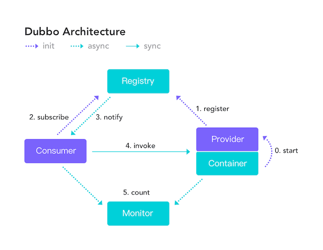

## CAP理论

[CAP 理论/定理](https://zh.wikipedia.org/wiki/CAP%E5%AE%9A%E7%90%86)起源于 2000年，由加州大学伯克利分校的Eric Brewer教授在分布式计算原理研讨会（PODC）上提出，因此 CAP定理又被称作 **布鲁尔定理（Brewer’s theorem）**

2年后，麻省理工学院的Seth Gilbert和Nancy Lynch 发表了布鲁尔猜想的证明，CAP理论正式成为分布式领域的定理。

### 简介

CAP 

C 一致性

A 可用性

P 分区容错

**CAP** 也就是 **Consistency（一致性）**、**Availability（可用性）**、**Partition Tolerance（分区容错性）** 这三个单词首字母组合。

CAP 理论的提出者布鲁尔在提出 CAP 猜想的时候，并没有详细定义 **Consistency**、**Availability**、**Partition Tolerance** 三个单词的明确定义。

因此，对于 CAP 的民间解读有很多，一般比较被大家推荐的是下面 👇 这种版本的解。

在理论计算机科学中，CAP 定理（CAP theorem）指出对于一个分布式系统来说，当设计读写操作时，只能能同时满足以下三点中的两个：

- **一致性（Consistence）** : 所有节点访问同一份最新的数据副本
- **可用性（Availability）**: 非故障的节点在合理的时间内返回合理的响应（不是错误或者超时的响应）。
- **分区容错性（Partition tolerance）** : 分布式系统出现网络分区的时候，仍然能够对外提供服务。

**什么是网络分区？**

> 分布式系统中，多个节点之前的网络本来是连通的，但是因为某些故障（比如部分节点网络出了问题）某些节点之间不连通了，整个网络就分成了几块区域，这就叫网络分区。

### 不是所谓的“3 选 2”

大部分人解释这一定律时，常常简单的表述为：“一致性、可用性、分区容忍性三者你只能同时达到其中两个，不可能同时达到”。实际上这是一个非常具有误导性质的说法，而且在 CAP 理论诞生 12 年之后，CAP 之父也在 2012 年重写了之前的论文。

> **当发生网络分区的时候，如果我们要继续服务，那么强一致性和可用性只能 2 选 1。也就是说当网络分区之后 P 是前提，决定了 P 之后才有 C 和 A 的选择。也就是说分区容错性（Partition tolerance）我们是必须要实现的。**
>
> 简而言之就是：CAP 理论中分区容错性 P 是一定要满足的，在此基础上，只能满足可用性 A 或者一致性 C。

在分布式的环境下，网络无法做到100%可靠，有可能出现故障，因此分区是一个必须的选项，如果选择了CA而放弃了P，若发生分区现象，为了保证C，系统需要禁止写入，此时就与A发生冲突，如果是为了保证A，则会出现正常的分区可以写入数据，有故障的分区不能写入数据，则与C就冲突了。因此分布式系统理论上不可能选择CA架构，而必须选择CP或AP架构。

因此，**分布式系统理论上不可能选择 CA 架构，只能选择 CP 或者 AP 架构。**

**为啥无同时保证 CA 呢？**

举个例子：若系统出现“分区”，系统中的某个节点在进行写操作。为了保证 C， 必须要禁止其他节点的读写操作，这就和 A 发生冲突了。如果为了保证 A，其他节点的读写操作正常的话，那就和 C 发生冲突了。

**选择的关键在于当前的业务场景，没有定论，比如对于需要确保强一致性的场景如银行一般会选择保证 CP 。**

### CAP 实际应用案例

我这里以注册中心来探讨一下 CAP 的实际应用。考虑到很多小伙伴不知道注册中心是干嘛的，这里简单以 Dubbo 为例说一说。

下图是 Dubbo 的架构图。**注册中心 Registry 在其中扮演了什么角色呢？提供了什么服务呢？**

注册中心负责服务地址的注册与查找，相当于目录服务，服务提供者和消费者只在启动时与注册中心交互，注册中心不转发请求，压力较小。

常见的可以作为注册中心的组件有：ZooKeeper、Eureka、Nacos...。

1. **ZooKeeper 保证的是 CP。** 任何时刻对 ZooKeeper 的读请求都能得到一致性的结果，但是， ZooKeeper 不保证每次请求的可用性比如在 Leader 选举过程中或者半数以上的机器不可用的时候服务就是不可用的。

CP 半数机器

2. **Eureka 保证的则是 AP。** Eureka 在设计的时候就是优先保证 A （可用性）。在 Eureka 中不存在什么 Leader 节点，每个节点都是一样的、平等的。因此 Eureka 不会像 ZooKeeper 那样出现选举过程中或者半数以上的机器不可用的时候服务就是不可用的情况。 Eureka 保证即使大部分节点挂掉也不会影响正常提供服务，只要有一个节点是可用的就行了。只不过这个节点上的数据可能并不是最新的。

AP 只要有一台可用都可 即使不是最新数据

3. **Nacos 不仅支持 CP 也支持 AP。**

### 总结

在进行分布式系统设计和开发时，我们不应该仅仅局限在 CAP 问题上，还要关注系统的扩展性、可用性等等

在系统发生“分区”的情况下，CAP 理论只能满足 CP 或者 AP。要注意的是，这里的前提是系统发生了“分区”

如果系统没有发生“分区”的话，节点间的网络连接通信正常的话，也就不存在 P 了。这个时候，我们就可以同时保证 C 和 A 了。

总结：**如果系统发生“分区”，我们要考虑选择 CP 还是 AP。如果系统没有发生“分区”的话，我们要思考如何保证 CA 。**

### ZooKeeper 和 eureka 的数据一致性问题

先要明确一点，eureka的创建初心就是为一个注册中心，但是zk更多是作为分布式协调服务的存在，只不过因为它的特性被dubbo赋予了注册中心，它的职责更多是保证数据（配置数据，状态数据）在管辖下的所有服务之间保持一致，所有这个就不难理解为何zk被设计成CP而不是AP，zk最核心的算法ZAB，就是为了解决分布式系统下数据在多个服务之间一致同步的问题。

更深层的原因，zookeeper是按照CP原则构建，也就是说它必须保持每一个节点的数据都保持一致，如果zookeeper下节点断开或者集群中出现网络分割（例如交换机的子网间不能互访），那么zk会将它们从自己的管理范围中剔除，外界不能访问这些节点，即使这些节点是健康的可以提供正常的服务，所以导致这些节点请求都会丢失。

而eureka则完全没有这方面的顾虑，它的节点都是相对独立，不需要考虑数据一致性的问题，这个应该是eureka的诞生就是为了注册中心而设计，相对zk来说剔除了leader节点选取和事务日志极致，这样更有利于维护和保证eureka在运行的健壮性。

再来看看，数据不一致性在注册服务中中会给eureka带来什么问题，无非就是某一个节点被注册的服务多，某个节点注册的服务少，在某一个瞬间可能导致某些ip节点被调用数少，某些ip节点调用数少的问题。也有可能存在一些本应该被删除而没被删除的脏数据。

#### 小结：服务注册应该选择AP还是CP

对于服务注册来说，针对同一个服务，即使注册中心的不同节点保存的服务注册信息不相同，也并不会造成灾难性的后果，对于服务消费者来说，能消费才是最重要的，就算拿到的数据不是最新的数据，消费者本身也可以进行尝试失败重试。总比为了追求数据的一致性而获取不到实例信息整个服务不可用要好。
所以，对于服务注册来说，可用性比数据一致性更加的重要，选择AP。

***

## BASE 理论

[BASE 理论](https://dl.acm.org/doi/10.1145/1394127.1394128)起源于 2008 年， 由eBay的架构师Dan Pritchett在ACM上发表。

### 简介

**BASE** 是 **Basically Available（基本可用）** 、**Soft-state（软状态）** 和 **Eventually Consistent（最终一致性）** 三个短语的缩写。BASE 理论是对 CAP 中一致性 C 和可用性 A 权衡的结果，其来源于对大规模互联网系统分布式实践的总结，是基于 CAP 定理逐步演化而来的，它大大降低了我们对系统的要求。

### BASE 理论的核心思想

即使无法做到强一致性，但每个应用都可以根据自身业务特点，采用适当的方式来使系统达到最终一致性。

> 也就是牺牲数据的一致性来满足系统的高可用性，系统中一部分数据不可用或者不一致时，仍需要保持系统整体“主要可用”。

**BASE 理论本质上是对 CAP 的延伸和补充，更具体地说，是对 CAP 中 AP 方案的一个补充。**

**为什么这样说呢？**

CAP 理论这节我们也说过了：

> 如果系统没有发生“分区”的话，节点间的网络连接通信正常的话，也就不存在 P 了。这个时候，我们就可以同时保证 C 和 A 了。因此，**如果系统发生“分区”，我们要考虑选择 CP 还是 AP。如果系统没有发生“分区”的话，我们要思考如何保证 CA 。**

因此，AP 方案只是在系统发生分区的时候放弃一致性，而不是永远放弃一致性。在分区故障恢复后，系统应该达到最终一致性。这一点其实就是 BASE 理论延伸的地方。

### BASE 理论三要素

~~众所周知 BASE 是 B A S E~~

BA 基本可用

S 软状态

E 最终一致性

#### 1. 基本可用

基本可用是指分布式系统在出现不可预知故障的时候，允许损失部分可用性。但是，这绝不等价于系统不可用。

**什么叫允许损失部分可用性呢？**

- **响应时间上的损失**: 正常情况下，处理用户请求需要 0.5s 返回结果，但是由于系统出现故障，处理用户请求的时间变为 3 s。
- **系统功能上的损失**：正常情况下，用户可以使用系统的全部功能，但是由于系统访问量突然剧增，系统的部分非核心功能无法使用。

#### 2. 软状态

软状态指允许系统中的数据存在中间状态（**CAP 理论中的数据不一致**），并认为该中间状态的存在不会影响系统的整体可用性，即允许系统在不同节点的数据副本之间进行数据同步的过程存在延时。

#### 3. 最终一致性

最终一致性强调的是系统中所有的数据副本，在经过一段时间的同步后，最终能够达到一个一致的状态。因此，最终一致性的本质是需要系统保证最终数据能够达到一致，而不需要实时保证系统数据的强一致性。

> 分布式一致性的 3 种级别：
>
> 1. **强一致性** ：系统写入了什么，读出来的就是什么。
>
> 2. **弱一致性** ：不一定可以读取到最新写入的值，也不保证多少时间之后读取到的数据是最新的，只是会尽量保证某个时刻达到数据一致的状态。
>
> 3. **最终一致性** ：弱一致性的升级版，系统会保证在一定时间内达到数据一致的状态。
>
> **业界比较推崇是最终一致性级别，但是某些对数据一致要求十分严格的场景比如银行转账还是要保证强一致性。**

转账就是 CP

### 总结

**ACID 是数据库事务完整性的理论，CAP 是分布式系统设计理论，BASE 是 CAP 理论中 AP 方案的延伸。**

***

### Paxos 算法和 Raft 算法

Paxos 算法诞生于 1990 年，这是一种解决分布式系统一致性的经典算法 。但是，由于 Paxos 算法非常难以理解和实现，不断有人尝试简化这一算法。到了2013 年才诞生了一个比 Paxos 算法更易理解和实现的分布式一致性算法—Raft 算法。

***

### 分布式锁，是选择AP还是选择CP ？

这里实现分布式锁的方式选取了三种：

- 基于数据库实现分布式锁
- 基于Redis实现分布式锁
- 基于zookeeper实现分布式锁

#### 基于数据库实现分布式锁

构建表结构

利用表的 UNIQUE KEY idx_lock (method_lock) 作为唯一主键，当进行上锁时进行insert动作，数据库成功录入则以为上锁成功，当数据库报出 Duplicate entry 则表示无法获取该锁。

不过这种方式对于单主却无法自动切换主从的mysql来说，基本就无法现实P分区容错性，（Mysql自动主从切换在目前并没有十分完美的解决方案）。可以说这种方式强依赖于数据库的可用性，数据库写操作是一个单点，一旦数据库挂掉，就导致锁的不可用。这种方式基本不在CAP的一个讨论范围。

通过数据库的锁不能保证 P 必死

#### 基于Redis实现分布式锁

Redis单线程串行处理天然就是解决串行化问题，用来解决分布式锁是再适合不过。

为了解决数据库锁的无主从切换的问题，可以选择Redis集群，或者是 sentinel 哨兵模式，实现主从故障转移，当master节点出现故障，哨兵会从slave中选取节点，重新变成新的master节点。

.jpg)

哨兵模式故障转移是由sentinel集群进行监控判断，当maser出现异常即复制中止，重新推选新slave成为master，sentinel在重新进行选举并不在意主从数据是否复制完毕具备一致性。

所以redis的复制模式是属于AP的模式。保证可用性，在主从复制中“主”有数据，但是可能“从”还没有数据，这个时候，一旦主挂掉或者网络抖动等各种原因，可能会切换到“从”节点，这个时候可能会导致两个业务县城同时获取得两把锁.

.jpg)

上述的问题其实并不是redis的缺陷，只是redis采用了AP模型，它本身无法确保我们对一致性的要求。Redis官方推荐redlock算法来保证，问题是redlock至少需要三个redis主从实例来实现，维护成本比较高，相当于redlock使用三个redis集群实现了自己的另一套一致性算法，比较繁琐，在业界也使用得比较少。

#### 能否使用redis作为分布式锁？

能不能使用redis作为分布式锁，这个本身就不是redis的问题，还是取决于业务场景，我们先要自己确认我们的场景是适合 AP 还是 CP ， 如果在社交发帖等场景下，我们并没有非常强的事务一致性问题，redis提供给我们高性能的AP模型是非常适合的，但如果是交易类型，对数据一致性非常敏感的场景，我们可能要寻在一种更加适合的 CP 模型

#### 基于zookeeper实现分布式锁

刚刚也分析过，redis其实无法确保数据的一致性，先来看zookeeper是否合适作为我们需要的分布式锁，首先zk的模式是CP模型，也就是说，当zk锁提供给我们进行访问的时候，在zk集群中能确保这把锁在zk的每一个节点都存在。

#### zk锁实现的原理

说zk的锁问题之前先看看zookeeper中几个特性，这几个特性构建了zk的一把分布式锁

特性：

1. 有序节点

    当在一个父目录下如 /lock 下创建 有序节点，节点会按照严格的先后顺序创建出自节点 lock000001,lock000002,lock0000003,以此类推，有序节点能严格保证各个自节点按照排序命名生成。

2. 临时节点

    客户端建立了一个临时节点，在客户端的会话结束或会话超时，zookepper会自动删除该解ID那。

3. 事件监听

    在读取数据时，我们可以对节点设置监听，当节点的数据发生变化（1 节点创建 2 节点删除 3 节点数据变成 4 自节点变成）时，zookeeper会通知客户端。

结合这几个特点，来看下zk是怎么组合分布式锁。

1. 业务线程-1 业务线程-2 分别向zk的/lock目录下，申请创建有序的临时节点

2. 业务线程-1 抢到/lock0001 的文件，也就是在整个目录下最小序的节点，也就是线程-1获取到了锁

3. 业务线程-2 只能抢到/lock0002的文件，并不是最小序的节点，线程2未能获取锁

4. 业务线程-1 与 lock0001 建立了连接，并维持了心跳，维持的心跳也就是这把锁的租期

5. 当业务线程-1 完成了业务，将释放掉与zk的连接，也就是释放了这把锁

#### zk分布式锁的代码实现

zk官方提供的客户端并不支持分布式锁的直接实现，我们需要自己写代码去利用zk的这几个特性去进行实现。

### 小结：究竟该用CP还是AP的分布式锁

首先得了解清楚我们使用分布式锁的场景，为何使用分布式锁，用它来帮我们解决什么问题，先聊场景后聊分布式锁的技术选型。

无论是Redis，zk，例如Redis的AP模型会限制很多使用场景，但它却拥有了几者中最高的性能.

zookeeper的分布式锁要比Redis可靠很多，但他繁琐的实现机制导致了它的性能不如Redis，而且zk会随着集群的扩大而性能更加下降。

简单来说，先了解业务场景，后进行技术选型。

### 推荐阅读

1. [CAP 定理简化](https://medium.com/@ravindraprasad/cap-theorem-simplified-28499a67eab4) （英文，有趣的案例）
2. [神一样的 CAP 理论被应用在何方](https://juejin.im/post/6844903936718012430) （中文，列举了很多实际的例子）
3. [请停止呼叫数据库 CP 或 AP ](https://martin.kleppmann.com/2015/05/11/please-stop-calling-databases-cp-or-ap.html) （英文，带给你不一样的思考）