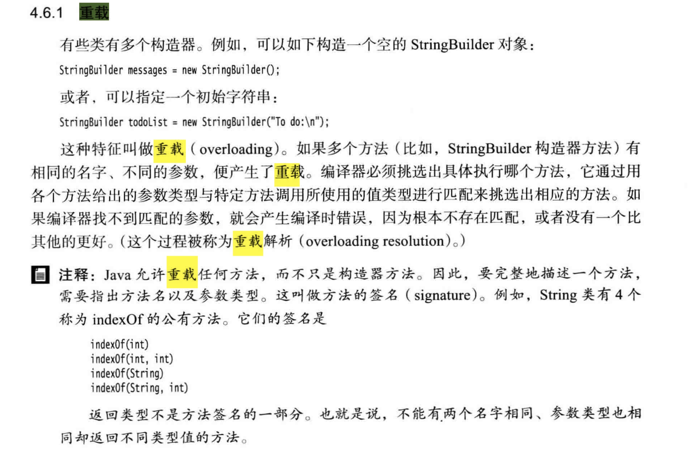
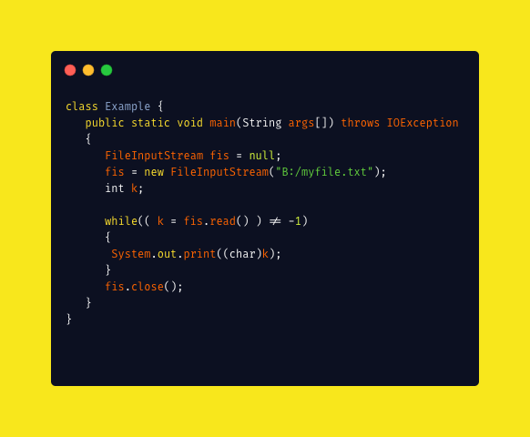

## 1. 基础

学习自 [JavaGuide](https://snailclimb.gitee.io/javaguide-interview/#/./docs/b-1%E9%9D%A2%E8%AF%95%E9%A2%98%E6%80%BB%E7%BB%93-Java%E5%9F%BA%E7%A1%80) + 自己批注

### 1.1. Java 和 C++的区别?

就算没学过 C++，也要记下来！

- 都是面向对象的语言，都支持封装、继承和多态
- Java 不提供指针来直接访问内存，程序内存更加安全
- Java 的类是单继承的，C++ 支持多重继承；虽然 Java 的类不可以多继承，但是接口可以多继承。
- Java 有自动内存管理机制，不需要程序员手动释放无用内存
- **在 C 语言中，字符串或字符数组最后都会有一个额外的字符‘\0’来表示结束。但是，Java 语言中没有结束符这一概念。** 这是一个值得深度思考的问题，具体原因推荐看这篇文章： [https://blog.csdn.net/sszgg2006/article/details/49148189](https://blog.csdn.net/sszgg2006/article/details/49148189)

### 1.2. 字符型常量和字符串常量的区别?

1. 形式上: 字符常量是单引号引起的一个字符; 字符串常量是双引号引起的若干个字符
2. 含义上: 字符常量相当于一个整型值( ASCII 值),可以参加表达式运算; 字符串常量代表一个地址值(该字符串在内存中存放位置)
3. 占内存大小 字符常量只占 2 个字节; 字符串常量占若干个字节 
   (**注意： char 在 Java 中占两个字节**)

> java 编程思想第四版：2.2.2 节


### 1.3. 构造器 Constructor 是否可被 override?

Constructor 不能被 override（重写）,但是可以 overload（重载）,所以你可以看到一个类中有多个构造函数的情况。


### 1.4. `@overload` 重载和 `@override` 重写的区别

> 重载就是同样的一个方法能够根据输入数据的不同，做出不同的处理
>
> 重写就是当子类继承自父类的相同方法，输入数据一样，但要做出有别于父类的响应时，你就要覆盖父类方法

**重载：**

发生在同一个类中，方法名必须相同，参数类型不同、个数不同、顺序不同，方法返回值和访问修饰符可以不同。

下面是《Java 核心技术》对重载这个概念的介绍：



综上：重载就是同一个类中多个同名方法根据不同的传参来执行不同的逻辑处理。

**重写：**

重写发生在运行期，是子类对父类的允许访问的方法的实现过程进行重新编写。

1. 返回值类型、方法名、参数列表必须相同，抛出的异常范围小于等于父类，访问修饰符范围大于等于父类。
2. 如果父类方法访问修饰符为 `private/final/static` 则子类就不能重写该方法，但是被 static 修饰的方法能够被再次声明。
3. 构造方法无法被重写

综上：重写就是子类对父类方法的重新改造，外部样子不能改变，内部逻辑可以改变


| 区别点     | 重载方法 | 重写方法                                                     |
| :--------- | :------- | :----------------------------------------------------------- |
| 发生范围   | 同一个类 | 子类                                                         |
| 参数列表   | 必须修改 | 一定不能修改                                                 |
| 返回类型   | 可修改   | 子类方法返回值类型应比父类方法返回值类型更小或相等           |
| 异常       | 可修改   | 子类方法声明抛出的异常类应比父类方法声明抛出的异常类更小或相等； |
| 访问修饰符 | 可修改   | 一定不能做更严格的限制（可以降低限制）                       |
| 发生阶段   | 编译期   | 运行期                                                       |

**方法的重写要遵循“两同两小一大”**（以下内容摘录自《疯狂 Java 讲义》,[issue#892](https://github.com/Snailclimb/JavaGuide/issues/892) ）：

- “两同”即`方法名`相同、`形参列表`相同；
- “两小”指的是`子类方法返回值类型应比父类方法返回值类型`更小或相等，`子类方法声明抛出的异常类应比父类方法声明抛出的异常类`更小或相等；
- “一大”指的是`子类方法的访问权限应比父类方法的访问权限`更大或相等。

⭐️ 关于 **重写的返回值类**型 这里需要额外多说明一下，上面的表述不太清晰准确：如果方法的返回类型是void和基本数据类型，则返回值重写时不可修改。但是如果方法的返回值是引用类型，重写时是可以返回该引用类型的子类的。

```java
public class Hero {
    public String name() {
        return "超级英雄";
    }
}
public class SuperMan extends Hero{
    @Override
    public String name() {
        return "超人";
    }
    public Hero hero() {
        return new Hero();
    }
}

public class SuperSuperMan extends SuperMan {
    public String name() {
        return "超级超级英雄";
    }

    @Override
    public SuperMan hero() {
        return new SuperMan();
    }
}
```

<font color = yellow>
`比较器不就是 经常重写的吗` 虽然我用 `λ`
</font>

### 1.5. Java 面向对象编程三大特性: 封装 继承 多态

#### 1.5.1. 封装

封装把一个对象的属性私有化，同时提供一些可以被外界访问的属性的方法，如果属性不想被外界访问，我们大可不必提供方法给外界访问。但是如果一个类没有提供给外界访问的方法，那么这个类也没有什么意义了。

#### 1.5.2. 继承

继承是使用已存在的类的定义作为基础建立新类的技术，新类的定义可以增加新的数据或新的功能，也可以用父类的功能，但不能选择性地继承父类。通过使用继承我们能够非常方便地复用以前的代码。

**关于继承如下 3 点请记住：**

1. 子类拥有父类对象所有的属性和方法（包括私有属性和私有方法），但是父类中的私有属性和方法子类是无法访问，**只是拥有**。
2. 子类可以拥有自己属性和方法，即子类可以对父类进行扩展。
3. 子类可以用自己的方式实现父类的方法。（以后介绍）。

#### 1.5.3. 多态

所谓多态就是指程序中定义的引用变量所指向的具体类型和通过该引用变量发出的方法调用在编程时并不确定，而是在程序运行期间才确定，即一个引用变量到底会指向哪个类的实例对象，该引用变量发出的方法调用到底是哪个类中实现的方法，必须在由程序运行期间才能决定。

在 Java 中有两种形式可以实现多态：继承（多个子类对同一方法的重写）和接口（实现接口并覆盖接口中同一方法）

### 1.6. String, StringBuffer 和 StringBuilder 的区别是什么? String 为什么是不可变的?

<font color = yellow>
就一个 线程安全 一个线程不安全 都是继承都继承自 `AbstractStringBuilder` 类 ，StringBuffer加了同步锁 ，StringBuilder性能 高个 15%

Java 9前 都是 char[] ， 9 后就是 byte[]
</font>

String 有 final 就常量

**可变性**

简单的来说：`String` 类中使用 `final` 关键字修饰字符数组来保存字符串，`private final char value[]`，所以 String 对象是不可变的。

> 补充（来自[issue 675](https://github.com/Snailclimb/JavaGuide/issues/675)）：在 Java 9 之后，String 、`StringBuilder` 与 `StringBuffer` 的实现改用 byte 数组存储字符串 `private final byte[] value`

而 `StringBuilder` 与 `StringBuffer` 都继承自 `AbstractStringBuilder` 类，在 `AbstractStringBuilder` 中也是使用字符数组保存字符串`char[]value` 但是没有用 `final` 关键字修饰，所以这两种对象都是可变的。

`StringBuilder` 与 `StringBuffer` 的构造方法都是调用父类构造方法也就是 `AbstractStringBuilder` 实现的，大家可以自行查阅源码。

`AbstractStringBuilder.java`

```java
abstract class AbstractStringBuilder implements Appendable, CharSequence {
    /**
     * The value is used for character storage.
     */
    char[] value;

    /**
     * The count is the number of characters used.
     */
    int count;

    AbstractStringBuilder(int capacity) {
        value = new char[capacity];
    }
```

**线程安全性**

`String` 中的对象是不可变的，也就可以理解为常量，线程安全。`AbstractStringBuilder` 是 `StringBuilder` 与 `StringBuffer` 的公共父类，定义了一些字符串的基本操作，如 `expandCapacity`、`append`、`insert`、`indexOf` 等公共方法。`StringBuffer` 对方法加了同步锁或者对调用的方法加了同步锁，所以是线程安全的。`StringBuilder` 并没有对方法进行加同步锁，所以是非线程安全的。

**性能**

每次对 `String` 类型进行改变的时候，都会生成一个新的 `String` 对象，然后将指针指向新的 `String` 对象。`StringBuffer` 每次都会对 `StringBuffer` 对象本身进行操作，而不是生成新的对象并改变对象引用。相同情况下使用 `StringBuilder` 相比使用 `StringBuffer` 仅能获得 10%~15% 左右的性能提升，但却要冒多线程不安全的风险。

**对于三者使用的总结：**

1. 操作少量的数据: 适用 `String`
2. 单线程操作字符串缓冲区下操作大量数据: 适用 `StringBuilder`
3. 多线程操作字符串缓冲区下操作大量数据: 适用 `StringBuffer`

### 1.7. 自动装箱与拆箱

<font color=yellow>
想到那个 steam 里的那个 IntStream 要boxed() 才能变成 IntegerStream
</font>

- **装箱**：将基本类型用它们对应的引用类型包装起来；
- **拆箱**：将包装类型转换为基本数据类型；

```java
Integer i = 10;  //装箱
int n = i;   //拆箱
```

int 有一个常量池的 
```java
public static Integer valueOf(int i) {
        if(i >= -128 && i <= IntegerCache.high)
            return IntegerCache.cache[i + 128];
        else
            return new Integer(i);
    }
```
在通过valueOf方法创建`Integer对象`的时候，如果数值在[-128,127]之间，便返回指向IntegerCache.cache中已经存在的对象的引用；否则创建一个新的Integer对象。

注意，`Integer、Short、Byte、Character、Long`这几个类的valueOf方法的实现是类似的。

`Double、Float`的valueOf方法的实现是类似的。

因为 在某个范围内的整型数值的个数是有限的，而浮点数却不是。

```java
public class Main {
    public static void main(String[] args) {
         
        Integer a = 1;
        Integer b = 2;
        Integer c = 3;
        Integer d = 3;
        Integer e = 321;
        Integer f = 321;
        Long g = 3L;
        Long h = 2L;
         
        System.out.println(c==d);
        System.out.println(e==f);
        System.out.println(c==(a+b));
        System.out.println(c.equals(a+b));
        System.out.println(g==(a+b));
        System.out.println(g.equals(a+b));
        System.out.println(g.equals(a+h));
    }
}
```

```
true
false
true
true
true
false
true
```
当 "=="运算符的两个操作数都是 包装器类型的引用，则是比较指向的是否是同一个对象，而如果其中有一个操作数是表达式（即包含算术运算）则比较的是数值（即会触发自动拆箱的过程）。另外，对于包装器类型，equals方法并不会进行类型转换。

更多内容见：[深入剖析 Java 中的装箱和拆箱](https://www.cnblogs.com/dolphin0520/p/3780005.html)

### 1.8. 在一个静态方法内调用一个非静态成员为什么是非法的?

由于静态方法可以不通过对象进行调用，因此在静态方法里，不能调用其他非静态变量，也不可以访问非静态变量成员。

### 1.9. 在 Java 中定义一个不做事且没有参数的构造方法的作用

Java 程序在执行子类的构造方法之前，如果没有用 `super()`来调用父类特定的构造方法，则会调用父类中“没有参数的构造方法”。因此，如果父类中只定义了有参数的构造方法，而在子类的构造方法中又没有用 `super()`来调用父类中特定的构造方法，则编译时将发生错误，因为 Java 程序在父类中找不到没有参数的构造方法可供执行。解决办法是在父类里加上一个不做事且没有参数的构造方法。

### 1.10. 接口和抽象类的区别是什么？

1. 接口的方法默认是 `public`，所有方法在接口中不能有实现(Java 8 开始接口方法可以有默认实现），而抽象类可以有非抽象的方法。
2. 接口中除了 `static`、`final` 变量，不能有其他变量，而抽象类中则不一定。
3. 一个类可以实现多个接口，但只能实现一个抽象类。接口自己本身可以通过 `extends` 关键字扩展多个接口。
4. 接口方法默认修饰符是 `public`，抽象方法可以有 `public`、`protected` 和 `default` 这些修饰符（抽象方法就是为了被重写所以不能使用 `private` 关键字修饰！）。
5. 从设计层面来说，抽象是对类的抽象，是一种模板设计，而接口是对行为的抽象，是一种行为的规范。

> 备注：
>
> 1. 在 JDK8 中，接口也可以定义静态方法，可以直接用接口名调用。实现类和实现是不可以调用的。如果同时实现两个接口，接口中定义了一样的默认方法，则必须重写，不然会报错。(详见 issue:[https://github.com/Snailclimb/JavaGuide/issues/146](https://github.com/Snailclimb/JavaGuide/issues/146)。
> 2. jdk9 的接口被允许定义私有方法 。

就 interface 

总结一下 jdk7~jdk9 Java 中接口概念的变化（[相关阅读](https://www.geeksforgeeks.org/private-methods-java-9-interfaces/)）：

1. 在 jdk 7 或更早版本中，接口里面只能有常量变量和抽象方法。这些接口方法必须由选择实现接口的类实现。
2. jdk 8 的时候接口可以有默认方法和静态方法功能。
3. Jdk 9 在接口中引入了私有方法和私有静态方法。

### 1.11. 成员变量与局部变量的区别有哪些？
<font color=yellow>
局部变量 不能被 static

成员变量 public private static

被 static 就是 `类` 的 在
没被 static 属于`实例` 在`堆`里

如果基本数据 栈

引用类型 堆内存的引用或指向常量池的地址
</font>
***

1. 从语法形式上看:成员变量是属于类的，而局部变量是在方法中定义的变量或是方法的参数；成员变量可以被 `public`,`private`,`static` 等修饰符所修饰，而局部变量不能被访问控制修饰符及 `static` 所修饰；但是，成员变量和局部变量都能被 `final` 所修饰。
2. 从变量在内存中的存储方式来看:如果成员变量是使用`static`修饰的，那么这个成员变量是属于类的，如果没有使用`static`修饰，这个成员变量是属于实例的。对象存于堆内存，如果局部变量类型为基本数据类型，那么存储在栈内存，如果为引用数据类型，那存放的是指向堆内存对象的引用或者是指向常量池中的地址。
3. 从变量在内存中的生存时间上看:成员变量是对象的一部分，它随着对象的创建而存在，而局部变量随着方法的调用而自动消失。
4. 成员变量如果没有被赋初值:则会自动以类型的默认值而赋值（一种情况例外:被 `final` 修饰的成员变量也必须显式地赋值），而局部变量则不会自动赋值。

### 1.12. 创建一个对象用什么运算符?对象实体与对象引用有何不同?

new 运算符，new 创建对象实例（对象实例在堆内存中），对象引用指向对象实例（对象引用存放在栈内存中）。一个对象引用可以指向 0 个或 1 个对象（一根绳子可以不系气球，也可以系一个气球）;一个对象可以有 n 个引用指向它（可以用 n 条绳子系住一个气球）。

### 1.13. 什么是方法的返回值?返回值在类的方法里的作用是什么?

方法的返回值是指我们获取到的某个方法体中的代码执行后产生的结果！（前提是该方法可能产生结果）。返回值的作用:接收出结果，使得它可以用于其他的操作！

### 1.14. 一个类的构造方法的作用是什么? 若一个类没有声明构造方法，该程序能正确执行吗? 为什么?

主要作用是完成对类对象的初始化工作。可以执行。因为一个类即使没有声明构造方法也会有默认的不带参数的构造方法。

### 1.15. 构造方法有哪些特性？

1. 名字与类名相同。
2. 没有返回值，但不能用 void 声明构造函数。
3. 生成类的对象时自动执行，无需调用。

### 1.16. 静态方法和实例方法有何不同

1. 在外部调用静态方法时，可以使用"类名.方法名"的方式，也可以使用"对象名.方法名"的方式。而实例方法只有后面这种方式。也就是说，调用静态方法可以无需创建对象。

2. 静态方法在访问本类的成员时，只允许访问静态成员（即静态成员变量和静态方法），而不允许访问实例成员变量和实例方法；实例方法则无此限制。

### 1.17. 对象的相等与指向他们的引用相等,两者有什么不同?

对象的相等，比的是内存中存放的内容是否相等。而引用相等，比较的是他们指向的内存地址是否相等。

### 1.18. 在调用子类构造方法之前会先调用父类没有参数的构造方法,其目的是?

帮助子类做初始化工作。

### 1.19. == 与 equals(重要)

**==** : 它的作用是判断两个对象的地址是不是相等。即，判断两个对象是不是同一个对象(基本数据类型==比较的是值，引用数据类型==比较的是内存地址)。

**equals()** : 它的作用也是判断两个对象是否相等。但它一般有两种使用情况：

- 情况 1：类没有覆盖 equals() 方法。则通过 equals() 比较该类的两个对象时，等价于通过“==”比较这两个对象。
- 情况 2：类覆盖了 equals() 方法。一般，我们都覆盖 equals() 方法来比较两个对象的内容是否相等；若它们的内容相等，则返回 true (即，认为这两个对象相等)。

**举个例子：**

```java
public class test1 {
    public static void main(String[] args) {
        String a = new String("ab"); // a 为一个引用
        String b = new String("ab"); // b为另一个引用,对象的内容一样
        String aa = "ab"; // 放在常量池中
        String bb = "ab"; // 从常量池中查找
        if (aa == bb) // true
            System.out.println("aa==bb");
        if (a == b) // false，非同一对象
            System.out.println("a==b");
        if (a.equals(b)) // true
            System.out.println("aEQb");
        if (42 == 42.0) { // true
            System.out.println("true");
        }
    }
}
```

**说明：**

- String 中的 equals 方法是被重写过的，因为 object 的 equals 方法是比较的对象的内存地址，而 String 的 equals 方法比较的是对象的值。
- 当创建 String 类型的对象时，虚拟机会在常量池中查找有没有已经存在的值和要创建的值相同的对象，如果有就把它赋给当前引用。如果没有就在常量池中重新创建一个 String 对象。

### 1.20. hashCode 与 equals (重要)

面试官可能会问你：“你重写过 `hashcode` 和 `equals`么，为什么重写 `equals` 时必须重写 `hashCode` 方法？”

**1)hashCode()介绍:**

`hashCode()` 的作用是获取哈希码，也称为散列码；它实际上是返回一个 int 整数。这个哈希码的作用是确定该对象在哈希表中的索引位置。`hashCode()`定义在 JDK 的 `Object` 类中，这就意味着 Java 中的任何类都包含有 `hashCode()` 函数。另外需要注意的是： `Object` 的 hashcode 方法是本地方法，也就是用 c 语言或 c++ 实现的，该方法通常用来将对象的 内存地址 转换为整数之后返回。

```java
public native int hashCode();
```

散列表存储的是键值对(key-value)，它的特点是：能根据“键”快速的检索出对应的“值”。这其中就利用到了散列码！（可以快速找到所需要的对象）

**2)为什么要有 hashCode？**

我们以“`HashSet` 如何检查重复”为例子来说明为什么要有 hashCode？

当你把对象加入 `HashSet` 时，`HashSet` 会先计算对象的 hashcode 值来判断对象加入的位置，同时也会与其他已经加入的对象的 hashcode 值作比较，如果没有相符的 hashcode，`HashSet` 会假设对象没有重复出现。但是如果发现有相同 hashcode 值的对象，这时会调用 `equals()` 方法来检查 hashcode 相等的对象是否真的相同。如果两者相同，`HashSet` 就不会让其加入操作成功。如果不同的话，就会重新散列到其他位置。（摘自我的 Java 启蒙书《Head First Java》第二版）。这样我们就大大减少了 equals 的次数，相应就大大提高了执行速度。

**3)为什么重写 `equals` 时必须重写 `hashCode` 方法？**

如果两个对象相等，则 hashcode 一定也是相同的。两个对象相等,对两个对象分别调用 equals 方法都返回 true。但是，两个对象有相同的 hashcode 值，它们也不一定是相等的 。**因此，equals 方法被覆盖过，则 `hashCode` 方法也必须被覆盖。**

> `hashCode()`的默认行为是对堆上的对象产生独特值。如果没有重写 `hashCode()`，则该 class 的两个对象无论如何都不会相等（即使这两个对象指向相同的数据）

<font color=yellow>

他这个有点像大数据里 那个 hashCode 用来做映射的 样子
```
本      射
a  ->   x  
a       x
b       x
```
你说 a  b 都射到 x ,a b相等？

</font>

**4)为什么两个对象有相同的 hashcode 值，它们也不一定是相等的？**

在这里解释一位小伙伴的问题。以下内容摘自《Head Fisrt Java》。

因为 `hashCode()` 所使用的杂凑算法也许刚好会让多个对象传回相同的杂凑值。越糟糕的杂凑算法越容易碰撞，但这也与数据值域分布的特性有关（所谓碰撞也就是指的是不同的对象得到相同的 `hashCode`。

我们刚刚也提到了 `HashSet`,如果 `HashSet` 在对比的时候，同样的 hashcode 有多个对象，它会使用 `equals()` 来判断是否真的相同。也就是说 `hashcode` 只是用来缩小查找成本。

更多关于 `hashcode()` 和 `equals()` 的内容可以查看：[Java hashCode() 和 equals()的若干问题解答](https://www.cnblogs.com/skywang12345/p/3324958.html)

### 1.21. 为什么 Java 中只有值传递？

首先回顾一下在程序设计语言中有关将参数传递给方法（或函数）的一些专业术语。**按值调用(call by value)表示方法接收的是调用者提供的值，而按引用调用（call by reference)表示方法接收的是调用者提供的变量地址。一个方法可以修改传递引用所对应的变量值，而不能修改传递值调用所对应的变量值。** 它用来描述各种程序设计语言（不只是 Java)中方法参数传递方式。

**Java 程序设计语言总是采用按值调用。也就是说，方法得到的是所有参数值的一个拷贝，也就是说，方法不能修改传递给它的任何参数变量的内容。**

**下面通过 3 个例子来给大家说明**

> **example 1**

```java
public static void main(String[] args) {
    int num1 = 10;
    int num2 = 20;

    swap(num1, num2);

    System.out.println("num1 = " + num1);
    System.out.println("num2 = " + num2);
}

public static void swap(int a, int b) {
    int temp = a;
    a = b;
    b = temp;

    System.out.println("a = " + a);
    System.out.println("b = " + b);
}
```

**结果：**

```
a = 20
b = 10
num1 = 10
num2 = 20
```

**解析：**

.png)

在 swap 方法中，a、b 的值进行交换，并不会影响到 num1、num2。因为，a、b 中的值，只是从 num1、num2 的复制过来的。也就是说，a、b 相当于 num1、num2 的副本，副本的内容无论怎么修改，都不会影响到原件本身。

**通过上面例子，我们已经知道了一个方法不能修改一个基本数据类型的参数，而对象引用作为参数就不一样，请看 example2.**

> **example 2**

```java
	public static void main(String[] args) {
		int[] arr = { 1, 2, 3, 4, 5 };
		System.out.println(arr[0]);
		change(arr);
		System.out.println(arr[0]);
	}

	public static void change(int[] array) {
		// 将数组的第一个元素变为0
		array[0] = 0;
	}
```

**结果：**

```
1
0
```

**解析：**

.png)

array 被初始化 arr 的拷贝也就是一个对象的引用，也就是说 array 和 arr 指向的是同一个数组对象。 因此，外部对引用对象的改变会反映到所对应的对象上。

**通过 example2 我们已经看到，实现一个改变对象参数状态的方法并不是一件难事。理由很简单，方法得到的是对象引用的拷贝，对象引用及其他的拷贝同时引用同一个对象。**

**很多程序设计语言（特别是，C++和 Pascal)提供了两种参数传递的方式：值调用和引用调用。有些程序员（甚至本书的作者）认为 Java 程序设计语言对对象采用的是引用调用，实际上，这种理解是不对的。由于这种误解具有一定的普遍性，所以下面给出一个反例来详细地阐述一下这个问题。**

> **example 3**

```java
public class Test {

	public static void main(String[] args) {
		// TODO Auto-generated method stub
		Student s1 = new Student("小张");
		Student s2 = new Student("小李");
		Test.swap(s1, s2);
		System.out.println("s1:" + s1.getName());
		System.out.println("s2:" + s2.getName());
	}

	public static void swap(Student x, Student y) {
		Student temp = x;
		x = y;
		y = temp;
		System.out.println("x:" + x.getName());
		System.out.println("y:" + y.getName());
	}
}
```

**结果：**

```
x:小李
y:小张
s1:小张
s2:小李
```

**解析：**

交换之前：

.png)

交换之后：

.png)

通过上面两张图可以很清晰的看出： **方法并没有改变存储在变量 s1 和 s2 中的对象引用。swap 方法的参数 x 和 y 被初始化为两个对象引用的拷贝，这个方法交换的是这两个拷贝**

> **总结**

Java 程序设计语言对对象采用的不是引用调用，实际上，对象引用是按
值传递的。

下面再总结一下 Java 中方法参数的使用情况：

- 一个方法不能修改一个基本数据类型的参数（即数值型或布尔型）。
- 一个方法可以改变一个对象参数的状态。
- 一个方法不能让对象参数引用一个新的对象。

**参考：**

《Java 核心技术卷 Ⅰ》基础知识第十版第四章 4.5 小节

### 1.22. 简述线程、程序、进程的基本概念。以及他们之间关系是什么?

**线程**与进程相似，但线程是一个比进程更小的执行单位。一个进程在其执行的过程中可以产生多个线程。与进程不同的是同类的多个线程`共享同一块内存空间和一组系统资源`，所以系统在产生一个线程，或是在各个线程之间作切换工作时，负担要比进程小得多，也正因为如此，线程也被称为轻量级进程。

**程序**是含有指令和数据的文件，被存储在磁盘或其他的数据存储设备中，也就是说程序是静态的代码。

**进程**是程序的一次执行过程，是`系统运行程序的基本单位`，因此进程是动态的。系统运行一个程序即是一个进程从创建，运行到消亡的过程。简单来说，一个进程就是一个执行中的程序，它在计算机中一个指令接着一个指令地执行着，同时，每个进程还占有某些系统资源如 CPU 时间，内存空间，文件，输入输出设备的使用权等等。换句话说，当程序在执行时，将会被操作系统载入内存中。

线程是进程划分成的更小的运行单位。线程和进程最大的不同在于基本上各进程是独立的，而各线程则不一定，因为同一进程中的线程极有可能会相互影响。从另一角度来说，进程属于操作系统的范畴，主要是同一段时间内，可以同时执行一个以上的程序，而线程则是在同一程序内几乎同时执行一个以上的程序段。

### 1.23. 线程有哪些基本状态?

Java 线程在运行的生命周期中的指定时刻只可能处于下面 6 种不同状态的其中一个状态（图源《Java 并发编程艺术》4.1.4 节）。


线程在生命周期中并不是固定处于某一个状态而是随着代码的执行在不同状态之间切换。Java 线程状态变迁如下图所示（图源《Java 并发编程艺术》4.1.4 节）：


由上图可以看出：

线程创建之后它将处于 **NEW（新建）** 状态，调用 `start()` 方法后开始运行，线程这时候处于 **READY（可运行）** 状态。可运行状态的线程获得了 cpu 时间片（timeslice）后就处于 **RUNNING（运行）** 状态。

> 操作系统隐藏 Java 虚拟机（JVM）中的 READY 和 RUNNING 状态，它只能看到 RUNNABLE 状态（图源：[HowToDoInJava](https://howtodoinjava.com/)：[Java Thread Life Cycle and Thread States](https://howtodoinjava.com/java/multi-threading/java-thread-life-cycle-and-thread-states/)），所以 Java 系统一般将这两个状态统称为 **RUNNABLE（运行中）** 状态 。


当线程执行 `wait()`方法之后，线程进入 **WAITING（等待）**状态。进入等待状态的线程需要依靠其他线程的通知才能够返回到运行状态，而 **TIME_WAITING(超时等待)** 状态相当于在等待状态的基础上增加了超时限制，比如通过 `sleep（long millis）`方法或 `wait（long millis）`方法可以将 Java 线程置于 TIMED WAITING 状态。当超时时间到达后 Java 线程将会返回到 RUNNABLE 状态。当线程调用同步方法时，在没有获取到锁的情况下，线程将会进入到 **BLOCKED（阻塞）** 状态。线程在执行 Runnable 的`run()`方法之后将会进入到 **TERMINATED（终止）** 状态。

### 1.24. 关于 final 关键字的一些总结

final 关键字主要用在三个地方：变量、方法、类。

1. 对于一个 final 变量，如果是基本数据类型的变量，则其数值一旦在初始化之后便不能更改；如果是引用类型的变量，则在对其初始化之后便不能再让其指向另一个对象。
2. 当用 final 修饰一个类时，表明这个类不能被继承。final 类中的所有成员方法都会被隐式地指定为 final 方法。
3. 使用 final 方法的原因有两个。第一个原因是把方法锁定，以防任何继承类修改它的含义；第二个原因是效率。在早期的 Java 实现版本中，会将 final 方法转为内嵌调用。但是如果方法过于庞大，可能看不到内嵌调用带来的任何性能提升（现在的 Java 版本已经不需要使用 final 方法进行这些优化了）。类中所有的 private 方法都隐式地指定为 final。

### 1.25. Java 中的异常处理

#### 1.25.1. Java 异常类层次结构图

一个是 程序员的bug exceptions 

一个是 JVM 问题 error


<p style="font-size:13px;text-align:right">图片来自：https://simplesnippets.tech/exception-handling-in-java-part-1/</p>


<p style="font-size:13px;text-align:right">图片来自：https://chercher.tech/java-programming/exceptions-java</p>

在 Java 中，所有的异常都有一个共同的祖先 `java.lang` 包中的 `Throwable` 类。`Throwable` 类有两个重要的子类 `Exception`（异常）和 `Error`（错误）。`Exception` 能被程序本身处理(`try-catch`)， `Error` 是无法处理的(只能尽量避免)。

`Exception` 和 `Error` 二者都是 Java 异常处理的重要子类，各自都包含大量子类。

- **`Exception`** :程序本身可以处理的异常，可以通过 `catch` 来进行捕获。`Exception` 又可以分为 受检查异常(必须处理) 和 不受检查异常(可以不处理)。
- **`Error`** ：`Error` 属于程序无法处理的错误 ，我们没办法通过 `catch` 来进行捕获 。例如，Java 虚拟机运行错误（`Virtual MachineError`）、虚拟机内存不够错误(`OutOfMemoryError`)、类定义错误（`NoClassDefFoundError`）等 。这些异常发生时，Java 虚拟机（JVM）一般会选择线程终止。

**受检查异常**

Java 代码在编译过程中，如果受检查异常没有被 `catch`/`throw` 处理的话，就没办法通过编译 。比如下面这段 IO 操作的代码。



除了`RuntimeException`及其子类以外，其他的`Exception`类及其子类都属于检查异常 。常见的受检查异常有： IO 相关的异常、`ClassNotFoundException` 、`SQLException`...。

**不受检查异常**

Java 代码在编译过程中 ，我们即使不处理不受检查异常也可以正常通过编译。

`RuntimeException` 及其子类都统称为非受检查异常，例如：`NullPoin​terException`、`NumberFormatException`（字符串转换为数字）、`ArrayIndexOutOfBoundsException`（数组越界）、`ClassCastException`（类型转换错误）、`ArithmeticException`（算术错误）等。

#### 1.25.2. Throwable 类常用方法

- **`public string getMessage()`**:返回异常发生时的简要描述
- **`public string toString()`**:返回异常发生时的详细信息
- **`public string getLocalizedMessage()`**:返回异常对象的本地化信息。使用 `Throwable` 的子类覆盖这个方法，可以生成本地化信息。如果子类没有覆盖该方法，则该方法返回的信息与 `getMessage（）`返回的结果相同
- **`public void printStackTrace()`**:在控制台上打印 `Throwable` 对象封装的异常信息

#### 1.25.3. 异常处理总结( 蛮重要的)

一般不推荐用 finally

- **`try`块：** 用于捕获异常。其后可接零个或多个 `catch` 块，如果没有 `catch` 块，则必须跟一个 `finally` 块。
- **`catch`块：** 用于处理 try 捕获到的异常。
- **`finally` 块：** 无论是否捕获或处理异常，`finally` 块里的语句都会被执行。当在 `try` 块或 `catch` 块中遇到 `return` 语句时，`finally` 语句块将在方法返回之前被执行。

**在以下 3 种特殊情况下，`finally` 块不会被执行：**

1. 在 `try` 或 `finally `块中用了 `System.exit(int)`退出程序。但是，如果 `System.exit(int)` 在异常语句之后，`finally` 还是会被执行
2. 程序所在的线程死亡。
3. 关闭 CPU。

下面这部分内容来自 issue:<https://github.com/Snailclimb/JavaGuide/issues/190>。

**注意：** 当 try 语句和 finally 语句中都有 return 语句时，在方法返回之前，finally 语句的内容将被执行，并且 finally 语句的返回值将会覆盖原始的返回值。如下：

```java
    public static int f(int value) {
        try {
            return value * value;
        } finally {
            if (value == 2) {
                return 0;
            }
        }
    }
```

如果调用 `f(2)`，返回值将是 0，因为 finally 语句的返回值覆盖了 try 语句块的返回值。

### 1.26. Java 序列化中如果有些字段不想进行序列化，怎么办？

对于不想进行序列化的变量，使用 transient 关键字修饰。

transient 关键字的作用是：阻止实例中那些用此关键字修饰的的变量序列化；当对象被反序列化时，被 transient 修饰的变量值不会被持久化和恢复。transient 只能修饰变量，不能修饰类和方法。

### 1.27. 获取用键盘输入常用的两种方法 (重要 手写输入输出必会)

方法 1：通过 Scanner

```java
Scanner input = new Scanner(System.in);
String s  = input.nextLine();
input.close();
```

方法 2：通过 BufferedReader

```java
BufferedReader input = new BufferedReader(new InputStreamReader(System.in));
String s = input.readLine();
```

### 1.28. Java 中 IO 流

#### 1.28.1. Java 中 IO 流分为几种?

- 按照流的流向分，可以分为输入流和输出流；
- 按照操作单元划分，可以划分为字节流和字符流；
- 按照流的角色划分为节点流和处理流。

Java Io 流共涉及 40 多个类，这些类看上去很杂乱，但实际上很有规则，而且彼此之间存在非常紧密的联系， Java I0 流的 40 多个类都是从如下 4 个抽象类基类中派生出来的。

- InputStream/Reader: 所有的输入流的基类，前者是字节输入流，后者是字符输入流。
- OutputStream/Writer: 所有输出流的基类，前者是字节输出流，后者是字符输出流。

按操作方式分类结构图：


按操作对象分类结构图：


#### 1.28.2. 既然有了字节流,为什么还要有字符流?

问题本质想问：**不管是文件读写还是网络发送接收，信息的最小存储单元都是字节，那为什么 I/O 流操作要分为字节流操作和字符流操作呢？**

回答：字符流是由 Java 虚拟机将字节转换得到的，问题就出在这个过程还算是非常耗时，并且，如果我们不知道编码类型就很容易出现乱码问题。所以， I/O 流就干脆提供了一个直接操作字符的接口，方便我们平时对字符进行流操作。如果音频文件、图片等媒体文件用字节流比较好，如果涉及到字符的话使用字符流比较好。

#### 1.28.3. BIO,NIO,AIO 有什么区别? 

NIO Netty 用了

- **BIO (Blocking I/O):** 同步阻塞 I/O 模式，数据的读取写入必须阻塞在一个线程内等待其完成。在活动连接数不是特别高（小于单机 1000）的情况下，这种模型是比较不错的，可以让每一个连接专注于自己的 I/O 并且编程模型简单，也不用过多考虑系统的过载、限流等问题。线程池本身就是一个天然的漏斗，可以缓冲一些系统处理不了的连接或请求。但是，当面对十万甚至百万级连接的时候，传统的 BIO 模型是无能为力的。因此，我们需要一种更高效的 I/O 处理模型来应对更高的并发量。
- **NIO (Non-blocking/New I/O):** NIO 是一种同步非阻塞的 I/O 模型，在 Java 1.4 中引入了 NIO 框架，对应 java.nio 包，提供了 Channel , Selector，Buffer 等抽象。NIO 中的 N 可以理解为 Non-blocking，不单纯是 New。它支持面向缓冲的，基于通道的 I/O 操作方法。 NIO 提供了与传统 BIO 模型中的 `Socket` 和 `ServerSocket` 相对应的 `SocketChannel` 和 `ServerSocketChannel` 两种不同的套接字通道实现,两种通道都支持阻塞和非阻塞两种模式。阻塞模式使用就像传统中的支持一样，比较简单，但是性能和可靠性都不好；非阻塞模式正好与之相反。对于低负载、低并发的应用程序，可以使用同步阻塞 I/O 来提升开发速率和更好的维护性；对于高负载、高并发的（网络）应用，应使用 NIO 的非阻塞模式来开发
- **AIO (Asynchronous I/O):** AIO 也就是 NIO 2。在 Java 7 中引入了 NIO 的改进版 NIO 2,它是异步非阻塞的 IO 模型。异步 IO 是基于事件和回调机制实现的，也就是应用操作之后会直接返回，不会堵塞在那里，当后台处理完成，操作系统会通知相应的线程进行后续的操作。AIO 是异步 IO 的缩写，虽然 NIO 在网络操作中，提供了非阻塞的方法，但是 NIO 的 IO 行为还是同步的。对于 NIO 来说，我们的业务线程是在 IO 操作准备好时，得到通知，接着就由这个线程自行进行 IO 操作，IO 操作本身是同步的。查阅网上相关资料，我发现就目前来说 AIO 的应用还不是很广泛，Netty 之前也尝试使用过 AIO，不过又放弃了。

### 1.29. 深拷贝 vs 浅拷贝

1. **浅拷贝**：对基本数据类型进行值传递，对引用数据类型进行引用传递般的拷贝，此为浅拷贝。
2. **深拷贝**：对基本数据类型进行值传递，对引用数据类型，创建一个新的对象，并复制其内容，此为深拷贝。


### 1.30. 参考

- https://stackoverflow.com/questions/1906445/what-is-the-difference-between-jdk-and-jre
- https://www.educba.com/oracle-vs-openjdk/
- https://stackoverflow.com/questions/22358071/differences-between-oracle-jdk-and-