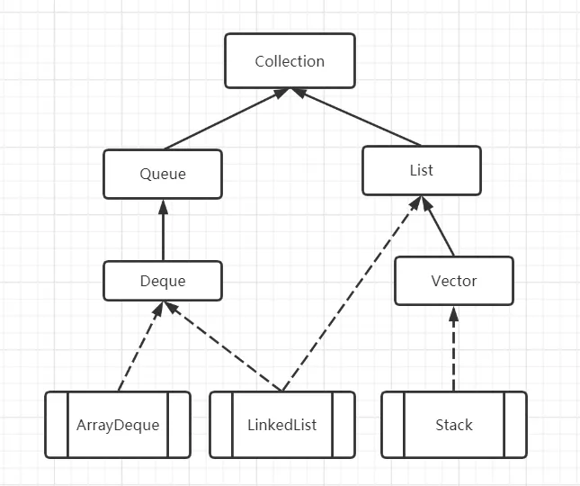

## 更新Stack写法
一般的
```java
Stack<T> stack = new Stack<>()
```
JavaDoc 推荐 
```java
Deque<Integer> stack = new ArrayDeque<Integer>();
```

WHY

    A more complete and consistent set of LIFO stack operations is provided by the Deque interface and its implementations, which should be used in preference to this class. 
    
    
    For example:Deque<Integer> stack = new ArrayDeque<Integer>();



Deque是继承自Queue，而Stack是继承自Vector，这就比较奇怪了。

### Vector

　　Vector是由数组实现的集合类，他包含了大量集合处理的方法。而Stack之所以继承Vector，是为了复用Vector中的方法，来实现进栈（push）、出栈(pop)等操作。这里就是Stack设计不好的地方，既然只是为了实现栈，不用链表来单独实现，而是为了复用简单的方法而迫使它继承Vector，Stack和Vector本来是毫无关系的。这使得Stack在基于数组实现上效率受影响，另外因为继承Vector类，Stack可以复用Vector大量方法，这使得Stack在设计上不严谨，例如Vector中的：

```java
public void add(int index, E element) {
    insertElementAt(element, index);
}
```

### Deuqe

Java中的Deuqe，即“double ended queue”的缩写，是Java中的双端队列集合类型，它集成自Deque，完全具备普通队列FIFO的功能，同时它也具备了Stack的LIFO功能，并且保留了push和pop函数，所以使用起来应该是一点障碍都没有。
　　

Deque可以由ArrayDeuqe或者LinkedList实现，它们两者使用的区别以及优劣也就是数组和链表的区别，你懂得。

#### ArrayDeque

ArrayDeque是Deque接口的一种具体实现，是依赖于可变数组来实现的。ArrayDeque 没有容量限制，可根据需求自动进行扩容。

ArrayDeque可以作为栈来使用，效率要高于 Stack。ArrayDeque也可以作为队列来使用，效率相较于基于双向链表的LinkedList也要更好一些。注意，ArrayDeque不支持为null的元素。

#### LinkedList
　　LinkedList与ArrayList一样实现List接口，只是ArrayList是List接口的大小可变数组的实现，LinkedList是List 接口链表的实现。基于链表实现的方式使得 LinkedList 在插入和删除时更优于ArrayList，而随机访问则比ArrayList逊色些。
　　

LinkedList实现所有可选的列表操作，并允许所有的元素包括null。

除了实现List接口外，LinkedList类还为在列表的开头及结尾 get、remove 和 insert 元素提供了统一的命名方法。这些操作允许将链接列表用作堆栈、队列或双端队列。


此类实现 Deque 接口，为 add、poll 提供先进先出队列操作，以及其他堆栈和双端队列操作。


所有操作都是按照双重链接列表的需要执行的。在列表中编索引的操作将从开头或结尾遍历列表（从靠近指定索引的一端）。

同时，与 ArrayList 一样此实现不是同步的。

[原文: http://chengfeng96.com/blog/2018/01/20/Java中用Deque接口代替Stack接口完成栈功能/　　作者: Hazza Cheng]