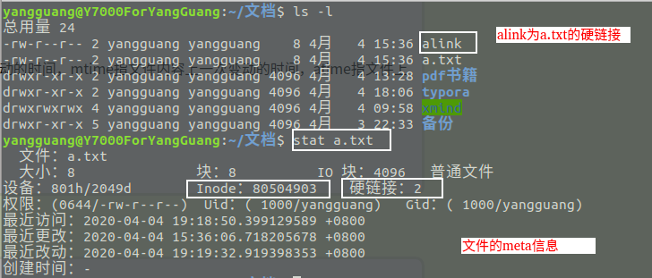

# 1. Linux

### 1.0.1. 关闭端口
  ```
  netstat -ano|findstr "8082"
  taskkill  -F -PID 6832
  ```
  
### 1.0.2. kill pid与kill -9 pid的区别
 
  kill pid的作用是向进程号为pid的进程发送SIGTERM（这是kill默认发送的信号），该信号是一个结束进程的信号且可以被应用程序捕获。若应用程序没有捕获并响应该信号的逻辑代码，则该信号的默认动作是kill掉进程。这是终止指定进程的推荐做法。

  kill -9 pid则是向进程号为pid的进程发送SIGKILL（该信号的编号为9），从本文上面的说明可知，SIGKILL既不能被应用程序捕获，也不能被阻塞或忽略，其动作是立即结束指定进程。通俗地说，应用程序根本无法“感知”SIGKILL信号，它在完全无准备的情况下，就被收到SIGKILL信号的操作系统给干掉了，显然，在这种“暴力”情况下，应用程序完全没有释放当前占用资源的机会。
  
  事实上，SIGKILL信号是直接发给init进程的，它收到该信号后，负责终止pid指定的进程。关于linux init进程的说明，可以参考这里或这里。在某些情况下（如进程已经hang死，无法响应正常信号），就可以使用kill -9来结束进程。

  若通过kill结束的进程是一个创建过子进程的父进程，则其子进程就会成为孤儿进程（Orphan Process），这种情况下，子进程的退出状态就不能再被应用进程捕获（因为作为父进程的应用程序已经不存在了），不过应该不会对整个linux系统产生什么不利影响。

## 1.1. Linux 文件系统概览

<font color = green>

就一个树型的文件目录

</font>

### 1.1.1. Linux 文件系统简介

**在 Linux 操作系统中，所有被操作系统管理的资源，例如网络接口卡、磁盘驱动器、打印机、输入输出设备、普通文件或是目录都被看作是一个文件。** 也就是说在 Linux 系统中有一个重要的概念：**一切都是文件**。

其实这是 UNIX 哲学的一个体现，在 UNIX 系统中，把一切资源都看作是文件，Linux 的文件系统也是借鉴 UNIX 文件系统而来。

### 1.1.2. inode 介绍

**inode 是 linux/unix 文件系统的基础。那么，inode 是什么?有什么作用呢?**

硬盘的最小存储单位是扇区(Sector)，块(block)由多个扇区组成。文件数据存储在块中。块的最常见的大小是 4kb，约为 8 个连续的扇区组成（每个扇区存储 512 字节）。一个文件可能会占用多个 block，但是一个块只能存放一个文件。

虽然，我们将文件存储在了块(block)中，但是我们还需要一个空间来存储文件的 **元信息 metadata** ：如某个文件被分成几块、每一块在的地址、文件拥有者，创建时间，权限，大小等。这种 **存储文件元信息的区域就叫 inode**，译为索引节点：**i（index）+node**。 每个文件都有一个 inode，存储文件的元信息。

可以使用 `stat` 命令可以查看文件的 inode 信息。每个 inode 都有一个号码，Linux/Unix 操作系统不使用文件名来区分文件，而是使用 inode 号码区分不同的文件。

简单来说：inode 就是用来维护某个文件被分成几块、每一块在的地址、文件拥有者，创建时间，权限，大小等信息。

简单总结一下：

- **inode** ：记录文件的属性信息，可以使用 stat 命令查看 inode 信息。
- **block** ：实际文件的内容，如果一个文件大于一个块时候，那么将占用多个 block，但是一个块只能存放一个文件。（因为数据是由 inode 指向的，如果有两个文件的数据存放在同一个块中，就会乱套了）



### 1.1.3. Linux 文件类型

Linux 支持很多文件类型，其中非常重要的文件类型有: **普通文件**，**目录文件**，**链接文件**，**设备文件**，**管道文件**，**Socket 套接字文件**等。

- **普通文件（-）** ： 用于存储信息和数据， Linux 用户可以根据访问权限对普通文件进行查看、更改和删除。比如：图片、声音、PDF、text、视频、源代码等等。
- **目录文件（d，directory file）** ：目录也是文件的一种，用于表示和管理系统中的文件，目录文件中包含一些文件名和子目录名。打开目录事实上就是打开目录文件。
- **符号链接文件（l，symbolic link）** ：保留了指向文件的地址而不是文件本身。
- **字符设备（c，char）** ：用来访问字符设备比如硬盘。
- **设备文件（b，block）** ： 用来访问块设备比如硬盘、软盘。
- **管道文件(p,pipe)** : 一种特殊类型的文件，用于进程之间的通信。
- **套接字(s,socket)** ：用于进程间的网络通信，也可以用于本机之间的非网络通信。

### 1.1.4. Linux 目录树

所有可操作的计算机资源都存在于目录树这个结构中，对计算资源的访问，可以看做是对这棵目录树的访问。

**Linux 的目录结构如下：**

Linux 文件系统的结构层次鲜明，就像一棵倒立的树，最顶层是其根目录：


**常见目录说明：**

- **/bin：** 存放二进制可执行文件(ls、cat、mkdir 等)，常用命令一般都在这里；
- **/etc：** 存放系统管理和配置文件；
- **/home：** 存放所有用户文件的根目录，是用户主目录的基点，比如用户 user 的主目录就是/home/user，可以用~user 表示；
- **/usr ：** 用于存放系统应用程序；
- **/opt：** 额外安装的可选应用程序包所放置的位置。一般情况下，我们可以把 tomcat 等都安装到这里；
- **/proc：** 虚拟文件系统目录，是系统内存的映射。可直接访问这个目录来获取系统信息；
- **/root：** 超级用户（系统管理员）的主目录（特权阶级^o^）；
- **/sbin:** 存放二进制可执行文件，只有 root 才能访问。这里存放的是系统管理员使用的系统级别的管理命令和程序。如 ifconfig 等；
- **/dev：** 用于存放设备文件；
- **/mnt：** 系统管理员安装临时文件系统的安装点，系统提供这个目录是让用户临时挂载其他的文件系统；
- **/boot：** 存放用于系统引导时使用的各种文件；
- **/lib ：** 存放着和系统运行相关的库文件 ；
- **/tmp：** 用于存放各种临时文件，是公用的临时文件存储点；
- **/var：** 用于存放运行时需要改变数据的文件，也是某些大文件的溢出区，比方说各种服务的日志文件（系统启动日志等。）等；
- **/lost+found：** 这个目录平时是空的，系统非正常关机而留下“无家可归”的文件（windows 下叫什么.chk）就在这里。

## 1.2. Linux 基本命令

下面只是给出了一些比较常用的命令。推荐一个 Linux 命令快查网站，非常不错，大家如果遗忘某些命令或者对某些命令不理解都可以在这里得到解决。

Linux 命令大全：[http://man.linuxde.net/](http://man.linuxde.net/)

### 1.2.1. 目录切换命令

- **`cd usr`：** 切换到该目录下 usr 目录
- **`cd ..（或cd../）`：** 切换到上一层目录
- **`cd /`：** 切换到系统根目录
- **`cd ~`：** 切换到用户主目录
- **`cd -`：** 切换到上一个操作所在目录

### 1.2.2. 目录的操作命令(增删改查)

- **`mkdir 目录名称`：** 增加目录。
- **`ls/ll`**（ll 是 ls -l 的别名，ll 命令可以看到该目录下的所有目录和文件的详细信息）：查看目录信息。
- **`find 目录 参数`：** 寻找目录（查）。示例：① 列出当前目录及子目录下所有文件和文件夹: `find .`；② 在`/home`目录下查找以.txt 结尾的文件名:`find /home -name "*.txt"` ,忽略大小写: `find /home -iname "*.txt"` ；③ 当前目录及子目录下查找所有以.txt 和.pdf 结尾的文件:`find . \( -name "*.txt" -o -name "*.pdf" \)`或`find . -name "*.txt" -o -name "*.pdf"`。
- **`mv 目录名称 新目录名称`：** 修改目录的名称（改）。注意：mv 的语法不仅可以对目录进行重命名而且也可以对各种文件，压缩包等进行 重命名的操作。mv 命令用来对文件或目录重新命名，或者将文件从一个目录移到另一个目录中。后面会介绍到 mv 命令的另一个用法。
- **`mv 目录名称 目录的新位置`：** 移动目录的位置---剪切（改）。注意：mv 语法不仅可以对目录进行剪切操作，对文件和压缩包等都可执行剪切操作。另外 mv 与 cp 的结果不同，mv 好像文件“搬家”，文件个数并未增加。而 cp 对文件进行复制，文件个数增加了。
- **`cp -r 目录名称 目录拷贝的目标位置`：** 拷贝目录（改），-r 代表递归拷贝 。注意：cp 命令不仅可以拷贝目录还可以拷贝文件，压缩包等，拷贝文件和压缩包时不 用写-r 递归。
- **`rm [-rf] 目录` :** 删除目录（删）。注意：rm 不仅可以删除目录，也可以删除其他文件或压缩包，为了增强大家的记忆， 无论删除任何目录或文件，都直接使用`rm -rf` 目录/文件/压缩包。

### 1.2.3. 文件的操作命令(增删改查)

- **`touch 文件名称`:** 文件的创建（增）。
- **`cat/more/less/tail 文件名称`** ：文件的查看（查） 。命令 `tail -f 文件` 可以对某个文件进行动态监控，例如 tomcat 的日志文件， 会随着程序的运行，日志会变化，可以使用 `tail -f catalina-2016-11-11.log` 监控 文 件的变化 。
- **`vim 文件`：** 修改文件的内容（改）。vim 编辑器是 Linux 中的强大组件，是 vi 编辑器的加强版，vim 编辑器的命令和快捷方式有很多，但此处不一一阐述，大家也无需研究的很透彻，使用 vim 编辑修改文件的方式基本会使用就可以了。在实际开发中，使用 vim 编辑器主要作用就是修改配置文件，下面是一般步骤： `vim 文件------>进入文件----->命令模式------>按i进入编辑模式----->编辑文件 ------->按Esc进入底行模式----->输入：wq/q!` （输入 wq 代表写入内容并退出，即保存；输入 q!代表强制退出不保存）。
- **`rm -rf 文件`：** 删除文件（删）。

### 1.2.4. 压缩文件的操作命令

**1）打包并压缩文件：**

Linux 中的打包文件一般是以.tar 结尾的，压缩的命令一般是以.gz 结尾的。而一般情况下打包和压缩是一起进行的，打包并压缩后的文件的后缀名一般.tar.gz。
命令：`tar -zcvf 打包压缩后的文件名 要打包压缩的文件` ，其中：

- z：调用 gzip 压缩命令进行压缩
- c：打包文件
- v：显示运行过程
- f：指定文件名

比如：假如 test 目录下有三个文件分别是：aaa.txt bbb.txt ccc.txt，如果我们要打包 test 目录并指定压缩后的压缩包名称为 test.tar.gz 可以使用命令：**`tar -zcvf test.tar.gz aaa.txt bbb.txt ccc.txt` 或 `tar -zcvf test.tar.gz /test/`**

**2）解压压缩包：**

命令：`tar [-xvf] 压缩文件``

其中：x：代表解压

示例：

- 将 /test 下的 test.tar.gz 解压到当前目录下可以使用命令：**`tar -xvf test.tar.gz`**
- 将 /test 下的 test.tar.gz 解压到根目录/usr 下:**`tar -xvf test.tar.gz -C /usr`**（- C 代表指定解压的位置）

### 1.2.5. Linux 的权限命令

<font color = green>

```shell
chmod 777 xxx
```
拥有者 所在用户组 其他
</font>

操作系统中每个文件都拥有特定的权限、所属用户和所属组。权限是操作系统用来限制资源访问的机制，在 Linux 中权限一般分为读(readable)、写(writable)和执行(excutable)，分为三组。分别对应文件的属主(owner)，属组(group)和其他用户(other)，通过这样的机制来限制哪些用户、哪些组可以对特定的文件进行什么样的操作。

通过 **`ls -l`** 命令我们可以 查看某个目录下的文件或目录的权限

示例：在随意某个目录下`ls -l`


第一列的内容的信息解释如下：


> 下面将详细讲解文件的类型、Linux 中权限以及文件有所有者、所在组、其它组具体是什么？

**文件的类型：**

- d： 代表目录
- -： 代表文件
- l： 代表软链接（可以认为是 window 中的快捷方式）

**Linux 中权限分为以下几种：**

- r：代表权限是可读，r 也可以用数字 4 表示
- w：代表权限是可写，w 也可以用数字 2 表示
- x：代表权限是可执行，x 也可以用数字 1 表示

**文件和目录权限的区别：**

对文件和目录而言，读写执行表示不同的意义。

对于文件：

| 权限名称 |                  可执行操作 |
| :------- | --------------------------: |
| r        | 可以使用 cat 查看文件的内容 |
| w        |          可以修改文件的内容 |
| x        |    可以将其运行为二进制文件 |

对于目录：

| 权限名称 |               可执行操作 |
| :------- | -----------------------: |
| r        |       可以查看目录下列表 |
| w        | 可以创建和删除目录下文件 |
| x        |     可以使用 cd 进入目录 |

需要注意的是： **超级用户可以无视普通用户的权限，即使文件目录权限是 000，依旧可以访问。**

**在 linux 中的每个用户必须属于一个组，不能独立于组外。在 linux 中每个文件有所有者、所在组、其它组的概念。**

- **所有者(u)** ：一般为文件的创建者，谁创建了该文件，就天然的成为该文件的所有者，用 `ls ‐ahl` 命令可以看到文件的所有者 也可以使用 chown 用户名 文件名来修改文件的所有者 。
- **文件所在组(g)** ：当某个用户创建了一个文件后，这个文件的所在组就是该用户所在的组用 `ls ‐ahl`命令可以看到文件的所有组也可以使用 chgrp 组名 文件名来修改文件所在的组。
- **其它组(o)** ：除开文件的所有者和所在组的用户外，系统的其它用户都是文件的其它组。

> 我们再来看看如何修改文件/目录的权限。

**修改文件/目录的权限的命令：`chmod`**

示例：修改/test 下的 aaa.txt 的权限为文件所有者有全部权限，文件所有者所在的组有读写权限，其他用户只有读的权限。

**`chmod u=rwx,g=rw,o=r aaa.txt`** 或者 **`chmod 764 aaa.txt`**


**补充一个比较常用的东西:**

假如我们装了一个 zookeeper，我们每次开机到要求其自动启动该怎么办？

1. 新建一个脚本 zookeeper
2. 为新建的脚本 zookeeper 添加可执行权限，命令是:`chmod +x zookeeper`
3. 把 zookeeper 这个脚本添加到开机启动项里面，命令是：`chkconfig --add zookeeper`
4. 如果想看看是否添加成功，命令是：`chkconfig --list`

### 1.2.6. Linux 用户管理

Linux 系统是一个多用户多任务的分时操作系统，任何一个要使用系统资源的用户，都必须首先向系统管理员申请一个账号，然后以这个账号的身份进入系统。

用户的账号一方面可以帮助系统管理员对使用系统的用户进行跟踪，并控制他们对系统资源的访问；另一方面也可以帮助用户组织文件，并为用户提供安全性保护。

**Linux 用户管理相关命令:**

- `useradd 选项 用户名`:添加用户账号
- `userdel 选项 用户名`:删除用户帐号
- `usermod 选项 用户名`:修改帐号
- `passwd 用户名`:更改或创建用户的密码
- `passwd -S 用户名` :显示用户账号密码信息
- `passwd -d 用户名`: 清除用户密码

`useradd` 命令用于 Linux 中创建的新的系统用户。`useradd`可用来建立用户帐号。帐号建好之后，再用`passwd`设定帐号的密码．而可用`userdel`删除帐号。使用`useradd`指令所建立的帐号，实际上是保存在 `/etc/passwd`文本文件中。

`passwd`命令用于设置用户的认证信息，包括用户密码、密码过期时间等。系统管理者则能用它管理系统用户的密码。只有管理者可以指定用户名称，一般用户只能变更自己的密码。

### 1.2.7. Linux 系统用户组的管理

每个用户都有一个用户组，系统可以对一个用户组中的所有用户进行集中管理。不同 Linux 系统对用户组的规定有所不同，如 Linux 下的用户属于与它同名的用户组，这个用户组在创建用户时同时创建。

用户组的管理涉及用户组的添加、删除和修改。组的增加、删除和修改实际上就是对`/etc/group`文件的更新。

**Linux 系统用户组的管理相关命令:**

- `groupadd 选项 用户组` :增加一个新的用户组
- `groupdel 用户组`:要删除一个已有的用户组
- `groupmod 选项 用户组` : 修改用户组的属性

### 1.2.8. 其他常用命令

- **`pwd`：** 显示当前所在位置

- `sudo + 其他命令`：以系统管理者的身份执行指令，也就是说，经由 sudo 所执行的指令就好像是 root 亲自执行。

- **`grep 要搜索的字符串 要搜索的文件 --color`：** 搜索命令，--color 代表高亮显示

- **`ps -ef`/`ps -aux`：** 这两个命令都是查看当前系统正在运行进程，两者的区别是展示格式不同。如果想要查看特定的进程可以使用这样的格式：**`ps aux|grep redis`** （查看包括 redis 字符串的进程），也可使用 `pgrep redis -a`。

  注意：如果直接用 ps（（Process Status））命令，会显示所有进程的状态，通常结合 grep 命令查看某进程的状态。

- **`kill -9 进程的pid`：** 杀死进程（-9 表示强制终止。）

  先用 ps 查找进程，然后用 kill 杀掉

- **网络通信命令：**
  - 查看当前系统的网卡信息：ifconfig
  - 查看与某台机器的连接情况：ping
  - 查看当前系统的端口使用：netstat -an
- **net-tools 和 iproute2 ：**
  `net-tools`起源于 BSD 的 TCP/IP 工具箱，后来成为老版本 LinuxLinux 中配置网络功能的工具。但自 2001 年起，Linux 社区已经对其停止维护。同时，一些 Linux 发行版比如 Arch Linux 和 CentOS/RHEL 7 则已经完全抛弃了 net-tools，只支持`iproute2`。linux ip 命令类似于 ifconfig，但功能更强大，旨在替代它。更多详情请阅读[如何在 Linux 中使用 IP 命令和示例](https://linoxide.com/linux-command/use-ip-command-linux)
- **`shutdown`：** `shutdown -h now`： 指定现在立即关机；`shutdown +5 "System will shutdown after 5 minutes"`：指定 5 分钟后关机，同时送出警告信息给登入用户。

- **`reboot`：** **`reboot`：** 重开机。**`reboot -w`：** 做个重开机的模拟（只有纪录并不会真的重开机）。
