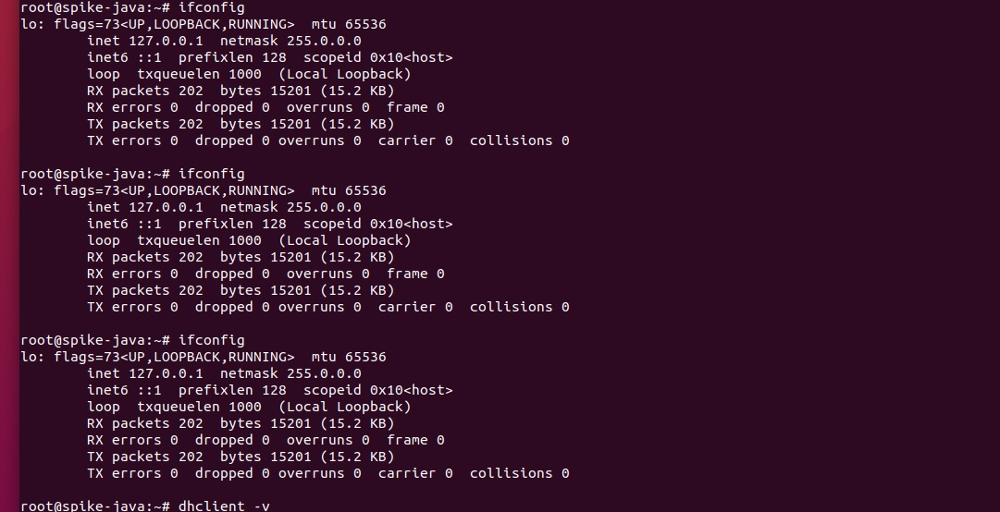
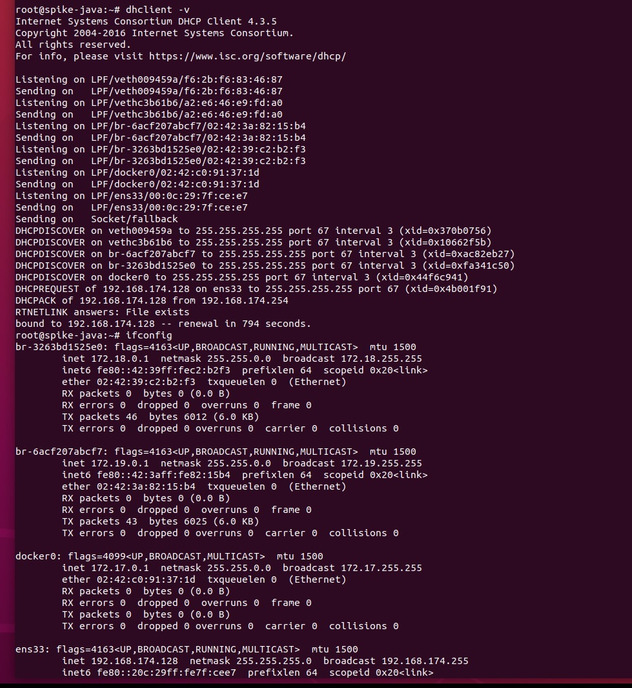

## VMware IP 分配

今天又又又被要求改需求

之前的数据库已经上线了，肯定不能乱搞 prod 的

那只能操作 虚拟机 了

发现 RedisManager 连不上 感觉像是虚拟机的IP的问题

一看 127.0.0.1 这肯定不对啊 本地了哥



最开始还以为是 他那个 网卡的 NAT 和桥接的问题

### 解决办法

通过 dhclient 命令配置网络接口参数。

```shell
dhclient -v
```




```shell
ens33: flags=4163<UP,BROADCAST,RUNNING,MULTICAST>  mtu 1500
        inet 192.168.174.128  netmask 255.255.255.0  broadcast 192.168.174.255
```


dhclient (选项) (参数)
```shell
0 : 指定dhcp客户端监听的端口号；
d : 总是以前台方式运行程序；
q : 安静模式，不打印任何错误的提示信息；
r : 释放ip地址。
```