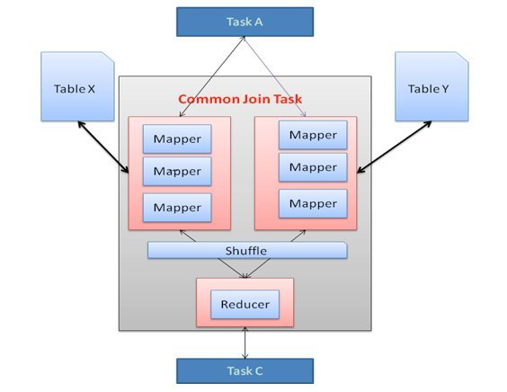
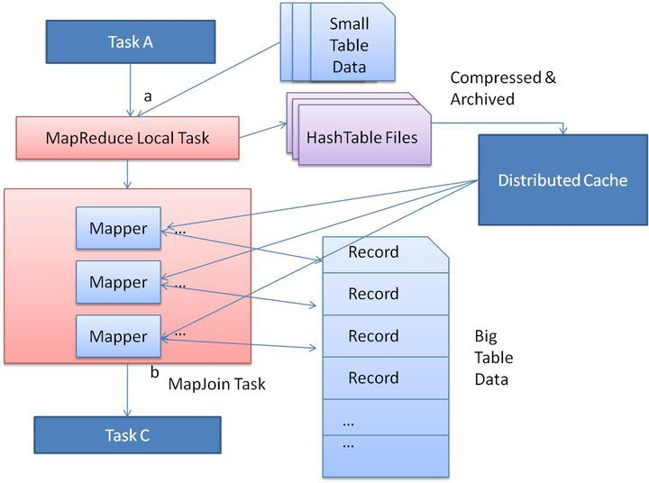
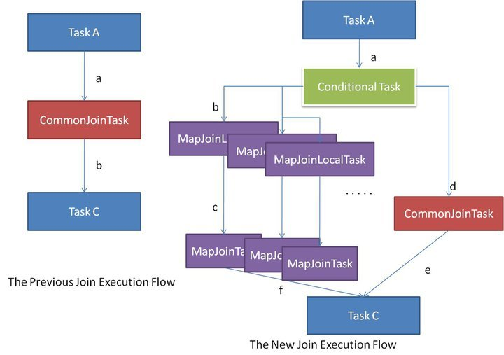

# BugFixInHive
## MapJoin
### CommonMapJoin 
common map join 按照这个流程走

就是一拆一和

Common Join 操作如图1所示被编译为 MapReduce 任务。Common Join 任务涉及 Map 阶段和 Reduce 阶段。Mapper 从连接表中读取数据并将连接的 key 和连接的 value 键值对输出到中间文件中。Hadoop 在所谓的 shuffle 阶段对这些键值对进行排序和合并。Reducer 将排序结果作为输入，并进行实Join。Shuffle 阶段代价非常昂贵，因为它需要排序和合并。减少 Shuffle 和 Reduce 阶段的代价可以提高任务性能。

Map Join 的目的是减少 Shuffle 和 Reducer 阶段的代价，并仅在 Map 阶段进行 Join。通过这样做，当其中一个连接表足够小可以装进内存时，所有 Mapper 都可以将数据保存在内存中并完成 Join。因此，所有 Join 操作都可以在 Mapper 阶段完成。但是，这种类型的 Map Join 存在一些扩展问题。当成千上万个 Mapper 同时从 HDFS 将小的连接表读入内存时，连接表很容易成为性能瓶颈，导致 Mapper 在读取操作期间超时。

### 优化版MapJoin

<font color = green>
对于特别小的Map < 25MB，每天机器通过localThread转化成HashTable,当 MapReduce 任务启动时，会将这个哈希表文件上传到 Hadoop 分布式缓存中，该缓存会将这些文件发送到每个 Mapper 的本地磁盘上。因此，所有 Mapper 都可以将此持久化的哈希表文件加载回内存，并像之前一样进行 Join。
</font>

优化的 Map Join 的执行流程如下图所示。优化后，小表只需要读取一次。此外，如果多个 Mapper 在同一台机器上运行，则分布式缓存只需将哈希表文件的一个副本发送到这台机器上。


由于 Map Join 比 Common Join 更快，因此最好尽可能运行 Map Join。以前，Hive用户需要在查询中给出提示来指定哪一个是小表。例如：
```SQL
SELECT　/*+MAPJOIN（a）*/ FROM src1 x JOIN src2 y ON x.key = y.key;。
```
对于 Map Join，查询处理器应该知道哪个输入表是大表。其他输入表在执行阶段被识别为小表，并将这些表保存在内存中。然而，查询处理器在编译时不知道输入文件大小，因为一些表可能是从子查询生成的中间表。因此查询处理器只能在执行期间计算出输入文件的大小



如上图所示，左侧流程显示了先前的 Common Join 执行流程，这非常简单。另一方面，右侧流程是新的 Common Join 执行流程。在编译期间，查询处理器生成一个包含任务列表的 Conditional Task。在执行期间运行其中一个任务。首先，应将原始的 Common Join 任务放入任务列表中。然后，查询处理器通过假设每个输入表可能是大表来生成一系列的 Map Join 任务。例如，`select * from src1 x join src2 y on x.key=y.key`。因为表 src2 和 src1 都可以是大表，所以处理器生成两个 Map Join 任务，其中一个假设 src1 是大表，另一个假设 src2 是大表。

在执行阶段，Conditional Task 知道每个输入表的确切文件大小，即使该表是中间表。如果所有表都太大而无法转换为 Map Join，那么只能像以前一样运行 Common Join 任务。如果其中一个表很大而其他表足够小可以运行 Map Join，则将 Conditional Task 选择相应 Map Join 本地任务来运行。通过这种机制，可以自动和动态地将 Common Join 转换为 Map Join。

目前，如果小表的总大小大于25MB，Conditional Task 会选择原始 Common Join 来运行。25MB是一个非常保守的数字，你可以使用 set `hive.smalltable.filesize` 来修改。

虽然说在后面的版本引入了 按照文件大小来处理

### 需求 

然而他在local处理的时候，如果报错了是没有log的,他这个log是写在hadoop里的，我们最好能把Hadoop里的报错日志写到hive.log里


## Client端仿Service段输出日志
Service端任务调用Metastore API的时候打印相关日志，方便问题定位。

### 思路 
观察 HiveMeataStore 发现存在日志输出

模仿这部分在Service服务调用前输出日志

在Service端是有两个logInfo的输出的，`startFunction` 和 `endFunction`,通过学习 Hive 的架构发现 他也是RPC。那我只要在client.service调用的时候在他前后进行一个 startFunction 和 endFunction日志的打印就可以了。

~~本来用的try catch finnally 来做日志的打印，但这样我把exception给捕获，那service端的本来的服务就不正常了，所以最后还是用 开一个tmp的办法来解决问题~~

## Hive MapJoin参数限制

mapJoin时存在hive.mapjoin.smalltable.filesize和 hive.auto.convert.join.noconditionaltask.size 参数过大问题，添加warning日志和设置参数，方便排查
### 解决方法

寻找在conf里设置的参数，定位到具体方法，在把设置warning的地方的参数给抽出来放到 conf里。
有些引用是在exec部分，没必要，只用在逻辑判断地方加就ok

ex.
```java
long ThresholdOfSmallTblSizeSum = HiveConf.getLongVar(pCtx.getConf(),
          HiveConf.ConfVars.HIVESMALLTABLESFILESIZE);
      long maxSmallTblSizeSumRange = HiveConf.getLongVar(pCtx.getConf(),
              HiveConf.ConfVars.HIVESMALLTABLESFILESIZERANGE);
      if (ThresholdOfSmallTblSizeSum > maxSmallTblSizeSumRange){
        LOG.warn("The HIVESMALLTABLESFILESIZE = "+ ThresholdOfSmallTblSizeSum +
                " is greater than the maxSmallTblSizeSumRange = " + maxSmallTblSizeSumRange);
      }
```
## 日志清洗脚本

在线上环境中 总是遇到 partition 过多的问题。

定位出 partition 超过 waring 界限的线程，这个线程的 start end 和他所操作的 db 和 tb，梳理。

```python
import re

f = open("/home/hadoop/hive/logs/xxxxx.log")

# threadNum
p1 = re.compile(r"[[](.*?)[]]", re.S)
# db tb
p2 = re.compile(r"(?<= : ).*$", re.S)
# partitionNum
p3 = re.compile(r"(?<=get_partitions )\d+",re.S)
# partitionExpr
p4 = re.compile(r"(?<=get_partitions_by_expr )\d+", re.S)

lines = f.readlines()
n = 0
list=[]
res = []
dic = {}

for line in lines:
    n = n + 1
    thread = re.findall(p1,line)
    list.append(thread)
    list.append(n)
    if "more than" in line:
        # 定位到错误行
        # print(n)
        # 正则得出错误的线程
        # 同线程 向上找2个 向下找1个 下是连着的
        # 因为log是时间顺序的 所以直接逆序查找即可     
        wrongThread = re.findall(p1,line)
        # 如果只要 
        flag = 0
        for i in range(len(list)-1,-1,-1):
            if flag == 2:
                flag = 0
                break
            if  list[i] == wrongThread:
                ans = list[i+1]
                dic[ans] = wrongThread
                # print(ans)
                res.append(ans)
                flag = flag + 1  
        # res.append(n + 1) 

#顺序 3 2 1 4 , sort一下
res.sort()
# 从 0 行开始打印
resDIC = []
print(res)
for i in res:
    # print( "Log line number = ", i)
    # print(lines[i-1])
    resDIC.append(dic[i])
    # print(dic[i])

for i in range(len(resDIC)):
    for j in range(i+1,len(resDIC)):
        if(resDIC[i] == resDIC[j]):
            # print(resDIC[i])
            # print(i)
            li = res[i]
            lj = res[j]
            if re.findall(p2,lines[li - 1]) != []:
                st1 = re.findall(p2,lines[li -1])[0]
                print(st1.strip()),
            if re.findall(p3,lines[lj - 1]) != []:
                st2 = re.findall(p3,lines[lj-1])[0]
                print("partitions=" + st2)
            if re.findall(p4,lines[lj - 1]) != []:
                st2 = re.findall(p4,lines[lj-1])[0]
                print("partitions=" + st2)
# print(res)

f.close()

```


