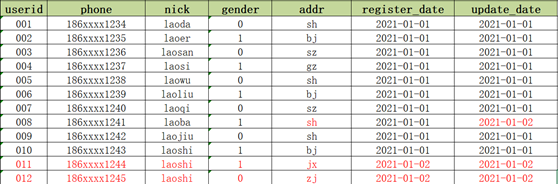

# Hive 

## Hadoop && Hive

### Hadoop 2.7.7 编译

最开始用Ubuntu20 编译的,问题很多

1. protoBuf版本不对
2. findbugs 未安装
3. CmakeList.txt 文件中需要在cmake_minimum_required(VERSION 2.6 FATAL_ERROR)增加一行
    ```
    project(ProjectName)
    ```
4. openssl版本太高（1.1.1->1.0.2）
   ```
   make VERBOSE=1
   ```
### Hadoop 2.10.1 的部署

后来想了下，编译个锤子，直接编译好的包

先搞个 本地模式试试看

解压
```
tar -zxvf hadoop-2.10.1.tar.gz
```
配下profile
```
sudo vim /etc/profile
```
配置 HADOOP_HOME 变量,将 hadoop 的 bin 目录加入到 PATH 变量中
```shell
export HADOOP_HOME=/home/spike/hadoop-2.10.1
PATH=$PATH:$HADOOP_HOME/bin
```


#### run demo 

搞一个 words.txt 内容如下
```
java hadoop spark
python scala hive
hive hbase scala spark
java php spark hadoop
```
运行 hadoop 的 wordcount mapreduce 示例
```shell
hadoop jar $HADOOP_HOME/share/hadoop/mapreduce/hadoop-mapreduce-examples-2.10.1.jar wordcount words output
```

查看output 目录下生成了两个文件 

`part-r-00000` 和 `_SUCCESS`

`_SUCCESS` 说明运行成功了,我们查看 `part-r-00000` 的输出结果
```shell
hadoop	2
hbase	1
hive	2
java	2
php	1
python	1
scala	2
spark	3
```

### Hive 2.1.1 编译和部署

用到的版本就是 2.1.1 而且一般都是要通过 JDBC 链接 MySQL 的

Caution：MySQL 巨坑

换了 Ubuntu 不同版本的MySQL都是不同的
```
我之前用的是 Ubuntu 20 默认是 8.0 坑大的一b
迁移到 16,有手就行
```
安装MySQL
```shell
sudo apt-get install -y mysql-server-5.7
```
配置对应JDBC驱动 丢到lib下
```shell
cd /home/spike/hive-2.1.1/lib
wget https://maven.aliyun.com/repository/public/mysql/mysql-connector-java/8.0.20/mysql-connector-java-8.0.20.jar
```

配置 profile
```shell
export HIVE_HOME=/home/spike/hive-2.1.1
PATH=$PATH:$HIVE_HOME/bin
```
```shell
source /etc/profile
```

配置 hive 的 xml
```shell
mv conf/hive-env.sh.template conf/hive-env.sh # 重命名环境文件
mv conf/hive-log4j2.properties.template conf/hive-log4j2.properties # 重命名日志文件
cp conf/hive-default.xml.template conf/hive-site.xml # 拷贝生成 xml 文件
```
配置 xml 直接查找 
```xml
<!-- hive元数据地址，默认是/user/hive/warehouse -->
<property>
    <name>hive.metastore.warehouse.dir</name>
    <value>/user/hive/warehouse</value>
</property>
<!-- hive查询时输出列名 -->
<property>
    <name>hive.cli.print.header</name>
    <value>true</value>
</property>
<!-- 显示当前数据库名 -->
<property>
    <name>hive.cli.print.current.db</name>
    <value>true</value>
</property>
<!-- 开启本地模式，默认是false -->
<property>
    <name>hive.exec.mode.local.auto</name>
    <value>true</value>
</property>

<property>
    <name>javax.jdo.option.ConnectionUserName</name>
    <value>root</value>
    <description>Username to use against metastore database</description>
</property>
<property>
    <name>javax.jdo.option.ConnectionPassword</name>
    <value>root</value>
    <description>password to use against metastore database</description>
</property>
<!-- URL用于连接远程元数据 -->
<property>
    <name>hive.metastore.uris</name>
    <value>thrift://localhost:9083</value>
</property>
<!-- 元数据使用mysql数据库, amp用来配置时区的-->
<property>
    <name>javax.jdo.option.ConnectionURL</name>
    <value>jdbc:mysql://localhost:3306/hivedb?createDatabaseIfNotExist=true&amp;userSSL=false</value>
</property>
<property>
    <name>javax.jdo.option.ConnectionDriverName</name>
    <value>com.mysql.cj.jdbc.Driver</value>
    <description>Driver class name for a JDBC metastore</description>
</property>
```
error 1
```shell
Caused by: java.net.URISyntaxException: Relative path in absolute URI: ${system:java.io.tmpdir%7D/$%7Bsystem:user.name%7D
```
add this in xml
```xml
  <property>
    <name>system:java.io.tmpdir</name>
    <value>/tmp/hive/java</value>
  </property>
  <property>
    <name>system:user.name</name>
    <value>${user.name}</value>
  </property>
```

error2
```shell
java.lang.IllegalArgumentException:java.net.URISyntaxException: Relative path in absolute URI:{system:java.io.tmpdir%7D/{system:java.io.tmpdir%7D/%7Bsystem:user.name%7D
```
缺少 tmp 文件
```
在hive安装目录下创建临时io的tmp文件夹：
mkdir iotmp
然后，将这个iotmp的绝对路径替换hive-site.xml文件中的
${system:java.io.tmpdir}。
再执行hive，启动成功！
在进行hive测试时也会有IllegalArgumentException问题，这时也只需要将相对路径改为绝对路径！
```
error3
```shell
Error: Duplicate key name 'PCS_STATS_IDX' (state=42000,code=1061)
```
一看 deplicate 数据库重了

这个错误是因为之前你的数据库名字或者表的名字已经存在啦，需要你把之前的删了或者在重新创建一个新的，直接在/conf/hive-site.xml配置文件下面修改，如下图所示，重新定义了一个数据库的名字就可以了


给 MySQL 提权
```SQL
mysql> update mysql.user set host='%' where user='root';
mysql> flush privileges;
```

初始化hive
```
schematool -dbType mysql -initSchema
```
开始元数据
```shell
nohup hive --service metastore & 
```
启动hive
```shell
hive
```
hive 里查看 hdfs 文件系统
```shell
hive(default)>dfs -ls /;
```

### Hive 架构学习和beeline

最近改了一些 service 和 client 的日志方面的东西

发现对编译好的文件，我总是无法体现出我要的效果

啊，发现其实hive是由三种启动模式的。

之前看尚硅谷的课，就没说 我服了。

三种模式 
1. 内嵌式 内置的 derby
2. 本地式 一个数据库对应 启动一个metastore 效率低 可有 MySQL
3. remote 同意链接到一个metastore，metastore再处理对应的

我这里主要是要做到 beeline 就是来连接 HiveService2，HiveService2在和metastore通信，metastore负责处理MySQL中的对应关系

## Hive 基础理论和语法学习

### 建表语法
```SQL
CREATE [EXTERNAL] TABLE [IF NOT EXISTS] table_name
[(col_name data_type [COMMENT col_comment], ...)]
[COMMENT table_comment]
[PARTITIONED BY (col_name data_type [COMMENT col_comment], ...)]
[CLUSTERED BY (col_name, col_name, ...)
[SORTED BY (col_name [ASC|DESC], ...)] INTO num_buckets BUCKETS]
[ROW FORMAT row_format]
[STORED AS file_format]
[LOCATION hdfs_path]
[TBLPROPERTIES (property_name=property_value, ...)]
[AS select_statement]
```

1. CREATE TABLE 创建一个指定名字的表。如果相同名字的表已经存在，则抛出异常；用户可以用 IF NOT EXISTS 选项来忽略这个异常。
2. `EXTERNAL 关键字可以让用户创建一个外部表，在建表的同时可以指定一个指向实
际数据的路径（LOCATION），在删除表的时候，内部表的元数据和数据会被一起删除，而外部表只删除元数据，不删除数据。`
3. COMMENT：为表和列添加注释。
4. `PARTITIONED BY 创建分区表 `
5. CLUSTERED BY 创建分桶表
6. SORTED BY 不常用，对桶中的一个或多个列另外排序
7. `ROW FORMAT 行的格式`
8. STORED AS 指定存储文件类型
常用的存储文件类型：SEQUENCEFILE（二进制序列文件）、TEXTFILE（文本）、RCFILE（列式存储格式文件）如果文件数据是纯文本，可以使用STORED AS TEXTFILE。如果数据需要压缩，使用 STORED AS SEQUENCEFILE。
9. LOCATION ：指定表在 HDFS 上的存储位置。
10. AS：后跟查询语句，根据查询结果创建表。
11. LIKE 允许用户复制现有的表结构，但是不复制数据。

#### 管理表

当我们删除一个管理表时，Hive 也会删除这个表中数据。管理表不适合和其他工具共享
数据。

#### 外部表

因为表是外部表，所以 Hive 并非认为其完全拥有这份数据。删除该表并不会删除掉这
份数据，不过描述表的元数据信息会被删除掉。

#### 两种表相互转换

1. 查询表的类型
```SQL
hive (default)> desc formatted test2;
```
```SQL
OK
col_name	data_type	comment
# col_name            	data_type           	comment             
	 	 
id                  	string              	                    
	 	 
# Detailed Table Information	 	 
Database:           	db_hive             	 
Owner:              	root                	 
CreateTime:         	Fri May 21 11:29:23 CST 2021	 
LastAccessTime:     	UNKNOWN             	 
Retention:          	0                   	 
Location:           	file:/user/hive/warehouse/db_hive.db/test2	 
Table Type:         	EXTERNAL_TABLE      	 
Table Parameters:	 	 
	COLUMN_STATS_ACCURATE	{\"BASIC_STATS\":\"true\"}
	EXTERNAL            	TRUE                
	numFiles            	0                   
	numRows             	0                   
	rawDataSize         	0                   
	totalSize           	0                   
	transient_lastDdlTime	1621567763          
	 	 
# Storage Information	 	 
SerDe Library:      	org.apache.hadoop.hive.serde2.lazy.LazySimpleSerDe	 
InputFormat:        	org.apache.hadoop.mapred.TextInputFormat	 
OutputFormat:       	org.apache.hadoop.hive.ql.io.HiveIgnoreKeyTextOutputFormat	 
Compressed:         	No                  	 
Num Buckets:        	-1                  	 
Bucket Columns:     	[]                  	 
Sort Columns:       	[]                  	 
Storage Desc Params:	 	 
	serialization.format	1                   
Time taken: 0.351 seconds, Fetched: 31 row(s)

```
2. 修改外部表为内部表
```SQL
alter table test2 set tblproperties('EXTERNAL'='false');
```
3. 查询表的类型
```SQL
hive (default)> desc formatted test2;
```
```SQL
OK
col_name	data_type	comment
# col_name            	data_type           	comment             
	 	 
id                  	string              	                    
	 	 
# Detailed Table Information	 	 
Database:           	db_hive             	 
Owner:              	root                	 
CreateTime:         	Fri May 21 11:29:23 CST 2021	 
LastAccessTime:     	UNKNOWN             	 
Retention:          	0                   	 
Location:           	file:/user/hive/warehouse/db_hive.db/test2	 
Table Type:         	MANAGED_TABLE       	 
Table Parameters:	 	 
	EXTERNAL            	false               
	last_modified_by    	root                
	last_modified_time  	1621568343          
	numFiles            	0                   
	numRows             	0                   
	rawDataSize         	0                   
	totalSize           	0                   
	transient_lastDdlTime	1621568343          
	 	 
# Storage Information	 	 
SerDe Library:      	org.apache.hadoop.hive.serde2.lazy.LazySimpleSerDe	 
InputFormat:        	org.apache.hadoop.mapred.TextInputFormat	 
OutputFormat:       	org.apache.hadoop.hive.ql.io.HiveIgnoreKeyTextOutputFormat	 
Compressed:         	No                  	 
Num Buckets:        	-1                  	 
Bucket Columns:     	[]                  	 
Sort Columns:       	[]                  	 
Storage Desc Params:	 	 
	serialization.format	1                   
Time taken: 0.109 seconds, Fetched: 32 row(s)
```
4. 修改外部表 test2 为内部表
alter table test2 set tblproperties('EXTERNAL'='TRUE');
5. 查询表的类型
hive (default)> desc formatted test2;

注意：('EXTERNAL'='TRUE')和('EXTERNAL'='FALSE')为固定写法，区分大小写！

### 修改表信息

#### 重命名表
```SQL
ALTER TABLE table_name RENAME TO new_table_name
```

```SQL
alter table test2 rename to test22;
```

#### 增加/修改/替换列信息

1. 更新列
```SQL
ALTER TABLE table_name CHANGE [COLUMN] col_old_name col_new_name
column_type [COMMENT col_comment] [FIRST|AFTER column_name]
```
必须同时修改 `类型+列名` 类型修改前和后可以一样。
```SQL
alter table test2 change id stu_id string;
```

2. 增加或者替换列
```SQL
ALTER TABLE table_name ADD|REPLACE COLUMNS (col_name data_type [COMMENT
col_comment], ...)
```
```SQL
alter table test22 add columns (name string);
```

ADD 是代表新增一字段，字段位置在所有列后面(partition 列前)，

REPLACE 则是表示替换表中所有字段。

### DML

#### Load 语法
```SQL
hive> load data [local] inpath '数据的 path' [overwrite] into table
student [partition (partcol1=val1,…)];
```
1. load data:表示加载数据
2. local:表示从本地加载数据到 hive 表；否则从 HDFS 加载数据到 hive 表
3. inpath:表示加载数据的路径
4. overwrite:表示覆盖表中已有数据，否则表示追加
5. into table:表示加载到哪张表
6. student:表示具体的表
7. partition:表示上传到指定分区
上传到HDFS
```SQL
hive (default)> dfs -put /opt/module/hive/data/student.txt
/user/atguigu/hive;
```
从HDFS上加载
```SQL
hive (default)> load data inpath '/user/atguigu/hive/student.txt' into
table default.student;
```
实操
```SQL
load data local inpath '/home/spike/stu.txt' into table db_hive.student;
```
通过 put 不走 MR 可能会有 count(*) 会漏数据

通过 load 会走 MR 

#### Insert 语法

1. 创建一张表
```SQL
hive (default)> create table student_par(id int, name string) row format
delimited fields terminated by '\t';
```
2. 基本插入数据
```SQL
hive (default)> insert into table student_par
values(1,'wangwu'),(2,'zhaoliu');
```
3. 基本模式插入（根据单张表查询结果）
```SQL
hive (default)> insert overwrite table student_par
 select id, name from student where month='201709';
```
insert into：以追加数据的方式插入到表或分区，原有数据不会删除

insert overwrite：会覆盖表中已存在的数据

注意：insert 不支持插入部分字段


#### As Select
根据查询结果创建表（查询的结果会添加到新创建的表中）

不用指定数据类型，直接抄查询的那张表的数据类型
```SQL
create table if not exists student3
as select id, name from student;
```

#### 建表的时候通过 Location 来指定加载路径
先上传
```SQL
hive (default)> dfs -mkdir /student;
hive (default)> dfs -put /opt/module/datas/student.txt /student;
```
通过location来指定位置
```SQL
hive (default)> create external table if not exists student5(
 id int, name string
 )
 row format delimited fields terminated by '\t'
 location '/student;
```

### Insert 导出

* 注意有坑 `overwrite` 直接覆写 我导出到 home/user 下直接人没了
1. 将查询的结果导出到本地
```SQL
hive (default)> insert overwrite local directory
'/home/spike/stu'
select * from student;
```
2. 将查询的结果格式化导出到本地
```SQL
hive(default)>insert overwrite local directory
'/opt/module/hive/data/export/student1'
ROW FORMAT DELIMITED FIELDS TERMINATED BY '\t'
select * from student;
```
3. 将查询的结果导出到 HDFS 上(没有 local)
```SQL
hive (default)> insert overwrite directory '/user/atguigu/student2'
 ROW FORMAT DELIMITED FIELDS TERMINATED BY '\t'
 select * from student;
```

### Export 导出 HDFS
```SQL
(defahiveult)> export table default.student
to '/user/hive/warehouse/export/student';
```

### Import 数据到指定 Hive 表中
注意：先用 export 导出后，再将数据导入。
```SQL
hive (default)> import table student2
from '/user/hive/warehouse/export/student';
```
1. 要是空表
2. 文件下不能有 metadata

export 和 import 主要用于两个 Hadoop 平台集群之间 Hive 表迁移。

### Truncate
```SQL
hive (default)> truncate table student;
```
注意：Truncate 只能删除管理表，不能删除外部表中数据

## 查询

查表基本语法
```SQL
SELECT [ALL | DISTINCT] select_expr, select_expr, ...
FROM table_reference
[WHERE where_condition]
[GROUP BY col_list]
[ORDER BY col_list]
[CLUSTER BY col_list
| [DISTRIBUTE BY col_list] [SORT BY col_list]
]
[LIMIT number]
```
做两个表 部门表 员工表 `\t` 做分隔符
### 建表
```SQL
create table if not exists dept(
deptno int,
dname string,
loc int
)
row format delimited fields terminated by '\t';
```
```SQL
create table if not exists emp(
empno int,
ename string,
job string,
mgr int,
hiredate string,
sal double,
comm double,
deptno int)
row format delimited fields terminated by '\t';
```
```txt
7369    MITH    CLERK   7902    1980-12-17      800.00          20
7499    ALLEN   SALESMAN        7698    1981-2-20       600.00  300.00  30
7521    WARD    SALESMAN        7698    1981-2-22       1250.00 500.00  30
7566    JONES   MANAGER 7839    1981-4-2        2975.00         20
7654    MARTIN  SALESMAN        7698    1981-9-28       1250.00 1400.00 30
7698    BLAKE   MANAGER 7839    1981-5-1        2850.00         30
7782    CLARK   MANAGER 7839    1981-6-9        2450.00         10
7788    SCOTT   ANALYST 7566    1987-4-19       3000.00         20
7839    KING    PRESIDENT               1981-11-17      5000.00         10
7844    TURNER  SALESMAN        7698    1981-9-8        1500.00 0.00    30
7876    ADAMS   CLERK   7788    1987-5-23       1100.00         20
7900    JAMES   CLERK   7698    1981-12-3       950.00          30
7902    FORD    ANALYST 7566    1981-12-3       3000.00         20
7934    MILLER  CLERK   7782    1982-1-23       1300.00         10
```
```
10      ACCOUNTING      1700
20      RESEARCH        1800
30      SALES   1900
40      OPERATIONS      1700
```

### 导入数据 
```SQL
load data local inpath '/home/spike/data/emp.txt' into table emp;

load data local inpath '/home/spike/data/dept.txt' into table dept;
```
### 基础查询
1. 全表查询
```SQL
hive (default)> select * from emp;
hive (default)> select empno,ename,job,mgr,hiredate,sal,comm,deptno from
emp ;
```
2）选择特定列查询
```SQL
hive (default)> select empno, ename from emp;
```
注意：
1. SQL 语言大小写不敏感。
2. SQL 可以写在一行或者多行
3. 关键字不能被缩写也不能分行
4. 各子句一般要分行写。
5. 使用缩进提高语句的可读性。Linux 里用 tab 会出现提示然后GG。四个空格 ok

### 别名用法

1. 重命名一个列
2. 便于计算
3. 紧跟列名，也可以在列名和别名之间加入关键字‘AS’

查询名称和部门
```SQL
hive (default)> select ename AS name, deptno dn from emp;

OK
name	dn
MITH	20
ALLEN	30
WARD	30
JONES	20
MARTIN	30
BLAKE	30
CLARK	10
SCOTT	20
KING	10
TURNER	30
ADAMS	20
JAMES	30
FORD	20
MILLER	10
Time taken: 0.124 seconds, Fetched: 14 row(s)
```
### 常见函数
所有员工的薪水后加 1 显示。
```SQL
hive (default)> select sal +1 from emp;
```

1. 求总行数（count）
```SQL
hive (default)> select count(*) cnt from emp;
```
2. 求工资的最大值（max）
```SQL
hive (default)> select max(sal) max_sal from emp;
```
3. 求工资的最小值（min）
```SQL
hive (default)> select min(sal) min_sal from emp;
```
4. 求工资的总和（sum）
```SQL
hive (default)> select sum(sal) sum_sal from emp;
```
5. 求工资的平均值（avg）
```SQL
hive (default)> select avg(sal) avg_sal from emp;
```
### SQL 子句顺序

1. FROM 子句, 组装来自不同数据源的数据
2. WHERE 子句, 基于指定的条件对记录进行筛选
3. GROUP BY 子句, 将数据划分为多个分组
4. 使用聚合函数进行计算
5. 使用 HAVING 子句筛选分组
6. 计算所有的表达式
7. 使用 ORDER BY 对结果集进行排序
```
在学生成绩表中 (暂记为 tb_Grade), 把 "考生姓名"内容不为空的记录按照 "考生姓名" 分组, 并且筛选分组结果, 选出 "总成绩" 大于 600 分的.
```
标准顺序的 SQL 语句为: 
```SQL
select 考生姓名, max(总成绩) as max总成绩
from tb_Grade
where 考生姓名 is not null
group by 考生姓名
having max(总成绩) > 600
order by max总成绩
```
在上面的示例中 SQL 语句的执行顺序如下:
1. 首先执行 FROM 子句, 从 tb_Grade 表组装数据源的数据
2. 执行 WHERE 子句, 筛选 tb_Grade 表中所有数据不为 NULL 的数据
3. 执行 GROUP BY 子句, 把 tb_Grade 表按 "学生姓名" 列进行分组
4. 计算 max() 聚集函数, 按 "总成绩" 求出总成绩中最大的一些数值
5. 执行 HAVING 子句, 筛选课程的总成绩大于 600 分的.
6. 执行 ORDER BY 子句, 把最后的结果按 "Max 成绩" 进行排序.

#### Limit 语句
典型的查询会返回多行数据。LIMIT 子句用于限制返回的行数。
```SQL
hive (default)> select * from emp limit 5;
```
#### Where 语句
1. 使用 WHERE 子句，将不满足条件的行过滤掉
2. WHERE 子句紧随 FROM 子句
3. 案例实操
查询出薪水大于 1000 的所有员工
```SQL
hive (default)> select * from emp where sal >1000;
```
注意：where 子句中不能使用字段别名

where,from,select的执行顺序，where中的不能用select的别名，因为where的执行顺序在select前面

#### 比较运算符（Between/In/ Is Null）

1. 查询出薪水等于 5000 的所有员工
```SQL
hive (default)> select * from emp where sal =5000;
```
2. 查询工资在 500 到 1000 的员工信息
两个闭区间
```SQL
hive (default)> select * from emp where sal between 500 and 1000;
```
3. 查询 comm 为空的所有员工信息
```SQL
hive (default)> select * from emp where comm is null;
```
4. 查询工资是 1500 或 5000 的员工信息
两个值，直接写死
```SQL
hive (default)> select * from emp where sal IN (1500, 5000);
```

#### Like 和 RLike
1. 使用 LIKE 运算选择类似的值
2. 选择条件可以包含字符或数字:
```SQL
% 代表零个或多个字符(任意个字符)。
_ 代表一个字符。
```
3. RLIKE 子句
```
RLIKE 子句是 Hive 中这个功能的一个扩展，其可以通过 Java 的正则表达式这个更强大
的语言来指定匹配条件。
```
4. 查找名字以 A 开头的员工信息
```SQL
hive (default)> select * from emp where ename LIKE 'A%';
```
5. 查找名字中第二个字母为 A 的员工信息
```SQL
hive (default)> select * from emp where ename LIKE '_A%';
```
6. 查找名字中带有 A 的员工信息
```SQL
hive (default)> select * from emp where ename RLIKE '[A]';
```

### 分区表

#### 加载静态分区

所谓静态分区指的是分区的字段值是由用户在加载数据的时候手动指定的。

语法如下：
```SQL
load data [local] inpath ' ' into table tablename partition(分区字段='分区值'...);
```
Local表示数据是位于本地文件系统还是HDFS文件系统。关于load语句后续详细展开讲解。


#### 动态分区

所谓动态分区指的是分区的字段值是基于查询结果（参数位置）自动推断出来的。核心语法就是insert+select。

启用hive动态分区，需要在hive会话中设置两个参数：
```SQL
#是否开启动态分区功能
set hive.exec.dynamic.partition=true;
#指定动态分区模式，分为nonstick非严格模式和strict严格模式。#strict严格模式要求至少有一个分区为静态分区。
set hive.exec.dynamic.partition.mode=nonstrict;
```
创建一张新的分区表，执行动态分区插入。

动态分区插入时，分区值是根据查询返回字段位置自动推断的。

分区表的注意事项: 

1. 分区表不是建表的必要语法规则，是一种优化手段表，可选；
2. 分区字段不能是表中已有的字段，不能重复；
3. 分区字段是虚拟字段，其数据并不存储在底层的文件中；
4. 分区字段值的确定来自于用户价值数据手动指定（静态分区）或者根据查询结果位置自动推断（动态分区）
5. Hive支持多重分区，也就是说在分区的基础上继续分区，划分更加细粒度
 
### 分桶表

类似于桶排的意思

分桶表也叫做桶表，叫法源自建表语法中bucket单词，是一种用于优化查询而设计的表类型。

分桶表对应的数据文件在底层会被分解为若干个部分，通俗来说就是被拆分成若干个独立的小文件。

在分桶时，要指定根据哪个字段将数据分为几桶（几个部分）。

Hash然后取模用来分割小文件


CLUSTERED BY (col_name)表示根据哪个字段进行分；

INTO N BUCKETS表示分为几桶（也就是几个部分）。

需要注意的是，分桶的字段必须是表中已经存在的字段。
```SQL
--分桶表建表语句
CREATE [EXTERNAL] TABLE [db_name.]table_name
[(col_name data_type, ...)]
CLUSTERED BY (col_name)
INTO N BUCKETS;
```
#### 分桶表的好处

1. 基于分桶字段查询时，减少全表扫描
```SQL
--基于分桶字段state查询来自于New York州的数据--不再需要进行全表扫描过滤--根据分桶的规则hash_function(New York) mod 5计算出分桶编号--查询指定分桶里面的数据 就可以找出结果  此时是分桶扫描而不是全表扫描
select * 
from t_usa_covid19_bucket where state="New York";
```

2. JOIN时可以提高MR程序效率，减少笛卡尔积数量
根据join的字段对表进行分桶操作（比如下图中id是join的字段）

提升效率是在 join 的字段加速

```SQL
a  join  b on a.id =b.id
```

3. 分桶表数据进行高效抽样

当数据量特别大时，对全体数据进行处理存在困难时，抽样就显得尤其重要了。抽样可以从被抽取的数据中估计和推断出整体的特性，是科学实验、质量检验、社会调查普遍采用的一种经济有效的工作和研究方法。

### Hive 事务表

Hive的核心目标是将已经存在的结构化数据文件映射成为表，然后提供基于表的SQL分析处理，是一款面向分析的工具。且映射的数据通常存储于HDFS上，而HDFS是不支持随机修改文件数据的。

这个定位就意味着在早期的Hive的SQL语法中是没有update，delete操作的，也就没有所谓的事务支持了，因为都是select查询分析操作。

为了解决以下问题

1. 流式传输数据。使用如Apache Flume或Apache Kafka之类的工具将数据流式传输到Hadoop集群中。虽然这些工具可以每秒数百行或更多行的速度写入数据，但是Hive只能每隔15分钟到一个小时添加一次分区。频繁添加分区会很快导致表中大量的分区。因此通常使用这些工具将数据流式传输到现有分区中，但是这会使读者感到脏读（也就是说，他们将在开始查询后看到写入的数据），并将许多小文件留在目录中，这将给NameNode带来压力。通过事务功能，同时允许读者获得一致的数据视图并避免过多的文件。
2. 尺寸变化缓慢。在典型的星型模式数据仓库中，维度表随时间缓慢变化。例如，零售商将开设新商店，需要将其添加到商店表中，或者现有商店可能会更改其平方英尺或某些其他跟踪的特征。这些更改导致插入单个记录或更新 记录（取决于所选策略）。
3. 数据重述。有时发现收集的数据不正确，需要更正。从Hive 0.14开始，可以通过INSERT，UPDATE和 DELETE支持这些用例 。


Hive的设计目标不是为了支持事务操作，而是支持分析操作，且最终基于HDFS的底层存储机制使得文件的增加删除修改操作需要动一些小心思。具体限制如下：
1. 尚不支持BEGIN，COMMIT和ROLLBACK。所有语言操作都是自动提交的。
2. 仅支持ORC文件格式（STORED AS ORC）。
3. 默认情况下事务配置为关闭。需要配置参数开启使用。
4. 表必须是分桶表（Bucketed）才可以使用事务功能。
5. 表参数transactional必须为true；
6. 外部表不能成为ACID表，不允许从非ACID会话读取/写入ACID表。

删除操作： 标记删除，并不是物理删除，然后重新写一个小文件（分桶表特性）

### Hive View 视图

是虚拟的 把握不住

Hive中的视图（view）是一种虚拟表，只保存定义，不实际存储数据。通常从真实的物理表查询中创建生成视图，也可以从已经存在的视图上创建新视图。

创建视图时，将冻结视图的架构，如果删除或更改基础表，则视图将失败，并且视图不能存储数据，操作数据，只能查询。

概况起来就是：视图是用来简化操作的，它其实是一张虚表，在视图中不缓冲记录，也没有提高查询性能。

好处：
1. 将真实表中特定的列数据提供给用户，保护数据隐式
2. 降低查询的复杂度，优化查询语句

### Hive DML语法

#### Load 

在将数据load加载到表中时，Hive不会进行任何转换。

加载操作是将数据文件移动到与Hive表对应的位置的纯复制/移动操作。

##### LOCAL参数

如果指定了LOCAL， load命令将在本地文件系统中查找文件路径。如果指定了相对路径，它将相对于用户的当前工作目录进行解释。用户也可以为本地文件指定完整的URI-例如：file:///user/hive/project/data1。

`如果对HiveServer2服务运行此命令。这里的本地文件系统指的是Hiveserver2服务所在机器的本地Linux文件系统，不是Hive客户端所在的本地文件系统。`

如果没有指定LOCAL关键字，如果filepath指向的是一个完整的URI，hive会直接使用这个URI。 否则如果没有指定schema或者authority，Hive会使用在hadoop配置文件中定义的schema 和 authority，即参数fs.default.name指定的（不出意外，都是HDFS）。 


### Hive 拉链法

主要是用来解决数据同步问题

实现方式：
1. 直接覆盖，历史的数据会被覆盖
2. 每次数据变化根据日期郭建一张全量快照。记录了数据的在不同时间的信息，数据冗余过大
3. 构造拉链表。对时间进行打标，实现类似于HashMap的拉链法的操作。


拉链法实现原理

整体实现过程一般分为三步，第一步先增量采集所有新增数据【增加的数据和发生变化的数据】放入一张增量表。第二步创建一张临时表，用于将老的拉链表与增量表进行合并。第三步，最后将临时表的数据覆盖写入拉链表中。例如：

碰到~~Hash~~冲突，直接链接到尾巴上

当前MySQL中的数据：



当前Hive数据仓库中拉链表的数据：


1. 增量采集变化数据，放入增量表中

2. 构建临时表，将Hive中的拉链表与临时表的数据进行合并

3. 将临时表的数据覆盖写入拉链表中


### Job 执行

Explain 查询计划