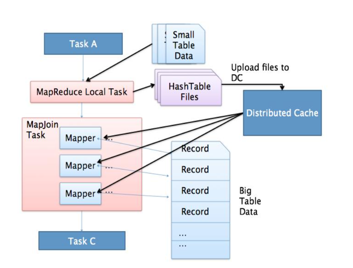
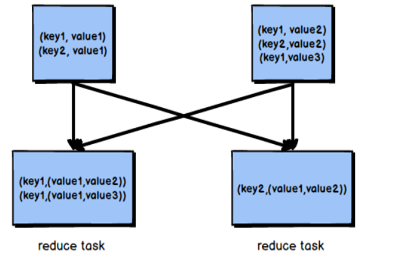
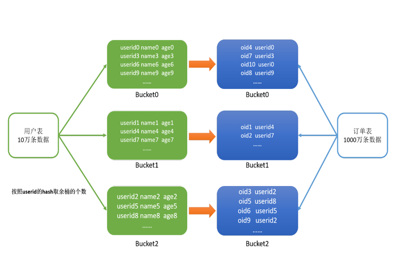

# Hive3
## Hive 版本升级

### Tez 引擎的编译和测试


## Join 学习 

Join是数据分析处理过程中必不可少的操作，Hive同样支持Join的语法；

Hive Join的底层是通过MapReduce来实现的，Hive实现Join时，为了提高MapReduce的性能，提供了多种Join方案来实现；

例如适合小表Join大表的`Map Join`，大表Join大表的`Reduce Join`，以及大表Join的优化方案`Bucket Join`等。

#### 如何看流程

之前就有讲到过,可以用explain来看

HiveQL 是一种类 SQL 的语言，从编程语言规范来说是一种声明式语言，用户会根据查询需求提交声明式的 HQL 查询，而 Hive 会根据底层计算引擎将其转化成  Mapreduce/Tez/Spark 的 job；

explain 命令可以帮助用户了解一条 HQL 语句在底层的实现过程。通俗来说就是 Hive 打算如何去做这件事。

explain 会解析 HQL 语句，将整个 HQL 语句的实现步骤、依赖关系、实现过程都会进行解析返回，可以了解一条HQL语句在底层是如何实现数据的查询及处理的过程，辅助用户对Hive进行优化。

#### MapJoin

小表 Join 大表 或者 小表 Join 小表,只走Map,没有Reduce

将小的那份数据给每个MapTask的内存都放一份完整的数据，大的数据每个部分都可以与小数据的完整数据进行join

底层不需要经过`shuffle`，需要占用内存空间存放小的数据文件



小表转换成 HashTable 然后放到分布式缓存里,分发到每个集群机器上,集群通过判断大表的大小来控制每一个机器来合理分配 Mapper 的任务个数

开了commonJoin自动转mapJoin

尽量使用Map Join来实现Join过程，Hive中默认自动开启了
```SQL
hive.auto.convert.join=true
```

MapJoin 参数控制
```Java
    HIVEIGNOREMAPJOINHINT("hive.ignore.mapjoin.hint", true, "Ignore the mapjoin hint"),
```

```SQL
set hive.auto.convert.join=true;
set hive.mapjoin.smalltable.filesize=25000000;
set hive.auto.convert.join.noconditionaltask=true;
set hive.auto.convert.join.noconditionaltask.size=512000000;
set hive.auto.convert.join.use.nonstaged=true;
```
hive.auto.convert.join：是否启用基于输入文件的大小，将普通连接转化为Map连接的优化机制。

hive.mapjoin.smalltable.filesize: 单张小表的最大文件大小，默认为25000000，即25M

hive.auto.convert.join.noconditionaltask：是否启用基于输入文件的大小，将普通连接转化为Map连接的优化机制。假设参与连接的表（或分区）有N个，如果打开这个 参数，并且有N-1个表（或分区）的大小总和小于hive.auto.convert.join.noconditionaltask.size参数指定的值，那么会直接将连接转为Map连接。

hive.auto.convert.join.noconditionaltask.size：如果hive.auto.convert.join.noconditionaltask是关闭的，则本参数不起作用,那个参数是用来控制多个MapJoin转化成一个，这样就存在多张小表。否则，如果参与连接的N个表（或分区）中的N-1个 的总大小小于这个参数的值，则直接将连接转为Map连接。默认值为10MB。

hive.auto.convert.join.use.nonstaged：对于条件连接，如果从一个小的输入流可以直接应用于join操作而不需要过滤或者投影，那么不需要通过MapReduce的本地任务在分布式缓存中预存。当前该参数在vectorization或tez执行引擎中不工作。

noconditionaltask 在 CommonJoinTaskDispatcher里用到
1. 当前表太大了，不能用来做大表 不能转化
2. 这些小表未知或者说是他们sum太大 不能转化
```java
      // If sizes of at least n-1 tables in a n-way join is known, and their sum is smaller than
      // the threshold size, convert the join into map-join and don't create a conditional task
      boolean convertJoinMapJoin = HiveConf.getBoolVar(conf,
          HiveConf.ConfVars.HIVECONVERTJOINNOCONDITIONALTASK);
      int bigTablePosition = -1;
      if (convertJoinMapJoin) {
        // This is the threshold that the user has specified to fit in mapjoin
        long mapJoinSize = HiveConf.getLongVar(conf,
            HiveConf.ConfVars.HIVECONVERTJOINNOCONDITIONALTASKTHRESHOLD);

        Long bigTableSize = null;
        Set<String> aliases = aliasToWork.keySet();
        for (int tablePosition : bigTableCandidates) {
          Operator<?> parent = joinOp.getParentOperators().get(tablePosition);
          Set<String> participants = GenMapRedUtils.findAliases(currWork, parent);
          long sumOfOthers = Utilities.sumOfExcept(aliasToSize, aliases, participants);
          if (sumOfOthers < 0 || sumOfOthers > mapJoinSize) {
            continue; // some small alias is not known or too big
          }
          if (bigTableSize == null && bigTablePosition >= 0 && tablePosition < bigTablePosition) {
            continue; // prefer right most alias
          }
          long aliasSize = Utilities.sumOf(aliasToSize, participants);
          if (bigTableSize == null || bigTableSize < 0 || (aliasSize >= 0 && aliasSize >= bigTableSize)) {
            bigTablePosition = tablePosition;
            bigTableSize = aliasSize;
          }
        }
      }
```

对于 filesize, 他就只限制单张小表转化HashTable前的size
```java
long threshold = HiveConf.getLongVar(conf, HiveConf.ConfVars.HIVESMALLTABLESFILESIZE);

    Long bigTableSize = null;
    Long smallTablesSize = null;
    Map.Entry<Task<? extends Serializable>, Set<String>> nextTask = null;
    for (Map.Entry<Task<? extends Serializable>, Set<String>> entry : taskToAliases.entrySet()) {
      Set<String> aliases = entry.getValue();
      long sumOfOthers = Utilities.sumOfExcept(aliasToKnownSize, participants, aliases);
      if (sumOfOthers < 0 || sumOfOthers > threshold) {
        continue;
      }
      // at most one alias is unknown. we can safely regard it as a big alias
      long aliasSize = Utilities.sumOf(aliasToKnownSize, aliases);
      if (bigTableSize == null || aliasSize > bigTableSize) {
        nextTask = entry;
        bigTableSize = aliasSize;
        smallTablesSize = sumOfOthers;
      }
    }
    if (nextTask != null) {
      LOG.info("Driver alias is " + nextTask.getValue() + " with size " + bigTableSize
          + " (total size of others : " + smallTablesSize + ", threshold : " + threshold + ")");
      return nextTask.getKey();
    }
    LOG.info("Failed to resolve driver alias (threshold : " + threshold +
        ", length mapping : " + aliasToKnownSize + ")");
    return null;
  }
```

#### SkewJoin 

Skew Join是Hive中一种专门为了避免数据倾斜而设计的特殊的Join过程

这种Join的原理是将Map Join和Reduce Join进行合并，如果某个值出现了数据倾斜，就会将产生数据倾斜的数据单独使用Map Join来实现

其他没有产生数据倾斜的数据由Reduce Join来实现，这样就避免了Reduce Join中产生数据倾斜的问题

最终将Map Join的结果和Reduce Join的结果进行Union合并

对倾斜的数据单独进行一个MapJoin，因为MapJoin所以他这里是少了一个中间表

参数配置

```SQL
-- 开启运行过程中skewjoin
set hive.optimize.skewjoin=true;
-- 如果这个key的出现的次数超过这个范围
set hive.skewjoin.key=100000;
-- 在编译时判断是否会产生数据倾斜
set hive.optimize.skewjoin.compiletime=true;
-- 不合并，提升性能
set hive.optimize.union.remove=true;
-- 如果Hive的底层走的是MapReduce，必须开启这个属性，才能实现不合并
set mapreduce.input.fileinputformat.input.dir.recursive=true;
```

用以处理倾斜键的MR作业数是表的数量减一(we can stream the last table, so big keys in the last table will not be a problem)

在执行JOIN的过程中，会将一个表中的大key（也就是倾斜的那部分数据，判断是否倾斜由配置项hive.skewjoin.key指定，默认是100000）输出到一个对应的目录中，同时该key在其他表中的数据输出到其他的目录中（每个表一个目录）。整个目录结构类似下面这样：

- T1表中的大key存储在目录 dir-T1-bigkeys中，这些key在T2表的数据存储在dir-T2-keys中，这些key在T3表的数据存储在dir-T3-keys中，以此类推。。。
- T2表中的大key在T1中的数据存储在 dir-T1-keys，T2表中的大key存储在目录dir-T2-bigkeys中，这些key在T3表的数据存储在dir-T3-keys中，以此类推。。。
- T3表中的大key在T1中的数据存储在 dir-T1-keys，这些key在T2表的数据存储在dir-T2-keys中，T3表中的大key存储在目录dir-T3-bigkeys中，以此类推。。。

对于每个表，都会单独启动一个mapjoin作业处理，输入的数据，就是该表的大key的目录和其他表中这些key对应的目录，对于上面情况基本就是会启动三个map join作业（一行对应一个）

对于每个表中每一个倾斜键(skew key一个表中可能会有多个倾斜键)首先会写入到本地的一个临时文件中，最后将这些文件上传到HDFS中


这边要求 skewJoin 不能是OutJoin，得是InnerJoin

```java
  public static boolean skewJoinEnabled(HiveConf conf, JoinOperator joinOp) {

    if (conf != null && !conf.getBoolVar(HiveConf.ConfVars.HIVESKEWJOIN)) {
      return false;
    }

    if (!joinOp.getConf().isNoOuterJoin()) {
      return false;
    }

    byte pos = 0;
    for (Byte tag : joinOp.getConf().getTagOrder()) {
      if (tag != pos) {
        return false;
      }
      pos++;
    }

    return true;
  }
```

#### ReduceJoin
- 适合于大表Join大表

原理
- 将两张表的数据在shuffle阶段利用shuffle的分组来将数据按照关联字段进行合并

- `必须经过shuffle`，利用Shuffle过程中的分组来实现关联

Hive会自动判断是否满足Map Join，如果不满足Map Join，则自动执行Reduce Join



#### Bucket Join

大表Join大表

将两张表按照相同的规则将数据划分 根据对应的规则的数据进行join 减少了比较次数，提高了性能

开启参数
```SQL
-- 开启分桶join
set hive.optimize.bucketmapjoin = true;
```

会 BucketSort 就会 BucketJoin



##### Sort Merge Bucket Join（SMB）

基于有序的数据Join

clustered by colName sorted by (colName)

```SQL
-- 开启分桶SMB join
set hive.optimize.bucketmapjoin = true;
set hive.auto.convert.sortmerge.join=true;
set hive.optimize.bucketmapjoin.sortedmerge = true;
set hive.auto.convert.sortmerge.join.noconditionaltask=true;
```
分桶字段 = Join字段 = 排序字段 ，桶的个数相等或者成倍数
