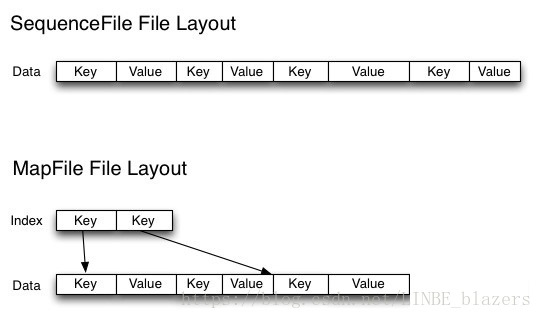
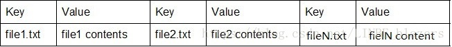
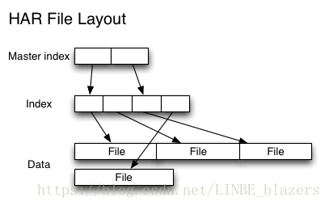

## Merge Hive Small File 合并小文件
### Hive Small File 产生

1. 在 MR 中的 reduce 阶段，会产生文件 reduce 的越多 小文件越多
2. 分区表，在进行动态分区表的操作时产生的动态分区的小文件
3. 数据表本来就有很多小文件

### Hive Small File 过多影响

1. Hive 的数据还是存在 HDFS 上的，小文件太多，容易在文件存储端造成瓶颈，给 NN 带来压力从而影响处理效率

2. 在MR任务时，也会对这些小文件也进行 map，效率低

## 合并方案
1. Hive 调参，开设置,他这里好多种类的参数
2. 定期从hdfs上拖小文件下来再合并
   1. 用appendToFile合并文件，或者getmerge合并文件到本地，然后在传hdfs。配合bash操作，还是可行的。该方案局限性较大,对 ORC、Parquet、Sequence 没办法。
3. 针对特定的文件格式，存在原生的指令
   1. ORC 用 CONCATENATE
   2. Parquet 用 parquet-tools merge
   3. 把现有数据转化为 SequnceFile
      1. 当需要维护原始文件名时，常见的方法是使用Sequence文件。 在此解决方案中，文件名作为key保存在sequence文件中，然后文件内容会作为value保存。下图给出将一些小文件存储为sequence文件的示例：
      2. 
      3. 如果一个sequence文件包含10000个小文件，则同时会包含10000个key在一个文件中。sequence文件支持块压缩，并且是可被拆分的。这样MapReduce作业在处理这个sequence文件时，只需要为每个128MB的block启动一个map任务，而不是每个小文件启动一个map任务。当你在同时抽取数百个或者数千个小文件，并且需要保留原始文件名时，这是非常不错的方案。
      4. 但是，如果你一次仅抽取少量的小文件到HDFS，则sequence文件的方法也不太可行，因为sequence文件是不可变的，无法追加。比如3个10MB文件将产生1个30MB的sequence文件，根据本文前面的定义，这仍然是一个小文件。另外一个问题是如果需要检索sequence文件中的文件名列表则需要遍历整个文件。
4. Hadoop 自带归档 har
5. FileCrush 别人造的轮子，试了好像没用？
6. 用 Hbase
7. 并行 INSERT OVERWRITE 慢慢搞
8. Flume + kafka ？
### Hive 开参数
输入端设置 CombineFileInputFormat 参数 

但这个东西 他只是执行的时候先合并，对 NN 并无帮助
```SQL
-- 每个Map最大输入大小(这个值决定了合并后文件的数量)
set mapred.max.split.size=256000000;  
-- 一个节点上split的至少的大小(这个值决定了多个DataNode上的文件是否需要合并)
set mapred.min.split.size.per.node=100000000;
-- 一个交换机下split的至少的大小(这个值决定了多个交换机上的文件是否需要合并)  
set mapred.min.split.size.per.rack=100000000;
-- 执行Map前进行小文件合并
set hive.input.format=org.apache.hadoop.hive.ql.io.CombineHiveInputFormat; 
```

输出端设置 打开动态合并
```SQL
-- 如果hive的程序，只有maptask，将MapTask产生的所有小文件进行合并
set hive.merge.mapfiles=true;
-- 如果hive的程序，有Map和ReduceTask,将ReduceTask产生的所有小文件进行合并
set hive.merge.mapredfiles=true;
-- 每一个合并的文件的大小
set hive.merge.size.per.task=256000000;
-- 平均每个文件的大小，如果小于这个值就会进行合并
set hive.merge.smallfiles.avgsize=16000000;
```

强制文件合并

强制文件合并的方法是指定Hive作业的Reduce数量。由于每个reducer都会生成一个文件，所以reducer的数量也就代表了最后生成的文件数量。

小于多少大小的一张表直接 reduce by 1

由于上述因素，只有在你至少粗略地知道查询生成的数据量时才使用此方法。如果查询结果生成的文件会非常小（小于256MB），我们只使用1个reduce也还不错。
```SQL
# ONLY ONE OF THE PARAMETERS BELOW SHOULD BE USED

# Limit the maximum number of reducers
SET hive.exec.reducers.max = <number>;

# Set a fixed number of reducers
SET mapreduce.job.reduces = <number>;
```
### 数据归档

#### 数据归档解释

HDP 内置一个 hadoop archive，可以把文件归并成较大的文件，归档后创建一个 data.har, 里面放索引和数据。索引记录归并前文件在归并后的位置。



#### 操作
```SQL
-- 用来控制归档是否可用
set hive.archive.enabled=true;
-- 通知Hive在创建归档时是否可以设置父目录
set hive.archive.har.parentdir.settable=true;
-- 控制需要归档文件的大小
set har.partfile.size=1099511627776;

-- 使用以下命令进行归档
ALTER TABLE A ARCHIVE PARTITION(dt='2020-12-24', hr='12');

-- 对已归档的分区恢复为原文件
ALTER TABLE A UNARCHIVE PARTITION(dt='2020-12-24', hr='12');
```
注意:
- 归档的分区可以查看不能 insert overwrite，必须先 unarchive

### 存储文件来处理

默认的 textfile 并不是高效的文件存储方式。

ORC 可以通过 `concatenate` 合并的
```SQL
ALTER TABLE table_name [PARTITION (partition_key = 'partition_value')] CONCATENATE;
```

Parquet文件合并

作为Apache Parquet项目的一部分，有一组基于Java的命令行工具，称为parquet-tools。最新的parquet-tools版本包括一个merge命令，该命令可以将较小的parquet文件逻辑地追加到较大的parquet文件中。该命令以二进制形式将parquet文件块串联在一起，而无需序列化/反序列化、合并页脚、修改路径和偏移量元数据。

要在HDFS中运行parquet-tools merge命令：
```shell
hadoop jar parquet-tools-1.9.0.jar merge <input> <output>
```
其中，input是源parquet文件或目录，而output是合并原始内容的目标parquet文件，此合并命令不会删除或覆盖原始文件。因此，它需要手动创建一个临时目录，并用压缩后的文件替换原始的小文件，以使Big SQL或Apache Hive知道该文件。

### INSERT OVERWRITE 

就相当于重新搞新表，重写

## 解决方法

参考几家的解决方法。一般都是开一个并行度为1的任务。

### 调研 

首先先是调研有多少小文件且预估性能预计提升多少。

我这边是 选择了 HDFS 