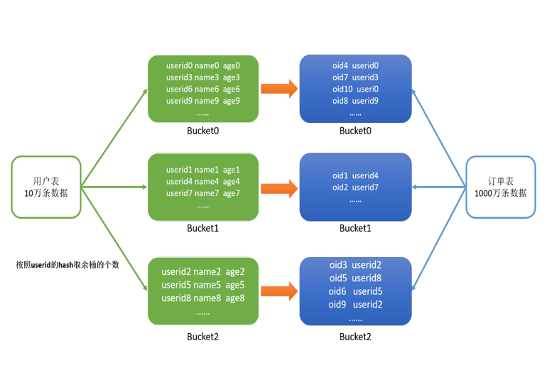

## Join 学习 

Join是数据分析处理过程中必不可少的操作，Hive同样支持Join的语法；

Hive Join的底层是通过MapReduce来实现的，Hive实现Join时，为了提高MapReduce的性能，提供了多种Join方案来实现；

例如适合小表Join大表的`Map Join`，大表Join大表的`Reduce Join`，以及大表Join的优化方案`Bucket Join`等。

#### 如何看流程

之前就有讲到过,可以用explain来看

HiveQL 是一种类 SQL 的语言，从编程语言规范来说是一种声明式语言，用户会根据查询需求提交声明式的 HQL 查询，而 Hive 会根据底层计算引擎将其转化成  Mapreduce/Tez/Spark 的 job；

explain 命令可以帮助用户了解一条 HQL 语句在底层的实现过程。通俗来说就是 Hive 打算如何去做这件事。

explain 会解析 HQL 语句，将整个 HQL 语句的实现步骤、依赖关系、实现过程都会进行解析返回，可以了解一条HQL语句在底层是如何实现数据的查询及处理的过程，辅助用户对Hive进行优化。

#### MapJoin

小表 Join 大表 或者 小表 Join 小表,只走Map,没有Reduce

将小的那份数据给每个MapTask的内存都放一份完整的数据，大的数据每个部分都可以与小数据的完整数据进行join

底层不需要经过`shuffle`，需要占用内存空间存放小的数据文件


小表转换成 HashTable 然后放到分布式缓存里,分发到每个集群机器上,集群通过判断大表的大小来控制每一个机器来合理分配 Mapper 的任务个数

开了commonJoin自动转mapJoin

尽量使用Map Join来实现Join过程，Hive中默认自动开启了
```SQL
hive.auto.convert.join=true
```

MapJoin 参数控制
```Java
    HIVEIGNOREMAPJOINHINT("hive.ignore.mapjoin.hint", true, "Ignore the mapjoin hint"),
```

```SQL
set hive.auto.convert.join=true;
set hive.mapjoin.smalltable.filesize=25000000;
set hive.auto.convert.join.noconditionaltask=true;
set hive.auto.convert.join.noconditionaltask.size=512000000;
set hive.auto.convert.join.use.nonstaged=true;
```
hive.auto.convert.join：是否启用基于输入文件的大小，将普通连接转化为Map连接的优化机制。

hive.mapjoin.smalltable.filesize: 单张小表的最大文件大小，默认为25000000，即25M

hive.auto.convert.join.noconditionaltask：是否启用基于输入文件的大小，将普通连接转化为Map连接的优化机制。假设参与连接的表（或分区）有N个，如果打开这个 参数，并且有N-1个表（或分区）的大小总和小于hive.auto.convert.join.noconditionaltask.size参数指定的值，那么会直接将连接转为Map连接。

hive.auto.convert.join.noconditionaltask.size：如果hive.auto.convert.join.noconditionaltask是关闭的，则本参数不起作用,那个参数是用来控制多个MapJoin转化成一个，这样就存在多张小表。否则，如果参与连接的N个表（或分区）中的N-1个 的总大小小于这个参数的值，则直接将连接转为Map连接。默认值为10MB。

hive.auto.convert.join.use.nonstaged：对于条件连接，如果从一个小的输入流可以直接应用于join操作而不需要过滤或者投影，那么不需要通过MapReduce的本地任务在分布式缓存中预存。当前该参数在vectorization或tez执行引擎中不工作。

noconditionaltask 在 CommonJoinTaskDispatcher里用到
1. 当前表太大了，不能用来做大表 不能转化
2. 这些小表未知或者说是他们sum太大 不能转化
```java
      // If sizes of at least n-1 tables in a n-way join is known, and their sum is smaller than
      // the threshold size, convert the join into map-join and don't create a conditional task
      boolean convertJoinMapJoin = HiveConf.getBoolVar(conf,
          HiveConf.ConfVars.HIVECONVERTJOINNOCONDITIONALTASK);
      int bigTablePosition = -1;
      if (convertJoinMapJoin) {
        // This is the threshold that the user has specified to fit in mapjoin
        long mapJoinSize = HiveConf.getLongVar(conf,
            HiveConf.ConfVars.HIVECONVERTJOINNOCONDITIONALTASKTHRESHOLD);

        Long bigTableSize = null;
        Set<String> aliases = aliasToWork.keySet();
        for (int tablePosition : bigTableCandidates) {
          Operator<?> parent = joinOp.getParentOperators().get(tablePosition);
          Set<String> participants = GenMapRedUtils.findAliases(currWork, parent);
          long sumOfOthers = Utilities.sumOfExcept(aliasToSize, aliases, participants);
          if (sumOfOthers < 0 || sumOfOthers > mapJoinSize) {
            continue; // some small alias is not known or too big
          }
          if (bigTableSize == null && bigTablePosition >= 0 && tablePosition < bigTablePosition) {
            continue; // prefer right most alias
          }
          long aliasSize = Utilities.sumOf(aliasToSize, participants);
          if (bigTableSize == null || bigTableSize < 0 || (aliasSize >= 0 && aliasSize >= bigTableSize)) {
            bigTablePosition = tablePosition;
            bigTableSize = aliasSize;
          }
        }
      }
```

对于 filesize, 他就只限制单张小表转化HashTable前的size
```java
long threshold = HiveConf.getLongVar(conf, HiveConf.ConfVars.HIVESMALLTABLESFILESIZE);

    Long bigTableSize = null;
    Long smallTablesSize = null;
    Map.Entry<Task<? extends Serializable>, Set<String>> nextTask = null;
    for (Map.Entry<Task<? extends Serializable>, Set<String>> entry : taskToAliases.entrySet()) {
      Set<String> aliases = entry.getValue();
      long sumOfOthers = Utilities.sumOfExcept(aliasToKnownSize, participants, aliases);
      if (sumOfOthers < 0 || sumOfOthers > threshold) {
        continue;
      }
      // at most one alias is unknown. we can safely regard it as a big alias
      long aliasSize = Utilities.sumOf(aliasToKnownSize, aliases);
      if (bigTableSize == null || aliasSize > bigTableSize) {
        nextTask = entry;
        bigTableSize = aliasSize;
        smallTablesSize = sumOfOthers;
      }
    }
    if (nextTask != null) {
      LOG.info("Driver alias is " + nextTask.getValue() + " with size " + bigTableSize
          + " (total size of others : " + smallTablesSize + ", threshold : " + threshold + ")");
      return nextTask.getKey();
    }
    LOG.info("Failed to resolve driver alias (threshold : " + threshold +
        ", length mapping : " + aliasToKnownSize + ")");
    return null;
  }
```

#### SkewJoin 

Skew Join是Hive中一种专门为了避免数据倾斜而设计的特殊的Join过程

这种Join的原理是将Map Join和Reduce Join进行合并，如果某个值出现了数据倾斜，就会将产生数据倾斜的数据单独使用Map Join来实现

其他没有产生数据倾斜的数据由Reduce Join来实现，这样就避免了Reduce Join中产生数据倾斜的问题

最终将Map Join的结果和Reduce Join的结果进行Union合并

对倾斜的数据单独进行一个MapJoin，因为MapJoin所以他这里是少了一个中间表

参数配置

```SQL
-- 开启运行过程中skewjoin
set hive.optimize.skewjoin=true;
-- 如果这个key的出现的次数超过这个范围
set hive.skewjoin.key=100000;
-- 在编译时判断是否会产生数据倾斜
set hive.optimize.skewjoin.compiletime=true;
-- 不合并，提升性能
set hive.optimize.union.remove=true;
-- 如果Hive的底层走的是MapReduce，必须开启这个属性，才能实现不合并
set mapreduce.input.fileinputformat.input.dir.recursive=true;
```

用以处理倾斜键的MR作业数是表的数量减一(we can stream the last table, so big keys in the last table will not be a problem)

在执行JOIN的过程中，会将一个表中的大key（也就是倾斜的那部分数据，判断是否倾斜由配置项hive.skewjoin.key指定，默认是100000）输出到一个对应的目录中，同时该key在其他表中的数据输出到其他的目录中（每个表一个目录）。整个目录结构类似下面这样：

- T1表中的大key存储在目录 dir-T1-bigkeys中，这些key在T2表的数据存储在dir-T2-keys中，这些key在T3表的数据存储在dir-T3-keys中，以此类推。。。
- T2表中的大key在T1中的数据存储在 dir-T1-keys，T2表中的大key存储在目录dir-T2-bigkeys中，这些key在T3表的数据存储在dir-T3-keys中，以此类推。。。
- T3表中的大key在T1中的数据存储在 dir-T1-keys，这些key在T2表的数据存储在dir-T2-keys中，T3表中的大key存储在目录dir-T3-bigkeys中，以此类推。。。

对于每个表，都会单独启动一个mapjoin作业处理，输入的数据，就是该表的大key的目录和其他表中这些key对应的目录，对于上面情况基本就是会启动三个map join作业（一行对应一个）

对于每个表中每一个倾斜键(skew key一个表中可能会有多个倾斜键)首先会写入到本地的一个临时文件中，最后将这些文件上传到HDFS中


这边要求 skewJoin 不能是OutJoin，得是InnerJoin

```java
  public static boolean skewJoinEnabled(HiveConf conf, JoinOperator joinOp) {

    if (conf != null && !conf.getBoolVar(HiveConf.ConfVars.HIVESKEWJOIN)) {
      return false;
    }

    if (!joinOp.getConf().isNoOuterJoin()) {
      return false;
    }

    byte pos = 0;
    for (Byte tag : joinOp.getConf().getTagOrder()) {
      if (tag != pos) {
        return false;
      }
      pos++;
    }

    return true;
  }
```

#### ReduceJoin
- 适合于大表Join大表

原理
- 将两张表的数据在shuffle阶段利用shuffle的分组来将数据按照关联字段进行合并

- `必须经过shuffle`，利用Shuffle过程中的分组来实现关联

Hive会自动判断是否满足Map Join，如果不满足Map Join，则自动执行Reduce Join


#### Bucket Join

大表Join大表

将两张表按照相同的规则将数据划分 根据对应的规则的数据进行join 减少了比较次数，提高了性能

开启参数
```SQL
-- 开启分桶join
set hive.optimize.bucketmapjoin = true;
```

会 BucketSort 就会 BucketJoin



##### Sort Merge Bucket Join（SMB）

基于有序的数据Join

clustered by colName sorted by (colName)

```SQL
-- 开启分桶SMB join
set hive.optimize.bucketmapjoin = true;
set hive.auto.convert.sortmerge.join=true;
set hive.optimize.bucketmapjoin.sortedmerge = true;
set hive.auto.convert.sortmerge.join.noconditionaltask=true;
```
分桶字段 = Join字段 = 排序字段 ，桶的个数相等或者成倍数


## Join 深入
Join关联

Join是Hive是最难的部分，也是最需要优化的部分

常用Join方法
1. 普通（Reduce端）Join， Common (Reduce-Side) Join
2. 广播（Map端）Join，Broadcast（Map-Side）Join
3. Bucket Map Join Sort Merge Bucket Map Join
4. 倾斜Join，Skew Join

### Common Join
Reduce端Join

背景知识：
- Hive只支持等值Join，不支持非等值Join
- 扫描N张表
- Join Key相同的放在一起（相同Reduce） -> 结果

流程:
- Mapper: 扫描，并处理N张表，生成发给Reduce的<Key, Value>  
  
  `Key = {JoinKey, TableAlias}, Value = {row}`

- Shuffle阶段
  - JoinKey相同的Reduce放到相同的
  - TableAlias 是排序的标识，就是表的编号，相同表的数据在一起是排序的。
- Reducer: 处理Join Key并输出结果

最坏的情况

所有的数据都被发送到相同的结点，同一个Reduce

数据倾斜 skew


#### JoinOperater
```Java
  @Override
  public void process(Object row, int tag) throws HiveException {
    try {
      alias = (byte) tag;
      if (hashMapRowGetters == null) {
        hashMapRowGetters = new ReusableGetAdaptor[mapJoinTables.length];
        MapJoinKey refKey = getRefKey(alias);
        for (byte pos = 0; pos < order.length; pos++) {
          if (pos != alias) {
            hashMapRowGetters[pos] = mapJoinTables[pos].createGetter(refKey);
          }
        }
      }

      // As we're calling processOp again to process the leftover "tuples", we know the "row" is
      // coming from the spilled matchfile. We need to recreate hashMapRowGetter against new hashtables
      if (hybridMapJoinLeftover) {
        MapJoinKey refKey = getRefKey(alias);
        for (byte pos = 0; pos < order.length; pos++) {
          if (pos != alias && spilledMapJoinTables[pos] != null) {
            hashMapRowGetters[pos] = spilledMapJoinTables[pos].createGetter(refKey);
          }
        }
      }

      // compute keys and values as StandardObjects
      ReusableGetAdaptor firstSetKey = null;
      int fieldCount = joinKeys[alias].size();
      boolean joinNeeded = false;
      boolean bigTableRowSpilled = false;
      for (byte pos = 0; pos < order.length; pos++) {
        if (pos != alias) {
          JoinUtil.JoinResult joinResult;
          ReusableGetAdaptor adaptor;
          if (firstSetKey == null) {
            adaptor = firstSetKey = hashMapRowGetters[pos];
            joinResult = setMapJoinKey(firstSetKey, row, alias);
          } else {
            // Keys for all tables are the same, so only the first has to deserialize them.
            adaptor = hashMapRowGetters[pos];
            joinResult = adaptor.setFromOther(firstSetKey);
          }
          MapJoinRowContainer rowContainer = adaptor.getCurrentRows();
          if (joinResult != JoinUtil.JoinResult.MATCH) {
            assert (rowContainer == null || !rowContainer.hasRows()) :
                "Expecting an empty result set for no match";
          }
          if (rowContainer != null && unwrapContainer[pos] != null) {
            Object[] currentKey = firstSetKey.getCurrentKey();
            rowContainer = unwrapContainer[pos].setInternal(rowContainer, currentKey);
          }
          // there is no join-value or join-key has all null elements
          if (rowContainer == null || firstSetKey.hasAnyNulls(fieldCount, nullsafes)) {
            if (!noOuterJoin) {
              // For Hybrid Grace Hash Join, during the 1st round processing,
              // we only keep the LEFT side if the row is not spilled
              if (!conf.isHybridHashJoin() || hybridMapJoinLeftover ||
                  (joinResult != JoinUtil.JoinResult.SPILL && !bigTableRowSpilled)) {
                joinNeeded = true;
                storage[pos] = dummyObjVectors[pos];
              } else {
                joinNeeded = false;
              }
            } else {
              storage[pos] = emptyList;
            }
          } else {
            joinNeeded = true;
            storage[pos] = rowContainer.copy();
            aliasFilterTags[pos] = rowContainer.getAliasFilter();
          }
          // Spill the big table rows into appropriate partition:
          // When the JoinResult is SPILL, it means the corresponding small table row may have been
          // spilled to disk (at least the partition that holds this row is on disk). So we need to
          // postpone the join processing for this pair by also spilling this big table row.
          if (joinResult == JoinUtil.JoinResult.SPILL &&
              !bigTableRowSpilled) {  // For n-way join, only spill big table rows once
            spillBigTableRow(mapJoinTables[pos], row);
            bigTableRowSpilled = true;
          }
        }
      }
      if (joinNeeded) {
        List<Object> value = getFilteredValue(alias, row);
        // Add the value to the ArrayList
        storage[alias].addRow(value);
        // generate the output records
        checkAndGenObject();
      }
      // done with the row
      storage[tag].clearRows();
      for (byte pos = 0; pos < order.length; pos++) {
        if (pos != tag) {
          storage[pos] = null;
        }
      }
    } catch (Exception e) {
      String msg = "Unexpected exception from "
          + this.getClass().getSimpleName() + " : " + e.getMessage();
      LOG.error(msg, e);
      throw new HiveException(msg, e);
    }
  }
```

row 就是SQL语句里里操作表的编号

checkAndGenObject是开始操作

#### CommonJoinOperator

```Java
 // creates objects in recursive manner
  private void genObject(int aliasNum, boolean allLeftFirst, boolean allLeftNull)
      throws HiveException {
    if (aliasNum < numAliases) {

      boolean[] skip = skipVectors[aliasNum];
      boolean[] prevSkip = skipVectors[aliasNum - 1];

      JoinCondDesc joinCond = condn[aliasNum - 1];
      int type = joinCond.getType();
      int left = joinCond.getLeft();
      int right = joinCond.getRight();

      // search for match in the rhs table
      AbstractRowContainer<List<Object>> aliasRes = storage[order[aliasNum]];

      boolean done = false;
      boolean loopAgain = false;
      boolean tryLOForFO = type == JoinDesc.FULL_OUTER_JOIN;

      boolean rightFirst = true;
      AbstractRowContainer.RowIterator<List<Object>> iter = aliasRes.rowIter();
      for (List<Object> rightObj = iter.first(); !done && rightObj != null;
           rightObj = loopAgain ? rightObj : iter.next(), rightFirst = loopAgain = false) {
        System.arraycopy(prevSkip, 0, skip, 0, prevSkip.length);

        boolean rightNull = rightObj == dummyObj[aliasNum];
        if (hasFilter(order[aliasNum])) {
          filterTags[aliasNum] = getFilterTag(rightObj);
        }
        skip[right] = rightNull;

        if (type == JoinDesc.INNER_JOIN) {
          innerJoin(skip, left, right);
        } else if (type == JoinDesc.LEFT_SEMI_JOIN) {
          if (innerJoin(skip, left, right)) {
            // if left-semi-join found a match, skipping the rest of the rows in the
            // rhs table of the semijoin
            done = true;
          }
        } else if (type == JoinDesc.LEFT_OUTER_JOIN ||
            (type == JoinDesc.FULL_OUTER_JOIN && rightNull)) {
          int result = leftOuterJoin(skip, left, right);
          if (result < 0) {
            continue;
          }
          done = result > 0;
        } else if (type == JoinDesc.RIGHT_OUTER_JOIN ||
            (type == JoinDesc.FULL_OUTER_JOIN && allLeftNull)) {
          if (allLeftFirst && !rightOuterJoin(skip, left, right) ||
            !allLeftFirst && !innerJoin(skip, left, right)) {
            continue;
          }
        } else if (type == JoinDesc.FULL_OUTER_JOIN) {
          if (tryLOForFO && leftOuterJoin(skip, left, right) > 0) {
            loopAgain = allLeftFirst;
            done = !loopAgain;
            tryLOForFO = false;
          } else if (allLeftFirst && !rightOuterJoin(skip, left, right) ||
            !allLeftFirst && !innerJoin(skip, left, right)) {
            continue;
          }
        }
        intermediate[aliasNum] = rightObj;

        // recursively call the join the other rhs tables
        genObject(aliasNum + 1, allLeftFirst && rightFirst, allLeftNull && rightNull);
      }
    } else if (!allLeftNull) {
      createForwardJoinObject(skipVectors[numAliases - 1]);
    }
  }
```
他这里的 skip[] 就是优化的部分，小表arraycopy出来然后再判断innerJoin还是leftJoin效率高

### MapJoin
也叫广播Join，Broadcast Join

1. 从 (n-1)张小表创建Hashtable，Hashtable的键是 Joinkey, 把这张Hashtable广播到每一个结点的map上，只处理大表.
2. 每一个大表的mapper在小表的hashtable中查找join key -> Join Result

    Ex: Join by “CityId”

    

#### 如何决定MapJoin
- 内存要求: N-1 张小表必须能够完全读入内存
- Hive决定MapJoin的两种方式（手动／自动）
    - 手动，通过Query Hints（不再推荐）:
        ```SQL
        SELECT /+ MAPJOIN(cities) */ * FROM cities JOIN sales on cities.cityId=sales.cityId;
        /+ MAPJOIN(cities) */ *会决定把cities读入内存，放在hashTable里边，分发到每一个节点。
        ```
    - 自动，打开(“hive.auto.convert.join”)
- 如果N-1张小表小于: “hive.mapjoin.smalltable.filesize”这个值

#### MapJoin Optimizers
1. 构造查询计划Query Plan时，决定MapJoin优化
2. “逻辑优化器Logical (Compile-time) optimizers” ：修改逻辑执行计划，把JoinOperator修改成MapJoinOperator
3. “物理优化器Physical (Runtime) optimizers” 修改物理执行计划(MapRedWork, TezWork, SparkWork), 引入条件判断等机制


逻辑优化之后ReduceSinkOperator.和普通的join operator被摘掉，换成mapjoin。

物理执行计划会被关联到具体的执行引擎，逻辑执行计划的小表部分会在本地执行，即左边小表在本地执行，逻辑执行计划的大表部分会被在远端执行。

优化：
1. Query Hint: 编译时知道哪个表是小表的情况.（手动模式，加一个/*+ MAPJOIN(cities) */ *注释） `弃用`
2. Logical Optimizer逻辑优化器: MapJoinProcessor
3. Auto-conversion: 编译时不知道哪个表是小表的情况（自动模式）
4. Physical Optimizer物理优化器: CommonJoinResolver, MapJoinResolver.
   1. 创建Conditional Tasks 把每个表是小表的情况考虑进去
   2. Noconditional mode: 如果没有子查询的话，表的大小是在编译时可以知道的，否则是不知道的(join of intermediate results..)


#### CommonJoinResolve
```java

/*
 * Convert tasks involving JOIN into MAPJOIN.
 * If hive.auto.convert.join is true, the tasks involving join are converted.
 * Consider the query:
 * select .... from T1 join T2 on T1.key = T2.key join T3 on T1.key = T3.key
 *
 * There is a map-reduce task which performs a 3-way join (T1, T2, T3).
 * The task would be converted to a conditional task which would have 4 children
 * a. Mapjoin considering T1 as the big table
 * b. Mapjoin considering T2 as the big table
 * c. Mapjoin considering T3 as the big table
 * d. Map-reduce join (the original task).
 *
 *  Note that the sizes of all the inputs may not be available at compile time. At runtime, it is
 *  determined which branch we want to pick up from the above.
 *
 * However, if hive.auto.convert.join.noconditionaltask is set to true, and
 * the sum of any n-1 tables is smaller than hive.auto.convert.join.noconditionaltask.size,
 * then a mapjoin is created instead of the conditional task. For the above, if the size of
 * T1 + T2 is less than the threshold, then the task is converted to a mapjoin task with T3 as
 * the big table.
 *
 * In this case, further optimization is performed by merging 2 consecutive map-only jobs.
 * Consider the query:
 * select ... from T1 join T2 on T1.key1 = T2.key1 join T3 on T1.key2 = T3.key2
 *
 * Initially, the plan would consist of 2 Map-reduce jobs (1 to perform join for T1 and T2)
 * followed by another map-reduce job (to perform join of the result with T3). After the
 * optimization, both these tasks would be converted to map-only tasks. These 2 map-only jobs
 * are then merged into a single map-only job. As a followup (HIVE-3952), it would be possible to
 * merge a map-only task with a map-reduce task.
 * Consider the query:
 * select T1.key2, count(*) from T1 join T2 on T1.key1 = T2.key1 group by T1.key2;
 * Initially, the plan would consist of 2 Map-reduce jobs (1 to perform join for T1 and T2)
 * followed by another map-reduce job (to perform groupby of the result). After the
 * optimization, the join task would be converted to map-only tasks. After HIVE-3952, the map-only
 * task would be merged with the map-reduce task to create a single map-reduce task.
 */
public class CommonJoinResolver implements PhysicalPlanResolver {
  @Override
  public PhysicalContext resolve(PhysicalContext pctx) throws SemanticException {

    // create dispatcher and graph walker
    Dispatcher disp = new CommonJoinTaskDispatcher(pctx);
    TaskGraphWalker ogw = new TaskGraphWalker(disp);

    // get all the tasks nodes from root task
    List<Node> topNodes = new ArrayList<Node>();
    topNodes.addAll(pctx.rootTasks);

    // begin to walk through the task tree.
    ogw.startWalking(topNodes, null);
    return pctx;
  }
}
```

他这里就是解释了把T3视为大表 T1+T2小于nocoditionaltask.size
会进行mapJoin

if hive.auto.convert.join.noconditionaltask is set to true, and
 * the sum of any n-1 tables is smaller than hive.auto.convert.join.noconditionaltask.size,
 * then a mapjoin is created instead of the conditional task. For the above, if the size of
 * T1 + T2 is less than the threshold, then the task is converted to a mapjoin task with T3 as the big table.
 * In this case, further optimization is performed by merging 2 consecutive map-only jobs.
 * Consider the query:
 * select ... from T1 join T2 on T1.key1 = T2.key1 join T3 on T1.key2 = T3.key2


### BucketMapJoin
Bucketed 表: 根据不同的值分成不同的桶
```SQL
CREATE TABLE cities (cityid int, value string) CLUSTERED BY (cityId) INTO 2 BUCKETS;即建表的时候指定桶。
```
- 如果把分桶键（Bucket Key）作为关联键（Join Key）: For each 
bucket of table, rows with matching joinKey values will be in corresponding bucket of other table

就是前面处理的时候多了个 取模分桶

1和3在一个桶（奇数），2和4一个桶（偶数）。

Bucket MapJoin 执行过程
1. 与MapJoin非常类似
2. HashTableSink (小表) 写Hashtable是每个桶写一个Hashtable，而不是每张表写一个
3. HashTableLoader (大表Mapper mapper) 也是每个桶读取一次HashTable

### 倾斜关联Skew Join

SkewJoin 不能优化

倾斜键Skew keys = 高频出现的键, 非常多的键，多到一个reduce处理不了

使用Common Join处理非倾斜键，使用Map Join处理倾斜键.
```SQL
A join B on A.id=B.id;
```
如果A 表中id=1倾斜, 那么查询会变成
```SQL
A join B on A.id=B.id and A.id!=1 union
A join B on A.id=B.id and A.id=1
```
判断是否是倾斜的，主要是判断建是不是倾斜的，那么怎么判断一个建是不是倾斜的呢？

#### Skew Join Optimizers (Compile Time, MR)

自己指定

建表时指定倾斜键: create table … skewed by (key) on (key_value);

- `hive.optimize.skewjoin.compiletime`

- Logical Optimizer逻辑优化器: SkewJoinOptimizer查看元数据
直接指定倾斜建，是最好的一种，他会直接给出union的方式处理倾斜：


但是实际环境是苛刻的很多情况并不知道那个建会倾斜，往下看。

#### Skew Join Optimizers (Runtime, MR)
- hive.optimize.skewjoin

- Physical Optimizer: SkewJoinResolver
    1. JoinOperator处理时候计数，如果某个可以被某个节点处理次数超过 “hive.skewjoin.key” 域值
    2. 倾斜键Skew key被跳过并且把值拷到单独的目录
    3. ConditionalTask会单独针对倾斜的键作处理，并将结果作Union
通过一个counter来计数


即最终结果是倾斜的建处理之后的结果加上未倾斜的common join的结果。不可否认这是一种笨重的方法，最好的方法是直接指定那个键会倾斜，单独处理倾斜。当出现处理慢的时候我们排查是join慢还是group by慢，如果是join慢能不能用map join处理，如果是group by慢，能不能进行预聚合。

#### SkewJoinResolver
```java
    @Override
    public Object dispatch(Node nd, Stack<Node> stack, Object... nodeOutputs)
        throws SemanticException {
      Task<? extends Serializable> task = (Task<? extends Serializable>) nd;

      if (!task.isMapRedTask() || task instanceof ConditionalTask
          || ((MapredWork) task.getWork()).getReduceWork() == null) {
        return null;
      }

      SkewJoinProcCtx skewJoinProcContext = new SkewJoinProcCtx(task,
          physicalContext.getParseContext());

      Map<Rule, NodeProcessor> opRules = new LinkedHashMap<Rule, NodeProcessor>();
      opRules.put(new RuleRegExp("R1",
        CommonJoinOperator.getOperatorName() + "%"),
        SkewJoinProcFactory.getJoinProc());

      // The dispatcher fires the processor corresponding to the closest
      // matching rule and passes the context along
      Dispatcher disp = new DefaultRuleDispatcher(SkewJoinProcFactory
          .getDefaultProc(), opRules, skewJoinProcContext);
      GraphWalker ogw = new DefaultGraphWalker(disp);

      // iterator the reducer operator tree
      ArrayList<Node> topNodes = new ArrayList<Node>();
      if (((MapredWork)task.getWork()).getReduceWork() != null) {
        topNodes.add(((MapredWork) task.getWork()).getReduceWork().getReducer());
      }
      ogw.startWalking(topNodes, null);
      return null;
    }
```

从TopNode开始   ~~dfs?~~
把当前的信息放进去统计