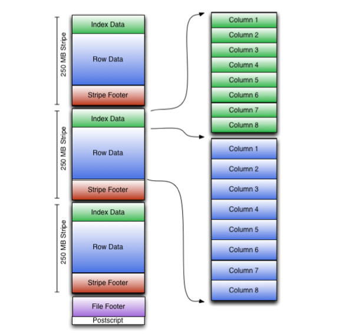

## ORC 

ORC 文件 split 时遇到的一切奇怪的问题。这边把他分析一下。

### ORC 结构



Strip 的形式，它主要就是用来一次跳多条数据

ORC 文件中的每个条带都包含 index索引 、RowData数据 和 Footer条带页脚

页脚包含流位置的目录。行数据用于表扫描。

索引数据包括每列的最小值和最大值以及每列中的行位置。（也可以包含位字段或布隆过滤器。）行索引条目提供偏移量，可以在解压缩块中找到正确的压缩块和字节。

请注意，ORC 索引仅用于选择条带和行组，而不用于回答查询。

尽管 Stripe 很大，但具有相对频繁的行索引条目可以在条带内跳过行以进行快速读取。默认情况下，可以每 10,000 行跳过一次。

### Split 遇到的问题

业务那边遇到了一个怪的事。

在处理一个大 ORC 文件的时候，想加快速度，把文件给map一下

他设置了 split 参数
```SQL
set mapred.max.split.size=10000000;
SET mapred.min.split.size=5000000;
```

讲道理，本文件应该类似均匀分成`size/max.split.size`的部分

但是出现了这种很奇怪的情况，少数大文件，一些小文件和0文件


ok,本地复现了一下，就是在 split 单个大orc文件的时候会出现这种情况。

最开始，我以为 orc 文件格式，使得文件数据分布不均匀导致的，但是在尝试了修改不同参数后,发现了一些规律


通过 Hive 自带的 orc 文件分析工具

```shell
hive --orcfiledump -j -p /user/hive/warehouse/jointable_orc
```


发现它实际上 2 个 stripe.

### 结论
1. Map 出的小文件个数 = orc.file.size / max.split.size
2. 分割出的小文件大小取决于，orc本身 stripe 的大小和 split 参数。
   1. 最小的切割单位就是 stripe，不会再对 stripe 进行切割
   2. 太小的 stripe 会合并到一个切割出的文件里，直到满足合并到小文件 > min.split.size ，但你切割出的文件数目是他直接算的，所以可能会出现空文件现象.

### Hive3 的尝试

先对 ORC文件分析 


ok,发现存在 22 个 stripe 

设置参数 ，使其分成 19 个小文件 


恭喜失败！

#### 结论 

看来这个就是 ORC 里的 Stripe 造成的，他不能破坏原 stripe 再重构 stripe。

### Mentor 的结论

1. orc大文件的切割是发生在stripe级别的文件切割以及合并，设置的小文件的阈值<单个stripe 大小，该stripe不会发生切割以及合并，会单独占据一个mapper，若小文件的阈值>单个stripe 大小,会发生小的stripe合并，且合并完成之后stripe仍然小于小文件的阈值，会继续同小于小文件阈值的stripe进行合并，直到合并之后的stripe大于小文件阈值。
2. mapper的数的估算，会根据ORC文件的大小以及小文件阈值来计算，但实际在分配每个mapper的处理数据量时，会根据上述的方法来分配每个mapper的处理文件大小，因此会出现有一些mapper处理的文件为空文件的情况。

#### 解决方案 

最好的办法是控制切割文件的参数大于stripe的大小。