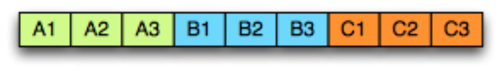

# Parquet

## 基本原理 

Parquet 和 ORC 一样都是列存

下图是拥有 A/B/C 3 个字段的简单示意表：


在面向行的存储中，每列的数据依次排成一行，如下所示：


而在面向列的存储中，相同列的数据存储在一起：



行存适用于数据整行读取场景，而列存适用于只读取部分列数据（统计分析等）场景

HDFS 上基本都是批量一次写入,多次读取的

### Schema

假设存在这么个字段

```SQL
message AddressBook {
  required string owner;
  repeated string ownerPhoneNumbers;
  repeated group contacts {
    required string name;
    optional string phoneNumber;
  }
}
```

schema 的最上层是 message，里面可以包含一系列字段。每个字段都拥有 3 个属性：重复性（repetition）、类型（type）以及名称（name）。字段类型可以是一个 group 或者原子类型（如 int、boolean、string 等），group 可以用来表示数据的嵌套结构。

字段的重复性有三种情况：
```    
required：有且只有一次
optional：0 或 1 次
repeated：0 或多次
```

exp:


### 列式存储 树形结构展示

为了使数据能够按列存储，对于一条记录（Record），首先要将其按列（Column）进行拆分。对于扁平（Flat）结构数据，拆分比较直观，一个字段即对应一列，而嵌套格式数据会复杂些。Dremel/Parquet 中，提出以树状层级的形式组织 schema 中的字段（Field），树的叶子结点对应一个原子类型字段，这样这个模型能同时覆盖扁平结构和嵌套结构数据（扁平结构只是嵌套结构的一种特例）。嵌套字段的完整路径使用简单的点分符号表示，如，contacts. name。

AddressBook 例子以树状结构展示的样式:

.jpg)

对比行式

.jpg)

### Repetition and Definition Level

对于嵌套格式列存，除了按列拆分进行连续的存储，还需要能够“无损”的保留嵌套格式的结构化信息，以便正确的重建记录。

只有字段值不能表达清楚记录的结构。给定一个重复字段的两个值，我们不知道此值是在什么“级别”被重复的（比如，这些值是来自两个不同的记录，还是相同的记录中两个重复的值）。同样的，给出一个缺失的可选字段，我们不知道整个路径有多少字段被显示定义了。

Repetition Level（重复级别）和 Definition Level（定义级别）两个概念，用以解决这个问题。并实现了记录中任意一个字段的恢复都不需要依赖其它字段，且可以对任意字段子集按原始嵌套格式进行重建。


#### Repetition levels

<font color = green>
个人理解，类似于 Trie Tree
</font>


用以表示在该字段路径上哪个节点进行了重复（at what repeated field in the field’s path the value has repeated）。

一个重复字段存储的列值，有可能来自不同记录，也可能由同一记录的不同层级节点重复导致。比如上图中的 Code 字段，他在 r1 记录中出现了 3 次，分别是字段 Name 和 Language 重复导致的，其中 Language 先重复了 2 次，Name 字段再重复了 1 次。

Repetition Levels 采用数字代表重复节点的层级。根据树形层次结构，根结点为 0、下一层级为 1… 依次类推。根结点的重复暗含了记录的重复，也即 r=0 代表新记录的开始。required 和 optional 字段不需要 repetition level，只有可重复的字段需要。因此，上述 Code 字段的 repetition levels 范围为 0-2。当我们从上往下扫描 r1 记录，首先遇到 Code 的值是”en-us“，由于它之前没有该字段路径相关的字段出现，因此 r=0；其次遇到”en“，是 Language 层级重复导致的，r=2；最后遇到”en-gb“，是 Name 层级重复导致的，因此 r=1。所以，Code 字段的 repetition levels 在 r1 记录中是”0,2,1“。

需要注意的是，r1 记录中的第二个重复 Name，由于其不包含 Code 字段，为了区分”en-gb“值是来自记录中的第三个 Name 而不是第二个，我们需要在”en“和”en-gb“之间插入一个值“null”。由于它是 Name 级重复的，因此它的 r=1。另外还需要注意一些隐含信息，比如 Code 是 required 字段类型，因此一旦 Code 出现未定义，则隐含表明其上级 Language 也肯定未定义。

#### Definition Levels

用以表示该字段路径上有多少可选的字段实际进行了定义（how many fields in p that could be undefined (because they are optional or repeated) are actually present）。

光有 Repetition Levels 尚无法完全保留嵌套结构信息，考虑上面图中 r1 记录的 Backward 字段。由于 r1 中未定义 Backward 字段，因此我们插入一个“null”并设置 r=0。但 Backward 的上级 Links 字段在 r1 中显式的进行了定义，null 和 r=0 无法再表达出这一层信息。因此需要额外再添加 Definition Levels 定义记录可选字段出现的个数，Backward 的路径上出现 1 个可选字段 Links，因此它的 d=1。

有了 Definition Levels 我们就可以清楚的知道该值出现在字段路径的第几层，对未定义字段的 null 和字段实际的值为 null 也能进行区分。只有 optional 和 repeated 字段需要 Definition Levels 定义，因为 required 字段已经隐含了字段肯定被定义（这可以减少 Definition Levels 需要描述的数字，并在一定程度上节省后续的存储空间）。另外一些其他的隐含信息：如果 Definition Levels 小于路径中 optional + repeated 字段的数量，则该字段的值肯定为 null；Definition Levels 的值为 0 隐含了 Repeated Levels 也为 0（路径中没有 optional/repeated 字段或整个路径未定义）。

#### Striping and Assembly 算法

现在把 Repetition Levels 和 Definition Levels 两个概念一起考虑。还是沿用上述 AddressBook 例子。下表显示了 AddressBook 中每个字段的最大重复和定义级别，并解释了为什么它们小于列的深度：


### 实现

Parquet 文件存储格式中的术语
- Block (hdfs block)：即指 HDFS Block，Parquet 的设计与 HDFS 完全兼容。Block 是 HDFS 文件存储的基本单位，HDFS 会维护一个 Block 的多个副本。在 Hadoop 1.x 版本中 Block 默认大小 64M，Hadoop 2.x 版本中默认大小为 128M。
- File：HDFS 文件，保存了该文件的元数据信息，但可以不包含实际数据（由 Block 保存）。
- Row group：按照行将数据划分为多个逻辑水平分区。一个 Row group（行组）由每个列的一个列块（Column Chunk）组成。
- Column chunk：一个列的列块，分布在行组当中，并在文件中保证是连续的。
- Page：一个列块切分成多个 Pages（页面），概念上讲，页面是 Parquet 中最小的基础单元（就压缩和编码方面而言）。一个列块中可以有多个类型的页面。
- 并行化执行的基本单元
- MapReduce - File/Row Group（一个任务对应一个文件或一个行组）
- IO - Column chunk（任务中的 IO 以列块为单位进行读取）
- Encoding/Compression - Page（编码格式和压缩一次以一个页面为单位进行）
- Block (hdfs block)：即指 HDFS Block，Parquet 的设计与 HDFS 完全兼容。Block 是 HDFS 文件存储的基本单位，HDFS 会维护一个 Block 的多个副本。在 Hadoop 1.x 版本中 Block 默认大小 64M，Hadoop 2.x 版本中默认大小为 128M。
- File：HDFS 文件，保存了该文件的元数据信息，但可以不包含实际数据（由 Block 保存）。
- Row group：按照行将数据划分为多个逻辑水平分区。一个 Row group（行组）由每个列的一个列块（Column Chunk）组成。
- Column chunk：一个列的列块，分布在行组当中，并在文件中保证是连续的。
- Page：一个列块切分成多个 Pages（页面），概念上讲，页面是 Parquet 中最小的基础单元（就压缩和编码方面而言）。一个列块中可以有多个类型的页面。

并行化执行的基本单元

- MapReduce - File/Row Group（一个任务对应一个文件或一个行组）
- IO - Column chunk（任务中的 IO 以列块为单位进行读取）
- Encoding/Compression - Page（编码格式和压缩一次以一个页面为单位进行）


元数据信息

Parquet 总共有 3 中类型的元数据：文件元数据、列（块）元数据和 page header 元数据。所有元数据都采用 thrift 协议存储。具体信息如下所示：


Parquet 数据类型
在实现层级上，Parquet 只保留了最精简的部分数据类型，以方便存储和读写。在其上有逻辑类型（Logical Types）以供扩展，比如：逻辑类型 strings 就映射为带有 UTF8 标识的二进制 byte arrays 进行存储。

##### 推荐配置

- 行组大小（Row group size）：更大的行组允许更大的列块，这使得可以执行更大的顺序 IO。不过更大的行组需要更大的写缓存。Parquet 建议使用较大的行组（512MB-1GB）。此外由于可能需要读取整个行组，因此最好一个行组能完全适配一个 HDFS Block。因此，HDFS 块大小也需要相应的设置更大。一个较优的读取配置为：行组大小 1GB，HDFS 块大小 1GB，每个 HDFS 文件对应 1 个 HDFS 块。
- 数据页大小（Data page size）：数据页应视为不可分割的，因此较小的数据页可实现更细粒度的读取（例如单行查找）。但较大的页面可以减少空间的开销（减少 page header 数量）和潜在的较少的解析开销（处理 headers）。Parquet 建议的页面大小为 8KB。