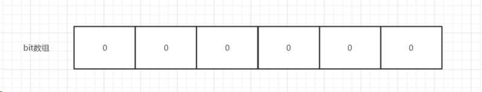
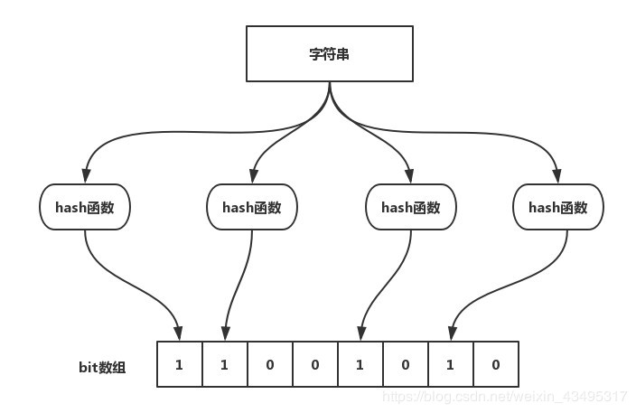

# 零碎知识点

## 结构化数据 非结构化数据 半结构化数据

### 结构化数据

二维结构 表结构?

结构化的数据是指可以使用关系型数据库表示和存储，表现为二维形式的数据。一般特点是：数据以行为单位，一行数据表示一个实体的信息，每一行数据的属性是相同的。举一个例子：

```SQL
id		name	age		gender
1		lyh		12		male
2		liangyh	13		female
3		liang	18		male
```
所以，结构化的数据的存储和排列是很有规律的，这对查询和修改等操作很有帮助。但是，显然，它的扩展性不好（比如，我希望增加一个字段，怎么办？）。

### 半结构化数据

半结构化数据是结构化数据的一种形式，它并不符合关系型数据库或其他数据表的形式关联起来的数据模型结构，但包含相关标记，用来分隔语义元素以及对记录和字段进行分层。因此，它也被称为自描述的结构。

半结构化数据，`属于同一类实体可以有不同的属性，即使他们被组合在一起，这些属性的顺序并不重要`。

常见的半结构数据有XML和JSON，对于对于两个XML文件，第一个可能有

```XML
<person>
	<name>A</name>
	<age>13</age>
  	<gender>female</gender>
</person>
```
第二个可能为：
```XML
<person>
	<name>B</name>
	<gender>male</gender>
</person>
```
从上面的例子中，属性的顺序是不重要的，不同的半结构化数据的属性的个数是不一定一样的。有些人说半结构化数据是以树或者图的数据结构存储的数据，怎么理解呢？

上面的例子中，<person>标签是树的根节点，<name>和<gender>标签是子节点。通过这样的数据格式，可以自由地表达很多有用的信息，包括自我描述信息（元数据）。所以，半结构化数据的扩展性是很好的。

### 非结构化数据
顾名思义，就是没有固定结构的数据。各种文档、图片、视频/音频等都属于非结构化数据。对于这类数据，我们一般直接整体进行存储，而且一般存储为二进制的数据格式。

## Bloom Fliter 布隆过滤器 BF

布隆过滤器（Bloom Filter）是一个叫做Bloom的人在1970年提出的。我们可以将它看作是由二进制向量（或者说位数据）和一系列的随机映射函数（哈希函数）两部分组成的数据结构。相比于List/Map/Set等数据结构，它占用的空间更少而且效率更高，但是缺点是返回的结果是概率性的，而不是非常准确的。理论下添加到集合中的元素越多，错误的可能性就越大。并且，存放在布隆过滤器的数据不易被删除。

其实就是 bitmap



位数组中的每个元素都只占用 1 bit ，并且每个元素只能是 0 或者 1。这样申请一个 100w 个元素的位数组只占用 1000000Bit / 8 = 125000 Byte = 125000/1024 kb ≈ 122kb 的空间。

比特类型的数组，不同于int long类型的数组。但是在实现的时候，可以用int类型的数组来拼凑，也就是说一个32个bit的int类型的数字，实际上是占用了32个bit。

原理介绍

当一个元素加入布隆过滤器中，会有如下操作：
- 使用哈希函数对要插入的元素值进行计算，得到哈希值（有可能有多个哈希函数
- 根据哈希值，在位数组中把对应下标的值设置为1

判断一个元素是否存在于布隆过滤器中，有如下操作：
- 给定元素哈希计算
- 得到值之后判断数组中每个元素是否都为1，如果是，那么这个值在布隆过滤器中，如果有一个值不为1，说明不在

如上所说，布隆过滤器可以判断极大容量的样本中是否存在某个值，并且对空间特别友好；相比之下，如果是哈希hashmap,那占用的内存空间将是极大的浪费，100亿个URL，每个URL64字节，需要用到640GB的内存。



如图所示，当字符串要存储到布隆过滤器中时，现将该bit数组的每一位全部初始化为0，该字符串首先由多个哈希函数生成不同的哈希值，然后在对应的位数组的下标的元素值设置为1。当第二次存储相同的字符串时，因为之前的对应为已经全部设置为1，所有很容易就知道这个元素已经存在了。

如果我们要判断某个字符串是否在布隆过滤器中时，只需要对给定字符串再次进行相同的哈希计算，得到值之后查看bit数组的指定位的元素是否为1，如果值都是1，那么说明这个字符串`可能`在布隆过滤器中，如果存在一个值不为1，说明该元素`一定`不在布隆过滤器中。

注意：
- 不同的字符串哈希出来的位置可能相同，这种情况我们可以适当增加数组大小或者调整哈希函数
- 布隆过滤器说某个元素存在，则可能会出现小概率的误判。布隆过滤器所某个元素不存在，则一定不存在