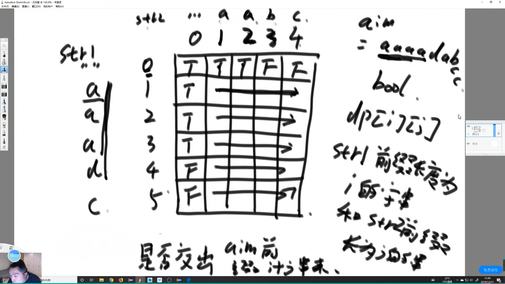

### 题目

给定三个字符串 s1、s2、s3，请你帮忙验证 s3 是否是由 s1 和 s2 交错 组成的。

两个字符串 s 和 t 交错 的定义与过程如下，其中每个字符串都会被分割成若干 非空 子字符串：

- s = s1 + s2 + ... + sn
- t = t1 + t2 + ... + tm
- |n - m| <= 1
- 交错 是 s1 + t1 + s2 + t2 + s3 + t3 + ... 或者 t1 + s1 + t2 + s2 + t3 + s3 + ...


提示：a + b 意味着字符串 a 和 b 连接。

示例 1：


```
输入：s1 = "aabcc", s2 = "dbbca", s3 = "aadbbcbcac"
输出：true
```
示例 2：
```
输入：s1 = "aabcc", s2 = "dbbca", s3 = "aadbbbaccc"
输出：false
```

示例 3：
```
输入：s1 = "", s2 = "", s3 = ""
输出：true
```

提示：

- 0 <= s1.length, s2.length <= 100
- 0 <= s3.length <= 200
- s1、s2、和 s3 都由小写英文字母组成

链接：https://leetcode-cn.com/problems/interleaving-string

### 思路

dp[i][j] 的定义  

    boolean  
    
    s1 前缀长度为 i 的子串 和  s2 前缀长度为 j 的子串 能否交错穿插出 

    s3长度为 i + j 的子串



.png)

DP 表 最右下就是我要求的答案
### Code
```java
    class Solution {
        public boolean isInterleave(String s1, String s2, String s3) {
            char[] chs1 = s1.toCharArray();
            char[] chs2 = s2.toCharArray();
            char[] chs3 = s3.toCharArray();

            if (chs3.length != chs1.length + chs2.length) {
                return false;
            }
            // 留 "" 空的位置 
            boolean[][] dp = new boolean[chs1.length + 1][chs2.length + 1];
            dp[0][0] = true;
            
            // 填边框 看看第一个字母能实现的填 T  
            for (int i = 1; i <= chs1.length; i++) {
                if (chs1[i - 1] != chs3[i - 1]) {
                    break;
                }
                dp[i][0] = true;
            }

            for (int j = 1; j <= chs2.length; j++) {
                if (chs2[j - 1] != chs3[j - 1]) {
                    break;
                }
                dp[0][j] = true;
            }
            
            for (int i = 1; i <= chs1.length; i++) {
                for (int j = 1; j <= chs2.length; j++) {
                    // dp[i][j] 之和 左边 和 前缀字符串 + 上面 和 前缀有关
                    // 可空间优化到 1 维
                    if ((chs1[i - 1] == chs3[i + j - 1] && dp[i - 1][j])
                            || (chs2[j - 1] == chs3[i + j - 1] && dp[i][j - 1])) {
                        dp[i][j] = true;
                    }
                }
            }
            return dp[chs1.length][chs2.length];
        }
    }
```

```java
    class Solution {
        public boolean isInterleave(String s1, String s2, String s3) {
            char[] chs1 = s1.toCharArray();
            char[] chs2 = s2.toCharArray();
            char[] chs3 = s3.toCharArray();

            if (chs3.length != chs1.length + chs2.length) {
                return false;
            }
            // 交换长短方便处理
            char[] longs = chs1.length >= chs2.length ? chs1 : chs2;
            char[] shorts = chs1.length < chs2.length ? chs1 : chs2;
            boolean[] dp = new boolean[shorts.length + 1];
            dp[0] = true;
            for (int i = 1; i <= shorts.length; i++) {
                if (shorts[i - 1] != chs3[i - 1]) {
                    break;
                }
                dp[i] = true;
            }
            // 二维到一维
            for (int i = 1; i <= longs.length; i++) {
                dp[0] = dp[0] && longs[i - 1] == chs3[i - 1];
                for (int j = 1; j <= shorts.length; j++) {
                    if ((longs[i - 1] == chs3[i + j - 1] && dp[j]) ||
                            (shorts[j - 1] == chs3[i + j - 1] && dp[j - 1])) {
                        dp[j] = true;
                    } else {
                        dp[j] = false;
                    }
                }
            }
            return dp[shorts.length];
        }
    }
```

*** 
### 收获
