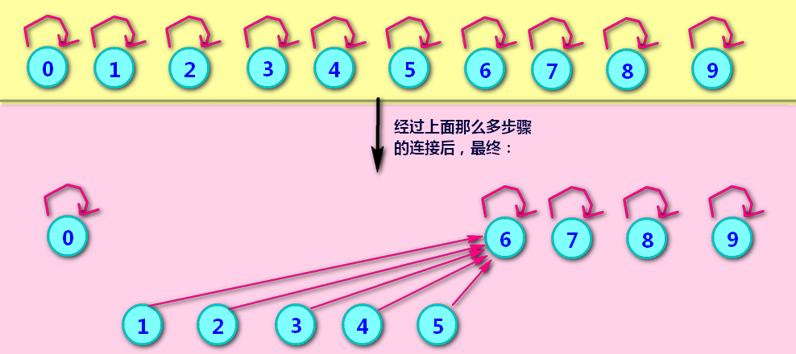
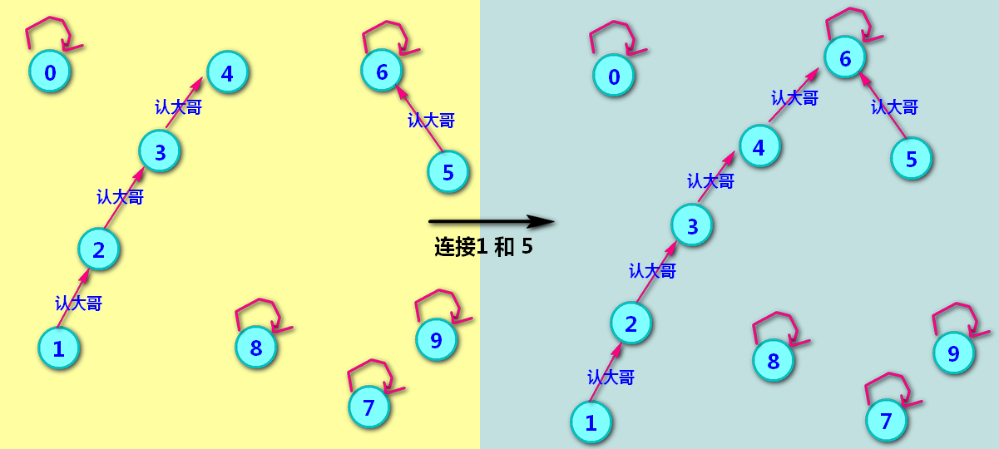
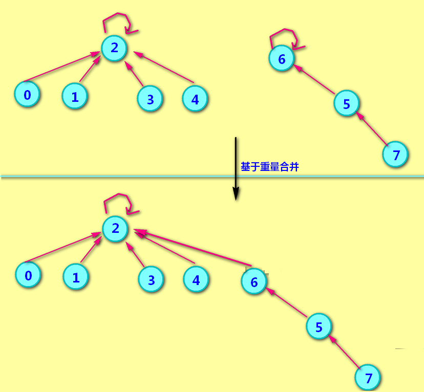
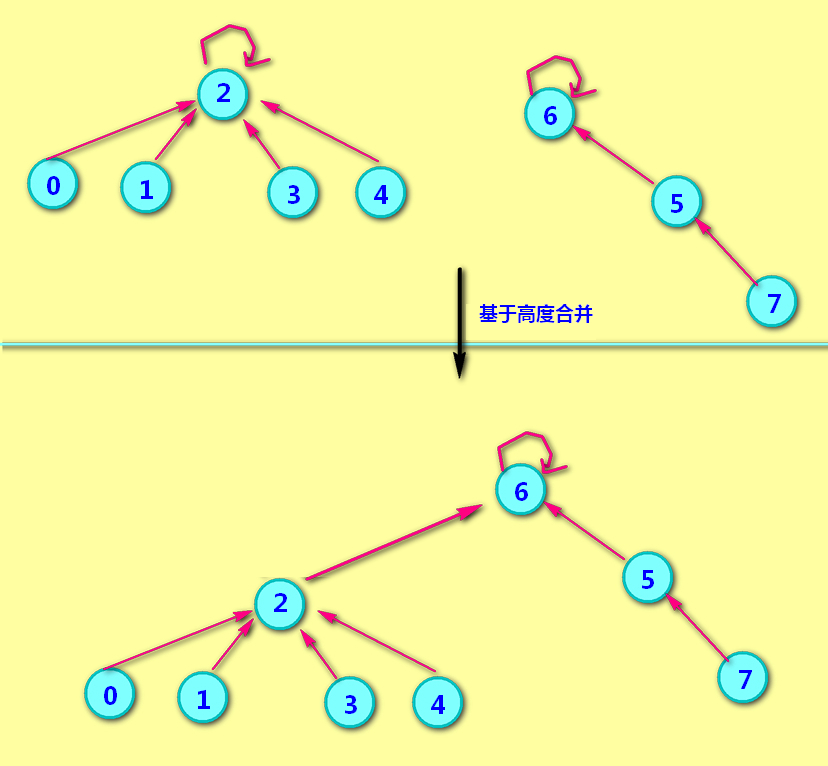
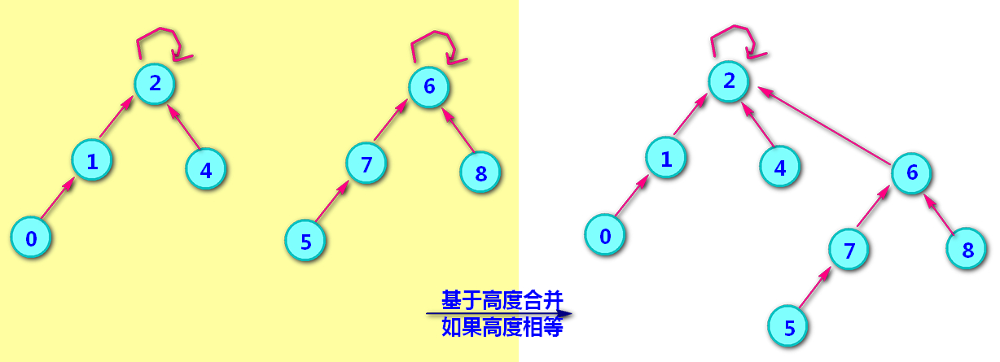
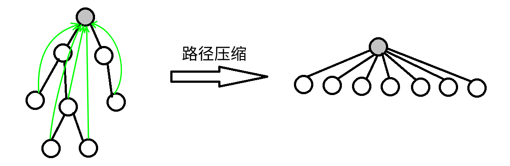
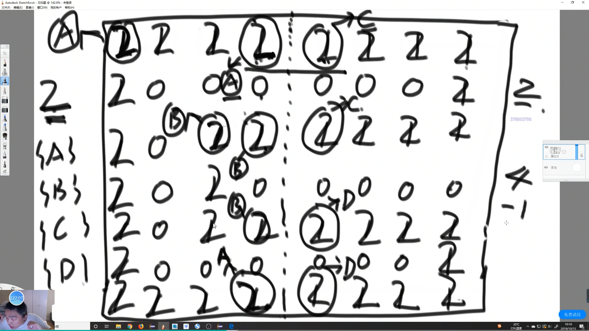
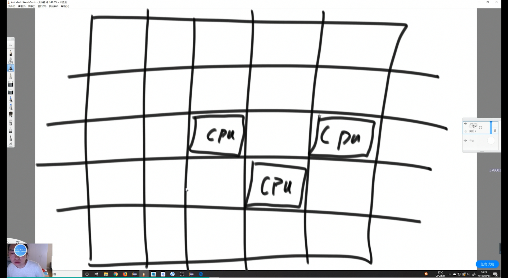

- [并查集](#并查集)
    - [最基础版](#最基础版)
    - [加速 Union](#加速-union)
      - [思路](#思路)
    - [并查集：快速union，快速find，基于重量](#并查集快速union快速find基于重量)
    - [并查集：快速union，快速find，基于高度(基于秩)](#并查集快速union快速find基于高度基于秩)
    - [启发式合并（按秩合并）](#启发式合并按秩合并)
    - [路径压缩](#路径压缩)
    - [时间复杂度表格](#时间复杂度表格)
    - [模板 路径压缩 + 重量合并 版本](#模板-路径压缩--重量合并-版本)
- [Island](#island)
  - [题目](#题目)
  - [思路](#思路-1)
  - [Code](#code)
  - [并行计算版本](#并行计算版本)
## 并查集

并查集是一种树形的数据结构，顾名思义，它用于处理一些不交集的 合并 及 查询 问题。 它支持两种操作：

- 查找（Find）：确定某个元素处于哪个子集；
- 合并（Union）：将两个子集合并成一个集合。

Warning:

    并查集不支持集合的分离，但是并查集在经过修改后可以支持集合中单个元素的删除操作（详见 UVA11987 Almost Union-Find）。使用动态开点线段树还可以实现可持久化并查集。

#### 最基础版



```java
        private class UnionFind {
            private int[] id;
            private int size;

            public UnionFind(int size) {
                this.size = size;
                this.id = new int[size];
                // 初始化 每个都指向自己
                for (int i = 0; i < size; i++) {
                    id[i] = i;
                }
            }

            private int find(int element) {
                return id[element];
            }

            private boolean isConnected(int fir, int sec) {
                return find(fir) == find(sec);
            }

            public void union(int fir, int sec) {
                int firstUnion = find(fir);
                int secondUnion = find(sec);

                if (firstUnion != secondUnion) {
                    for (int i = 0; i < this.size; i++) {
                        // 合并 如果是 2 合并到 1
                        if (id[i] == secondUnion) {
                            id[i] = firstUnion;
                        }
                    }
                }
            }
        }
```

#### 加速 Union 

在基础版中 元素1和元素5组队，那么就需要元素1所在队伍的所有成员都把自己的小组号改为新的小组号。 合并 O(N)

##### 思路

原先的数组中存的是小组号(或者队长的编号)，而现在数组中存的是自己的‘大哥’的编号,父节点

每个元素都可以去认一个大哥去保护自己，避免被欺负。只能认一个大哥...不能认多个.



```java
        private class UnionFind {
            // 建一个指向哪个父节点的数组
            private int[] parent;
            private int size;

            public UnionFind(int size) {
                this.size = size;
                this.parent = new int[size];
                // 初始化 每个都指向自己
                for (int i = 0; i < size; i++) {
                    parent[i] = i;
                }
            }

            public int find(int element) {
                // 通过父亲节点来找 是否在同一集合
                while (element != parent[element]) {
                    element = parent[element];
                }
                return element;
            }

            public boolean isConnected(int first, int second) {
                // 看看父节点是不是同一个 
                return find(first) == find(second);
            }

            public void unionElements(int first, int second) {
                int firstRoot = find(first);
                int secondRoot = find(second);
                // 相同就不用搞了
                if (firstRoot == secondRoot) {
                    return;
                }
                // sec 合并到 fir
                parent[secondRoot] = firstRoot;
            }
        }
```


#### 并查集：快速union，快速find，基于重量

其实上面讲的 union 函数，没有采取合理的手段去进行合并。每次都以 firstElement 为主，每次合并两个集合都让 firstElement 的根来继续充当合并之后的根。这样很可能退化成链表。


比如：有下面两个集合。其中 2 和 6 是两个集合的根。下面要让这两个集合合并，但是，合并之后只能有一个老大啊，到底谁来当呢？

在基于重量的union里，谁的人手多，就由谁来当合并之后的大哥。

2元素有4个手下，再算上自己，那就是5个人。

6元素有2个手下，再算上自己，那就是3个人。

很明显是2元素的人手多，所以2来充当合并之后的根节点。



```java
        private class UnionFind {
            private int[] parent;
            private int[] weight;
            private int size;

            public UnionFind(int size) {
                this.size = size;
                this.parent = new int[size];
                this.weight = new int[size];
                // 初始化 每个都指向自己
                for (int i = 0; i < size; i++) {
                    parent[i] = i;
                    weight[i] = 1;
                }
            }

            public int find(int element) {
                // 通过父亲节点来找 是否在同一集合
                while (element != parent[element]) {
                    element = parent[element];
                }
                return element;
            }

            public boolean isConnected(int first, int second) {
                // 看看父节点是不是同一个
                return find(first) == find(second);
            }

            public void unionElements(int first, int second) {
                int firstRoot = find(first);
                int secondRoot = find(second);
                // 相同就不用搞了
                if (firstRoot == secondRoot) {
                    return;
                }
                // 加入 weight 判断 每次都合并到 weight 大的父节点
                if (weight[firstRoot] > weight[secondRoot]) {
                    parent[secondRoot] = firstRoot;
                    weight[firstRoot] += weight[secondRoot];
                } else {//weight[firstRoot] <= weight[secondRoot]
                    parent[firstRoot] = secondRoot;
                    weight[secondRoot] += weight[firstRoot];
                }
            }
        }
```
#### 并查集：快速union，快速find，基于高度(基于秩)

上面介绍的是，当两个集合合并时，谁的重量大，谁就来当合并之后的根。是比以前好多了。但还是有并查集深度太深的问题。并查集越深，就越接近线性，find函数就越接近O(n)

所以有了这种基于高度的union。合并时，谁的深度深，谁就是新的根。这样集合的深度最多是最大深度的集合的深度，而不会让深度增加。

比如上面的例子中，元素2的深度是2，元素6的深度是3，按基于重量的union合并后，新的集合深度是4。

但是如果不比重量，而是比高度呢？

那就是6的深度是3，2的深度是2。3大于2, 所以6是新集合的根。看下面图。 可以看到按高度合并后,新的结合的深度并没有加深，深度为3，而按基于重量的合并后的高度是4。



两个集合的高度不一样的时候，对它们进行合并，新集合高度肯定等于高度大的那个集合的高度。所以高度不用调整。

而两个集合高度相等时，哪个根来当新集合的根已经无所谓了，只需要让其中一个指向另一个就好了。然后会发现深度加了一层，所以新集合的根的高度就得+1



```java
        private class UnionFind {
            private int[] parent;
            private int[] height;
            private int size;

            public UnionFind(int size) {
                this.size = size;
                this.parent = new int[size];
                this.height = new int[size];
                // 初始化 每个都指向自己
                for (int i = 0; i < size; i++) {
                    parent[i] = i;
                    height[i] = 1;
                }
            }

            public int find(int element) {
                // 通过父亲节点来找 是否在同一集合
                while (element != parent[element]) {
                    element = parent[element];
                }
                return element;
            }

            public boolean isConnected(int first, int second) {
                // 看看父节点是不是同一个
                return find(first) == find(second);
            }

            public void unionElements(int first, int second) {
                int firstRoot = find(first);
                int secondRoot = find(second);
                // 相同就不用搞了
                if (firstRoot == secondRoot) {
                    return;
                }
                // 加入 height 判断 每次都合并到 height 大的父节点
                if (height[firstRoot] > height[secondRoot]) {
                    parent[secondRoot] = firstRoot;
                } else if (height[firstRoot] < height[secondRoot]) {
                    parent[firstRoot] = secondRoot;
                } else {
                    // 如果要合并的两个集合高度一样，那么随意选一个作为根
                    // 我这里合并到 firstRoot。
                    // 然后 height[firstRoot]++
                    parent[secondRoot] = firstRoot;
                    height[firstRoot]++;
                }
            }
        }
```

#### 启发式合并（按秩合并）
一个祖先突然抖了个机灵：「你们家族人比较少，搬家到我们家族里比较方便，我们要是搬过去的话太费事了。」

由于需要我们支持的只有集合的合并、查询操作，当我们需要将两个集合合二为一时，无论将哪一个集合连接到另一个集合的下面，都能得到正确的结果。但不同的连接方法存在时间复杂度的差异。具体来说，如果我们将一棵点数与深度都较小的集合树连接到一棵更大的集合树下，显然相比于另一种连接方案，接下来执行查找操作的用时更小（也会带来更优的最坏时间复杂度）。

`在算法竞赛的实际代码中，即便不使用启发式合并，代码也往往能够在规定时间内完成任务。`

#### 路径压缩

这样的确可以达成目的，但是显然效率实在太低。为什么呢？因为我们使用了太多没用的信息，我的祖先是谁与我父亲是谁没什么关系，这样一层一层找太浪费时间，不如我直接当祖先的儿子，问一次就可以出结果了。甚至祖先是谁都无所谓，只要这个人可以代表我们家族就能得到想要的效果。把在路径上的每个节点都直接连接到根上，这就是路径压缩。


路径压缩就是处理并查集中的深的结点。实现方法很简单，就是在find函数里加上一句 `parent[element] = parent[parent[element]];`就好了，

让当前结点指向自己父亲的父亲，减少深度，同时还没有改变根结点的weight(非根节点的weight改变了无所谓)。

注：只能在基于重量的并查集上改find函数，而不能在基于高度的并查集上采用这种路径压缩。因为路径压缩后根的重量不变，但高度会变，然而高度改变后又不方便重新计算。





#### 时间复杂度表格

当并查集中的元素个数为 n 时，下面的表格给出了单次并查集操作的时间复杂度：

空间都是 O(n)

| 优化                | 平均时间复杂度 | 最坏时间复杂度 |
| ------------------- | -------------- | -------------- |
| 无优化              | O(logn)        | O(n)           |
| 路径压缩            | O(α(n))        | O(logn)        |
| 按秩合并            | O(logn)        | O(logn)        |
| 路径压缩 + 按秩合并 | O(α(n))        | O(α(n))        |

这里 α 表示阿克曼函数的反函数，在宇宙可观测的 n 内（例如宇宙中包含的粒子总数），α(n) 不会超过 5。

#### 模板 路径压缩 + 重量合并 版本

路径压缩就是处理并查集中的深的结点。实现方法很简单，就是在find函数里加上一句 parent[element] = parent[parent[element]];就好了，就是让当前结点指向自己父亲的父亲，减少深度，同时还没有改变根结点的weight(非根节点的weight改变了无所谓)。

注：只能在基于重量的并查集上改find函数，而不能在基于高度的并查集上采用这种路径压缩。因为路径压缩后根的重量不变，但高度会变，然而高度改变后又不方便重新计算。

```java
public class UnionFind {
    private int[] parent;
    private int[] weight;
    private int size;
 
    public UnionFind(int size) {
        this.parent = new int[size];
        this.weight = new int[size];
        this.size = size;
        for (int i = 0; i < size; i++) {
            this.parent[i] = i;
            this.weight[i] = 1;
        }
    }
 
    public int find(int element) {
        while (element != parent[element]) {
            parent[element] = parent[parent[element]];
            element = parent[element];
        }
        return element;
    }
 
    public boolean isConnected(int firstElement, int secondElement) {
        return find(firstElement) == find(secondElement);
    }
 
    public void unionElements(int firstElement, int secondElement) {
        int firstRoot = find(firstElement);
        int secondRoot = find(secondElement);
 
        //如果已经属于同一个集合了，就不用再合并了。
        if (firstRoot == secondRoot) {
            return;
        }
 
        if (weight[firstRoot] > weight[secondRoot]) {
            parent[secondRoot] = firstRoot;
            weight[firstRoot] += weight[secondRoot];
        } else {//weight[firstRoot] <= weight[secondRoot]
            parent[firstRoot] = secondRoot;
            weight[secondRoot] += weight[firstRoot];
        }
    }
```


## Island

### 题目

给你一个由 '1'（陆地）和 '0'（水）组成的的二维网格，请你计算网格中岛屿的数量。

岛屿总是被水包围，并且每座岛屿只能由水平方向和/或竖直方向上相邻的陆地连接形成。

此外，你可以假设该网格的四条边均被水包围。

 

示例 1：
```
输入：grid = [
  ["1","1","1","1","0"],
  ["1","1","0","1","0"],
  ["1","1","0","0","0"],
  ["0","0","0","0","0"]
]
输出：1
```
示例 2：
```
输入：grid = [
  ["1","1","0","0","0"],
  ["1","1","0","0","0"],
  ["0","0","1","0","0"],
  ["0","0","0","1","1"]
]
输出：3
```

提示：

- m == grid.length
- n == grid[i].length
- 1 <= m, n <= 300
- grid[i][j] 的值为 '0' 或 '1'

### 思路

感染递归 应该算是 DFS


其实也可用 并查集

### Code
```java
    class Solution {
        public int numIslands(char[][] m) {
            int res = 0;
            for (int i = 0; i < m.length; i++) {
                for (int j = 0; j < m[0].length; j++) {
                    // 遍历每个位置 如果是 "1" res++
                    if (m[i][j] == '1') {
                        res++;
                        // 把联通的地方全搞成 "1" 
                        infect(m, i, j);
                    }
                }
            }
            return res;
        }

        public void infect(char[][] m, int i, int j) {
            // 边界条件
            if (i < 0 || j < 0 || i >= m.length || j >= m[0].length || m[i][j] != '1') {
                return;
            }
            m[i][j] = '#';
            // 上下左右都看一下
            infect(m, i - 1, j);
            infect(m, i + 1, j);
            infect(m, i, j - 1);
            infect(m, i, j + 1);
        }
    }

```

### 并行计算版本



用并查集 每个分开计算岛的信息 




边界信息才进行合并


多任务解题思路：

    要解决合并岛的问题


边界信息要如何合并：

    标记感染中心。（并查集应用）

    看边界A和边界C是否合并过，没有就合并（指向同一个标记），岛数量减一。

    如何一路下去会碰到B和C，再次检查，合并，岛减一。

连成一片的这个概念，用并查集这个结构能非常好做，在结构上，怎么避免已经合完的部分，不重复减岛这个问题，用并查集来解决。

```java
import java.util.HashMap;
import java.util.List;
import java.util.Stack;

public class Code04_UnionFind {

	// 样本进来会包一层，叫做元素
	public static class Element<V> {
		public V value;

		public Element(V value) {
			this.value = value;
		}

	}

	public static class UnionFindSet<V> {
		public HashMap<V, Element<V>> elementMap;
		// key  某个元素  value 该元素的父
		public HashMap<Element<V>, Element<V>> fatherMap;
		// key 某个集合的代表元素   value 该集合的大小
		public HashMap<Element<V>, Integer> sizeMap;

		public UnionFindSet(List<V> list) {
			elementMap = new HashMap<>();
			fatherMap = new HashMap<>();
			sizeMap = new HashMap<>();
			for (V value : list) {
				Element<V> element = new Element<V>(value);
				elementMap.put(value, element);
				fatherMap.put(element, element);
				sizeMap.put(element, 1);
			}
		}

		// 给定一个ele，往上一直找，把代表元素返回
		private Element<V> findHead(Element<V> element) {
			Stack<Element<V>> path = new Stack<>();
			while (element != fatherMap.get(element)) {
				path.push(element);
				element = fatherMap.get(element);
			}
			while (!path.isEmpty()) {
				fatherMap.put(path.pop(), element);
			}
			return element;
		}

		public boolean isSameSet(V a, V b) {
			if (elementMap.containsKey(a) && elementMap.containsKey(b)) {
				return findHead(elementMap.get(a)) == findHead(elementMap.get(b));
			}
			return false;
		}

		public void union(V a, V b) {
			if (elementMap.containsKey(a) && elementMap.containsKey(b)) {
				Element<V> aF = findHead(elementMap.get(a));
				Element<V> bF = findHead(elementMap.get(b));
				if (aF != bF) {
					Element<V> big = sizeMap.get(aF) >= sizeMap.get(bF) ? aF : bF;
					Element<V> small = big == aF ? bF : aF;
					fatherMap.put(small, big);
					sizeMap.put(big, sizeMap.get(aF) + sizeMap.get(bF));
					sizeMap.remove(small);
				}
			}
		}

	}

}
```